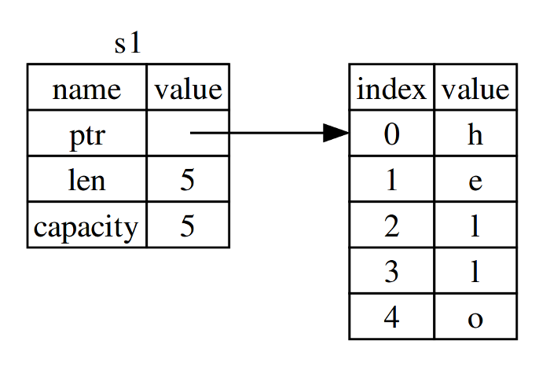
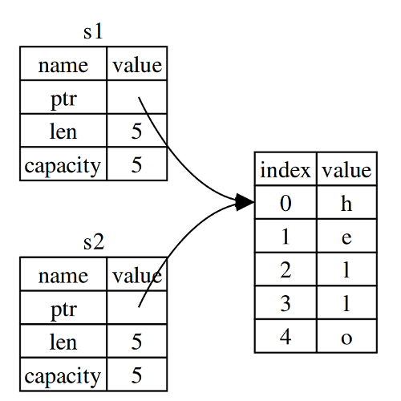
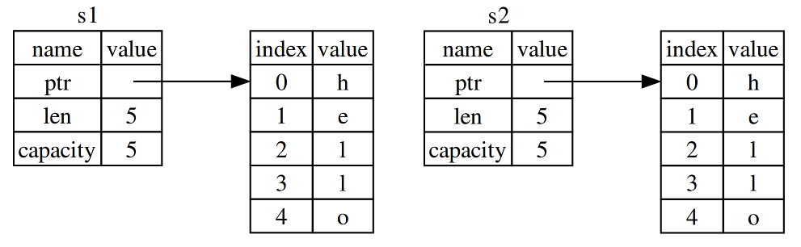

# Административни неща

- Инсталирайте си Rust: https://2017.fmi.rust-lang.bg/topics/1
--
- Елате в Discord канала: https://discord.gg/FCTNfbZ
--
- Предизвикателство 1: Повечето се справяте, но е добре да double-check-нете за потенциални грешки и проблеми ;)

---

# Въпрос 1

### Къде е грешката?

```rust
# // ignore
# fn main() {
let x = 3;
let y = 5_i32;

x = x + y;

println!("{}", x);
# }
```

---

# Въпрос 1

### Къде е грешката?

```rust
# // norun
# fn main() {
let x = 3;
let y = 5_i32;

x = x + y;

println!("{}", x);
# }
```

---

# Въпрос 1

### Как може да я оправим?

```rust
# fn main() {
let x = 3;
let y = 5_i32;

let x = x + y;

println!("{}", x);
# }
```

---

# Въпрос 2

### Къде е грешката?

```rust
# // ignore
# fn main() {
let x = 3.14_f32 as u32;
let y = 5_i32;

let z = x + y;

println!("{}", z);
# }
```

---

# Въпрос 2

### Къде е грешката?

```rust
# // norun
# fn main() {
let x = 3.14_f32 as u32;
let y = 5_i32;

let z = x + y;

println!("{}", z);
# }
```

---

# Въпрос 2

### Как може да я оправим?

```rust
# fn main() {
let x = 3.14_f32 as u32;
let y = 5_i32;

let z = (x as u8) + (y as u8);

println!("{}", z);
# }
```

---

# Преговор

* Инсталация и подкарване (`rustup`, `cargo`, Rust Playground)
--
* Документация (The Rust Book, `rustup doc`)
--
* Числа (конвертиране)
--
* Променливи (отгатване на типове, скриване на променливи, мутация)
--
* Control flow (`if`, `while`, `loop`)
--
* Твърдения и изрази (точка-и-запетаи!)
--
* Функции (`fn`, връщане на стойности)
--
* Печатане на стандартния изход (`println!("x = {}", x)`)

---

# Присвояване

```rust
# // norun
# fn main() {
let a = 7;
let b = a;
# }
```

---

# Присвояване

```rust
# fn main() {
let a = 7;
let b = a;

println!("a = {}, b = {}", a, b);
# }
```

---

# Присвояване

```rust
# // norun
# fn main() {
let a = "Hello";
let b = a;
# }
```

---

# Присвояване

```rust
# fn main() {
let a = "Hello";
let b = a;

println!("{}!", a);
println!("{} again!", b);
# }
```

---

# Присвояване

```rust
# // norun
# fn main() {
let s1 = String::from("Cookies!");
let s2 = s1;
# }
```

---

# Присвояване

```rust
# // ignore
let s1 = String::from("Cookies!");
let s2 = s1;

println!("{}", s1);
println!("Mmm, {}", s2);
```

---

# Присвояване

```rust
# fn main() {
let s1 = String::from("Cookies!");
let s2 = s1;

println!("{}", s1);
println!("Mmm, {}", s2);
# }
```

---

# Присвояване


---

# Разполагане в паметта

---

# Разполагане в паметта

### String - динамичен низ



---

# Разполагане в паметта

%%

### s2 = s1

Вариант: побитово копиране на стека → двойна деалокация

%%



%%

---

# Разполагане в паметта

### s2 = s1

Вариант: копие на стека и на динамичната памет - може да доведе до забавяне



---

# Семантика на местене (Move semantics)

Вместо копиране, което е скъпо в някои случаи, Rust използва местене

```rust
# fn main() {
let s1 = String::from("Cookies!");
let s2 = s1;

println!("{}", s1);
println!("Mmm, {}", s2);
# }

```

---

# А защо това е проблем само при `String`, а не при литералите?

--

Литералите използват статична памет, която не може да бъде променяна

---

# Клониране и копиране

### trait `Clone`

--
- типовете които го имплементират имат метод `clone`
--
- `clone` създава копие на обекта

---

# Клониране

Ако сме сигурни, че искаме да клонираме низа, може да използваме `.clone()`

```rust
# fn main() {
let s1 = String::from("Cookies!");
let s2 = s1.clone();

println!("{}", s1);
println!("Mmm, {}", s2);
# }
```

---

# Клониране и копиране

### trait `Copy`

--
- типа, който го имплементира позволява побитово копиране на паметта
--
- за типове, които са `Copy` не се използва семантика на местенето
--
- при присвояване те се копират - семантика на копирането

---

# Копиране

Числените типове имплементират `Copy`

```rust
# fn main() {
let n1 = 0xbeef;
let n2 = n1;         // копира s2
let n3 = n1.clone(); // еквивалентно на `n3 = n1`

println!("{}", n2);
println!("Mmm, {:#x}", n3);
# }
```

---

# Собственост


---

# Собственост и заемане

### Собственост

```rust
# // ignore
{
    let a = 123;

    // ...
}
```

--
* Променливата `a` е валидна от декларацията до края на scope-a

---

# Собственост

### Правила

--
* Всяка стойност в Rust си има променлива, която е нейн собственик
--
* Стойността може да има само един собственик по всяко време
--
* Когато собственикът излезе от scope, се извиква деструктора на стойността

---

# Собственост

### Функции с подаване на String

При подаването на аргументи към функция важат същите семантики

```rust
fn main() {
    let s = String::from("hello"); // Дефинираме s

    takes_ownership(s);            // Стойността на s се мести във функцията и
                                   // затова не е валидна след този ред.

} // Тук s излиза от scope, но s е преместен и съответно не се деалокация.

fn takes_ownership(some_string: String) {
    println!("{}", some_string);
} // some_string излиза от scope и се освобождава паметта.
```

---

# Собственост

### Функции с подаване на число

При подаването на аргументи към функция важат същите семантики

```rust
fn main() {
    let x = 5;     // Дефинираме x

    makes_copy(x); // Тук стойността на x би се преместила във функцията,
                   // но i32 е Copy, затова може да използваме x в последствие.

    println!("This was a triumph");
    println!("x is still alive");
    println!("with the value of {}", x);
} // Тук x излиза от scope.

fn makes_copy(some_integer: i32) {
    println!("{}", some_integer);
} // some_integer излиза от scope, но не се случва нищо особено.
```

---

# Собственост

### Функции които връщат стойност

Връщането на стойност от функция също може да прехвърля собственост

```rust
fn main() {
    let s1 = gives_ownership();
    let s2 = String::from("hello");
    let s3 = takes_and_gives_back(s2);
}

fn gives_ownership() -> String {
    let some_string = String::from("hello");
    some_string       // Тук местим стойността към функцията която е извикала gives_ownership
}

fn takes_and_gives_back(a_string: String) -> String {
    a_string
}
```

---

# Собственост

### Функции

А как може да продължим да използваме стойността след извикването на функцията?

--

```rust
fn main() {
    let s1 = String::from("hello");
    let (s2, len) = calculate_length(s1);

    println!("The length of '{}' is {}.", s2, len);
}

fn calculate_length(s: String) -> (String, usize) {
    let length = s.len(); // len() връща дължината на String.
    (s, length)
}
```

---

# Собственост и заемане

А какво ако искаме да използваме стойност във функция без да я местим всеки път?


---

# Заемане на стойност (borrowing)

### Референции

```rust
fn main() {
    let s1 = String::from("hello");
    let len = calculate_length(&s1);

    println!("The length of '{}' is {}.", s1, len);
}

fn calculate_length(s: &String) -> usize {
    s.len()
}
```

---

# Референции

### Immutable

--
- тип `&T`
--
- `let ref_x = &x;`

---

# Референции

### Представяне


---

# Референции

### Immutable

```rust
# // ignore
fn main() {
    let s = String::from("hello");
    change(&s);
    println!("{}", s);
}

fn change(some_string: &String) {
    some_string.push_str(", world");
}
```

---

# Референции

### Immutable

```rust
fn main() {
    let s = String::from("hello");
    change(&s);
    println!("{}", s);
}

fn change(some_string: &String) {
    some_string.push_str(", world");
}
```

---

# Референции

### Мutable

--
- тип `&mut T`
--
- `let ref_x = &mut x;`

---

# Референции

### Мutable

```rust
fn main() {
    let mut s = String::from("hello");
    change(&mut s);
    println!("{}", s);
}

fn change(some_string: &mut String) {
    some_string.push_str(", world");
}
```

---

# Референции

## Правила

- референцията винаги сочи към валидна стойност
--
- (съответно) референцията не може да е null

---

# Референции

### Валидност

```rust
# // ignore
# fn main() {
let r;
{
    let s = String::from("hello");
    r = &s;
}

println!("{}", r);
# }
```

---

# Референции

### Валидност

```rust
# fn main() {
let r;
{
    let s = String::from("hello");
    r = &s;
}

println!("{}", r);
# }
```

---

# Референции

## Правила

--
- По едно и също време към една стойност може да съществува само едно от следните:
--
  - точно една mutable референция
--
  - произволен брой immutable референции

--
<br/>
one mutable XOR many immutable

---

# Borrow checker

```rust
# // ignore
# fn main() {
let mut s = String::from("hello");

let r1 = &mut s;
let r2 = &mut s;

println!("{}, {}", r1, r2);
# }
```

---

# Borrow checker

```rust
# fn main() {
let mut s = String::from("hello");

let r1 = &mut s;
let r2 = &mut s;

println!("{}, {}", r1, r2);
# }
```

---

# Borrow checker

Решение: не ги използвайте заедно

```rust
# #![allow(unused_variables)]
# fn main() {
let mut s = String::from("hello");

let r1 = &mut s;
println!("{}", r1);

let r2 = &mut s;
println!("{}", r2);
# }
```

---

# Borrow checker

За повече яснота за живота на r1:

```rust
# fn main() {
let mut s = String::from("hello");

{
    let r1 = &mut s;
    println!("{}", r1);
}

let r2 = &mut s;
println!("{}", r2);
# }
```

---

# Borrow checker

Не можем да преместим стойност докато има референция към нея

```rust
# fn main() {
let s1 = String::from("hello");
let r = &s1;

let s2 = s1;
println!("{}", r);
# }
```

---

# Референции

### Към скрита (shadowed) променлива

```rust
# // ignore
# fn main() {
let s = String::from("first");
let r = &s;

let s = String::from("second");

println!("{}", r);
println!("{}", s);
# }
```

---

# Референции

### Към скрита (shadowed) променлива

```rust
# fn main() {
let s = String::from("first");
let r = &s;

let s = String::from("second");

println!("{}", r);
println!("{}", s);
# }
```

---

# Референции

### Към скрита (shadowed) променлива

```rust
# // ignore
# fn main() {
let s = String::from("hello");
let s = &s;

println!("{}", s);
# }
```

---

# Референции

### Към скрита (shadowed) променлива

```rust
# fn main() {
let s = String::from("hello");
let s = &s;

println!("{}", s);
# }
```

---

# Референции

### Към временна стойност

```rust
# fn main() {
let s = &String::from("hello");

println!("{}", s);
# }
```

---

# Референции

### Към временна стойност

```rust
# fn main() {
let s = &mut String::from("hello");

println!("{}", s);
# }
```

---

# Референции

### mutable → immutable

```rust
# // norun
fn main() {
    let mut s = String::from("hello");
    let r = &mut s;

    greet_cookies(r);
}

fn greet_cookies(greeting: &String) {
    println!("{}, cookies", greeting);
}
```

---

# Референции

### mutable → immutable

```rust
fn main() {
    let mut s = String::from("hello");
    let r = &mut s;

    greet_cookies(r);
}

fn greet_cookies(greeting: &String) {
    println!("{}, cookies", greeting);
}
```

---

# Референции

### mutable → mutable

```rust
# // norun
fn main() {
    let mut s = String::from("mmm");
    let r = &mut s;

    get_cookies(r);
    println!("{}", r);
}

fn get_cookies(s: &mut String) {
    s.push_str(", cookies");
}
```

---

# Референции

### mutable → mutable

```rust
fn main() {
    let mut s = String::from("mmm");
    let r = &mut s;

    get_cookies(r);
    println!("{}", r);
}

fn get_cookies(s: &mut String) {
    s.push_str(", cookies");
}
```

---

# Низове

### Литерали

```rust
# fn main() {
let s: &str = "hello";
# }
```

--
* Заделя се в статичната памет на програмата
--
* Непроменим (immutable)
--
* типа `&str` е специалиен вид референция
--
* стойността `"hello"` не се притежава от `s`
--
* стойността `"hello"` се "притежава" от програмата, защото е статична

---

# Низове

### String

```rust
# fn main() {
let s = String::from("hello");
# }
```

--
* Заделя се в динамичната памет
--
* Може да се променя (mutable)
--
* има собственост над низа

---

# Низове

### Slices

Можем да вземем част от низ

```rust
# #![allow(unused_variables)]
# fn main() {
let s = String::from("hello, world");
let r1 = &s[..];
let r2 = &r1[1..4];

println!("{}", r2);
# }
```

---

# Низове

### Slices

- какво е `1..4`?
--
- [Range](https://doc.rust-lang.org/std/ops/struct.Range.html)
--
- а какво е `&s[1..4]`?
--
- `&str`

---

# Типа &str

--
- резен от низ (string slice)
--
- специален вид референция
--
- репрезентация - `(ptr, len)`
--

<pre>
            my_name: String   last_name: &str
            [––––––––––––]    [–––––––]
            +–––+––––+––––+–––+–––+–––+
stack frame │ • │ 16 │ 13 │   │ • │ 6 │
            +–│–+––––+––––+–––+–│–+–––+
              │                 │
              │                 +–––––––––+
              │                           │
              │                           │
              │                         [–│––––––– str –––––––––]
            +–V–+–––+–––+–––+–––+–––+–––+–V–+–––+–––+–––+–––+–––+–––+–––+–––+
       heap │ P │ a │ s │ c │ a │ l │   │ P │ r │ e │ c │ h │ t │   │   │   │
            +–––+–––+–––+–––+–––+–––+–––+–––+–––+–––+–––+–––+–––+–––+–––+–––+
</pre>

---

# Типа &mut str

--
- mutable string slice
--
- можем да променяме елементите през него
--
- не можем да добавяме и премахваме елементи, защото имаме само референция към памет, която се притежава от някой друг

---

# Вектори

### Tипа Vec

```rust
# #![allow(unused_variables)]
# fn main() {
let mut v = Vec::new();
v.push(1);
v.push(2);
v.push(3);

println!("{:?}", v);
# }
```

--
- динамичен масив
--
- автоматично си разширява капацитета при добавяне на елементи

---

# Вектори

### макрото vec!

```rust
# #![allow(unused_variables)]
# fn main() {
let v = vec![1, 2, 3];

println!("{:?}", v);
# }
```

---

# Типа &[T]

--
- резен от масив
--
- аналогично на &str
--
- репрезентиран като `(ptr, len)`

---

# &[T]

### Резен от масив

```rust
# #![allow(unused_variables)]
# fn main() {
let arr = [1, 2, 3];
let slice = &arr[..];

println!("{:?}", slice);
# }
```

---

# &[T]

### Резен от масив литерал

```rust
# #![allow(unused_variables)]
# fn main() {
let slice = &[1, 2, 3];

println!("{:?}", slice);
# }
```

---

# &[T]

### Резен от вектор

```rust
# #![allow(unused_variables)]
# fn main() {
let v = vec![1, 2, 3];
let slice = &v[..];

println!("{:?}", slice);
# }
```
