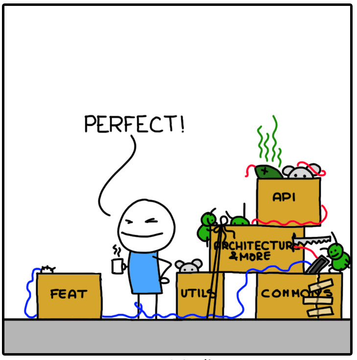

# Преговор

--
- Присвояване и местене; Clone и Copy
--
- Собственост (ownership) и заемане (borrowing)
--
- Референции
--
    - референцията винаги сочи към валидна стойност
--
    - или произволен брой `&T`, или точно една `&mut T`
--
- Низове (`String`) и резени от низове (`&str`)
--
- Вектори (`Vec<T>`) и резени от масиви (`&[T]`)

---

# Административни неща

- Предизвикателство 1 свърши

---

# Съдържание

- Структури
- Методи
- Модули
- Използване на пакети от crates.io

---

# Структури


---

# Структури

### Синтаксис

```rust
struct User {
    username: String,
    email: String,
    sign_in_count: u64,
}
# fn main() {}
```

---

# Структури

### Създаване на инстанция

```rust
# fn main() {
struct User {
    username: String,
    email: String,
    sign_in_count: u64
}

let user = User {
    username: String::from("Иванчо"),
    email: String::from("ivan40@abv.bg"),
    sign_in_count: 10,
};
# }
```

---

# Структури

### Достъп до полета

```rust
# fn main() {
struct User {
    username: String,
    email: String,
    sign_in_count: u64
}

let user = User {
    username: String::from("Иванчо"),
    email: String::from("ivan40@abv.bg"),
    sign_in_count: 10,
};

println!("{}, {}", user.username, user.email);
# }
```

---

# Структури

### Достъп до полета

Полетата се достъпват по същия начин и през референция.
Автоматично се правят необходимия брой дереференцирания.

```rust
# fn main() {
struct User {
    username: String,
    email: String,
    sign_in_count: u64
}

let user = User {
    username: String::from("Иванчо"),
    email: String::from("ivan40@abv.bg"),
    sign_in_count: 10,
};

let user_ref = &user;

println!("{}, {}", user_ref.username, user_ref.email);
# }
```

---

# Структури

### Промяна на полетата

Можем да променяме стойността на полетата, ако обекта е дефиниран като `mut`.

```rust
# fn main() {
struct User {
    username: String,
    email: String,
    sign_in_count: u64
}

let mut user = User {
    username: String::from("Иванчо"),
    email: String::from("ivan40@abv.bg"),
    sign_in_count: 10,
};

user.email = "ivan40.ivanov@abv.bg".to_string();

println!("{}, {}", user.username, user.email);
# }
```

---

# Структури

### Struct update syntax

Можем да дадем стойност само на част от полетата и останалите да попълним от друга инстанция

```rust
# struct User { username: String, email: String, sign_in_count: u64 }
# fn main() {
let user = User {
    username: String::from("Иванчо"),
    email: String::from("ivan40@abv.bg"),
    sign_in_count: 10,
};

let hacker = User {
    email: String::from("hackerman@l33t.hax"),
    ..user
};

println!("{}, {}", hacker.username, hacker.email);
# }
```
---

# Структури

### Struct update syntax

Това ще премести полетата от оригиналната инстанция

```rust
# struct User { username: String, email: String, sign_in_count: u64 }
# fn main() {
let user = User {
    username: String::from("Иванчо"),
    email: String::from("ivan40@abv.bg"),
    sign_in_count: 10,
};

let hacker = User {
    email: String::from("hackerman@l33t.hax"),
    ..user
};

println!("{}, {}", hacker.username, hacker.email);
println!("{}, {}", user.username, user.email);
# }
```

---

# Структури

### Кратък синтаксис за създаване на структури

Има кратък синтаксис ако стойността на поле се задава чрез променлива със същото име

%%
```rust
struct Rectangle {
    width: f64,
    height: f64,
}

# fn main() {
let width = 2.0;
let height = 3.0;

let rect = Rectangle {
    width: width,
    height: height,
};
# }
```

%%
```rust
struct Rectangle {
    width: f64,
    height: f64,
}

# fn main() {
let width = 2.0;
let height = 3.0;

let rect = Rectangle {
    width,
    height,
};
# }
```
%%

---

# Методи и асоциирани функции

### Асоциирани функции

--

```rust
# fn main() {}
# struct User { username: String, email: String, sign_in_count: u64 }
# /*
struct User { ... }
# */

impl User {
    fn new(username: String, email: String) -> User {
        User {
            username: username,
            email: email,
            sign_in_count: 0,
        }
    }
}
```

--
- разделение между данни и логика:
    - `struct` блока съдържа само полетата на структурата
    - методи и функции се добавят в отделен `impl` блок

---

# Методи и асоциирани функции

### Асоциирани функции

```rust
# struct User { username: String, email: String, sign_in_count: u64 }
# /*
struct User { ... }
# */

impl User {
    fn new(username: String, email: String) -> User {
        User {
            username: username,
            email: email,
            sign_in_count: 0,
        }
    }
}

# fn main() {
let user = User::new(String::from("Иванчо"), String::from("ivan40@abv.bg"));
# }
```

--
- функцията `new` се нарича асоциирана функция - семантично еднаква със статичен метод от други езици
- когато викаме асоциирани функции като `new`, трябва да ги префиксираме с името на структурата (`User`) и оператора `::`

---

# Методи и асоциирани функции

### Конструктори и деструктори

--
- в Rust няма конструктори
--
- конвенция е да има асоциирана функция, която създава обект от типа
--
- обикновенно името е
    - `new`
    - `from_*`
    - `with_*`
--
- но има и изключения
    - `File::open`

---

# Методи и асоциирани функции

### Конструктори и деструктори

- в Rust има деструктори
- дефинират се чрез trait-а Drop
- за тях ще говорим по-късно

---

# Методи и асоциирани функции

### Типа Self

```rust
struct Rectangle { width: f64, height: f64 }

impl Rectangle {
    fn new(width: f64, height: f64) -> Self {
        Self { width, height }
    }
}
# fn main() {}
```

--
- достъпен само в `impl` блок
--
- alias на типа, за който имплементираме

---

# Методи и асоциирани функции

### Методи

```rust
struct Rectangle { width: f64, height: f64 }

impl Rectangle {
    fn area(&self) -> f64 {
        self.width * self.height
    }
}
# fn main() {}
```

--
- функция, която приема като първи аргумент `self`, `&self`, `&mut self` (method receiver)
--
- `self` е еквивалентно на `self: Self`
--
- `&self` е еквивалентно на `self: &Self`
--
- `&mut self` е еквивалентно на `self: &mut Self`

---

# Методи и асоциирани функции

### Методи

Могат да се извикват със синтаксиса за методи

```rust
struct Rectangle { width: f64, height: f64 }

impl Rectangle {
#    fn new(width: f64, height: f64) -> Self { Self { width, height } }
    fn area(&self) -> f64 {
        self.width * self.height
    }
}

# fn main() {
let rect = Rectangle::new(2.0, 3.0);
let area = rect.area();

println!("{}", area);
# }
```

--
- както полетата, методите се достъпват с `.`
--
- компилаторът автоматично добавя `*`, `&` или `&mut`, така че типа на аргумента да съвпадне с типа на method receiver-а

---

# Методи и асоциирани функции

### Методи

Но могат да се извикват и като асоциирана функция

```rust
struct Rectangle { width: f64, height: f64 }

impl Rectangle {
#    fn new(width: f64, height: f64) -> Self { Self { width, height } }
    fn area(&self) -> f64 {
        self.width * self.height
    }
}

# fn main() {
let rect = Rectangle::new(2.0, 3.0);
let area = Rectangle::area(&rect);

println!("{}", area);
# }
```

---

# Методи и асоциирани функции

### Множество impl блокове

Позволено е декларирането на повече от един `impl` блок. Удобно е при групиране на методи.

```rust
struct Rectangle { width: f64, height: f64 }

impl Rectangle {
    fn area(&self) -> f64 {
        self.width * self.height
    }
}

impl Rectangle {
    fn perimeter(&self) -> f64 {
        2.0 * (self.width + self.height)
    }
}
# fn main() {}
```

---

# Tuple structs

Именувани кортежи

```rust
# fn main() {
struct Color(i32, i32, i32);
struct Point(i32, i32, i32);

let black = Color(0, 0, 0);
let origin = Point(0, 0, 0);
# }
```

---

# Tuple structs

Полетата се достъпват с `.0`, `.1`, и т.н., както при нормален

```rust
# fn main() {
struct Color(i32, i32, i32);

let black = Color(0, 0, 0);

println!("r: {}, g: {}, b: {}", black.0, black.1, black.2);
# }
```

---

# Празни структури

Възможна е декларацията на празни структури. Могат да се използват като маркери - големината им е 0 байта.

```rust
# fn main() {
struct Electron {}
struct Proton;

let x = Electron {};
let y = Proton;
# }
```

---

# Модули

<a href="https://www.monkeyuser.com/2018/architecture/" target="_blank">
    
</a>

---

# Модули

- начин да си организираме кода в отделни namespaces
--
- обикновенно йерархията от модули съвпада с йерархията на файловете на проекта ни

---

# Модули

Нека си създадем библиотека:

`$ cargo new communicator --lib`

```sh
communicator
├── Cargo.toml
└── src
    └── lib.rs
```

---

# Модули

- главния файл на проекта ни е и главния модул
    - src/main.rs
    - src/lib.rs

---

# Модули

Можем да дефинираме подмодули в същия файл

```rust
// src/lib.rs

mod network {
    fn connect() {
        // ...
    }
}

mod client {
    fn connect() {
        // ...
    }
}
# fn main() {}
```

---

# Модули

Можем да дефинираме подмодули и в отделни файлове

```sh
communicator
├── Cargo.toml
└── src
    ├── client.rs
    ├── lib.rs
    └── network.rs
```

---

# Модули

Можем да дефинираме подмодули и в отделни файлове

```rust
# // ignore
// src/lib.rs

mod network;
mod client;
```

%%
```rust
// src/network.rs

fn connect() {
    // ...
}
# fn main() {}
```
%%
```rust
// src/client.rs

fn connect() {
    // ...
}
# fn main() {}
```
%%

--
- декларираме подмодулите с `mod MOD_NAME;`
- компилатора търси файл `./MOD_NAME.rs` или `./MOD_NAME/mod.rs`

---

# Модули

Можем да имаме няколко нива на подмодули

```rust
// src/lib.rs

mod network {
    fn connect() {
        // ...
    }

    mod client {
        fn connect() {
            // ...
        }
    }
}

# fn main() {}
```

---

# Модули

Ако искаме да са в отделни файлове трябва да използваме директории

```sh
communicator
├── Cargo.toml
└── src
    ├── lib.rs
    └── network
        ├── client.rs
        └── mod.rs
```

---

# Модули

Ако искаме да са в отделни файлове трябва да използваме директории

```rust
# // ignore
// src/lib.rs

mod network;
```

```rust
# // ignore
// src/network/mod.rs

mod client;

fn connect() {
    // ...
}
```

```rust
// src/network/client.rs

fn connect() {
    // ...
}
# fn main() {}
```

---

# Достъп

В модул имаме директен достъп до всичко останало дефинирано в модула

```rust
mod client {
    fn connect() { /* ... */ }

    fn init() {
        // client::connect();
        connect();
    }
}
# fn main() {}
```

---

# Достъп

Ако искаме да използваме нещо извън модула трябва да използваме пълното име

```rust
# // ignore
mod client {
    fn connect() { /* ... */ }
}

mod network {
    fn init() {
        crate::client::connect();
    }
}
# fn main() {}
```

--
- пълното име започва с име на crate-а или ключовата дума `crate` ако е дефинирано в нашия проект
--
- след това следва пътя до item-а
--
    - `crate::client::connect`
    - `std::vec::Vec`

---

# Достъп

Ако искаме да използваме нещо извън модула трябва да използваме пълното име..

```rust
mod client {
    fn connect() { /* ... */ }
}

mod network {
    fn init() {
        crate::client::connect();
    }
}
# fn main() {}
```

---

# Достъп

... и освен това то трябва да е публично достъпно (keyword `pub`)

```rust
mod client {
    pub fn connect() { /* ... */ }
}

mod network {
    fn init() {
        crate::client::connect();
    }
}
# fn main() {}
```

---

# Достъп

Можем да използваме `use` за да импортираме имена от друг модул

```rust
mod client {
    pub fn connect() { /* ... */ }
}

mod network {
    use crate::client::connect;

    fn init() {
        connect();
    }
}
# fn main() {}
```

--
- ако искаме да импортираме повече от едно нещо: `use crate::client::{something, some_other_thing}`
--
- или ако искаме да импортираме всичко от даден модул: `use crate::client::*` (удобно за `prelude` модули)

---

# Достъп

Ако искаме да импортираме неща от подмодул, може да използваме `use self::...` или `use super::...` за релативен път

```rust
# #![allow(unused_imports)]
mod network {
    mod client {
        // еквивалентно на use crate::network::init;
        use super::init;

        pub fn connect() { /* ... */ }
    }

    // еквивалентно на use crate::network::client::connect;
    use self::client::connect;

    fn init() {
        connect();
    }
}
# fn main() {}
```

---

# Достъп: public и private

--
- по подразбиране всичко е private
--
- за да се направи нещо достъпно извън модула, в който е дефинирано, се използва ключовата дума `pub`
--
- винаги има достъп до нещата, които са дефинирани в текущия модул, или по-нагоре в йерархията

---

# Достъп: public и private

Нека да пуснем следния код

```rust
# // ignore
mod product {
    pub struct User {
        username: String,
        email: String,
    }
}

use self::product::User;

fn main() {
    let user = User {
        username: String::from("Иванчо"),
        email: String::from("ivan40@abv.bg"),
    };
}
```

---

# Достъп: public и private

Резултата

```rust
mod product {
    pub struct User {
        username: String,
        email: String,
    }
}

use self::product::User;

fn main() {
    let user = User {
        username: String::from("Иванчо"),
        email: String::from("ivan40@abv.bg"),
    };
}
```

---

# Достъп: public и private

Както казахме, по подразбиране всичко е private за външни модули, включително и полета на структурата.
Затова трябва да ги отбележим с `pub`.

```rust
mod product {
    pub struct User {
        pub username: String,
        pub email: String,
    }
}

use self::product::User;

fn main() {
    let user = User {
        username: String::from("Иванчо"),
        email: String::from("ivan40@abv.bg"),
    };
}
```

---

# Достъп: public и private

Без проблем може да достъпим private полета от същия модул в който е дефинирана структурата

```rust
mod product {
    pub struct User {
        username: String,
        email: String,
    }

    pub fn new(username: String, email: String) -> User {
        User { username, email }
    }
}

fn main() {
    let user = product::new(
        String::from("Иванчо"),
        String::from("ivan40@abv.bg"),
    );
}
```

---

# Достъп: public и private

Както и без проблем може да достъпим private полета от подмодул

```rust
mod product {
    pub struct User {
        username: String,
        email: String,
    }

    pub mod init_user {
        use super::User;

        pub fn new(username: String, email: String) -> User {
            User { username, email }
        }
    }
}

fn main() {
    let user = product::init_user::new(
        String::from("Иванчо"),
        String::from("ivan40@abv.bg"),
    );
}
```

---

# Достъп: public и private

Но ако модулите са съседни не можем

```rust
mod product {
    mod dto {
        pub struct User {
            username: String,
            email: String,
        }
    }

    pub mod init_user {
        use super::dto::User;

        pub fn new(username: String, email: String) -> User {
            User { username, email }
        }
    }
}
# fn main() {}
```

---

# Достъп: public и private

Тези правила важат и за tuple structs

```rust
mod product {
    pub struct UserId(u64);
}

use self::product::UserId;

fn main() {
    let id = UserId(123);
}
```

---

# Достъп: public и private

Тези правила важат и за tuple structs

```rust
mod product {
    pub struct UserId(pub u64);
}

use self::product::UserId;

fn main() {
    let id = UserId(123);
}
```

---

# Пакети

<a href="https://www.monkeyuser.com/2018/refactoring/" target="_blank">
    
</a>

---

# Пакети

Ще си направим игра за отгатване на число

`$ cargo new number_guessing_game --bin`

---

# Пакети

- трябва ни генератор на случайни числа
--
- в стандартната библиотека няма такъв
--
- може да потърсим в https://crates.io/
--
- https://crates.io/crates/rand

---

# Cargo.toml

Трябва да си добавим пакета като зависомист на проекта ни

```toml
[package]
name = "number_guessing_game"
version = "0.1.0"
authors = ["..."]
edition = "2018"

[dependencies]
```

---

# Cargo.toml

Трябва да си добавим пакета като зависомист на проекта ни

```toml
[package]
name = "number_guessing_game"
version = "0.1.0"
authors = ["..."]
edition = "2018"

[dependencies]
rand = "0.7.2"
```

---

# Използване

След като се добави библиотека в `[dependencies]`, може да се използва както всеки останал модул

```rust
# // ignore
use rand::*;

// ...
```

---

# Документация

- https://docs.rs/ - документация за всички пакети от crates.io
--
- https://docs.rs/rand/

---

# Имплементация

### Live demo

---

# Имплементация

### Код от демото

```rust
# // ignore
use rand::prelude::*;
use std::io::{self, Write};

fn main() {
    // Generate a random number between 0 and 10
    let secret = rand::thread_rng().gen_range(0, 10_u32);
    let stdin = io::stdin();

    let tries = 5;
    println!("You have {} tries to guess the number. Good luck!", tries);

    for _ in 0..tries {
        // Note that stdout is frequently line-buffered by default so it may be necessary
        // to use io::stdout().flush() to ensure the output is emitted immediately.
        print!("Your guess: ");
        let _ = io::stdout().flush();

        let mut line = String::new();
        let _ = stdin.read_line(&mut line);

        // No error handling - panic if parsing fails
        let guess: u32 =
            line
            .trim()
            .parse()
            .unwrap();

        if secret < guess {
            println!("I am less than that");
        } else if secret > guess {
            println!("I am greater than that");
        } else {
            println!("Congratulations, you won!");
            return;
        }
    }

    println!("The number was {}", secret);
}
```
