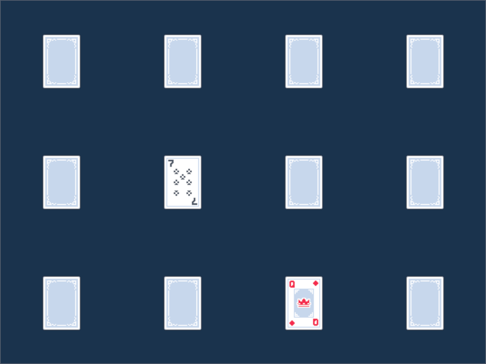

# Административни неща

* Домашно 3: https://fmi.rust-lang.bg/tasks/3
* Инструкции за проектите: https://fmi.rust-lang.bg/guides/projects

---

# Rust-shooter

Пълен код: https://github.com/AndrewRadev/rust-shooter


---

# Инсталация на ggez

Библиотеката има стабилна версия 0.5.1, но поне под линукс/X11 ударих на panic on mouseover... Това не е свързано с GGEZ, а с една от вътрешните библиотеки, но означава, че ми трябваше непубликувания `devel` branch.

--

Това, което ползвам в текущата версия на rust-shooter:

```
[dependencies]
ggez = { git = "https://github.com/ggez/ggez", rev = "3183367f397aa46fade5912fe23b53ca68b55bb4" }
```

Или, алтернативно:

```
[dependencies]
ggez = { git = "https://github.com/ggez/ggez", branch = "devel" }
```

Тази версия работи чудесно за мен, но имайте предвид, че може публикуваната документация в docs.rs да не е 100% правилна. Ползвайте `cardo doc --open`.

---

# Инсталиране от път

Допълнително, ако някой ден се озовете в ситуация, в която искате да оправите бъг локално и да ползвате тази версия, можете да си инсталирате пакет от локален път:

```
[dependencies]
ggez = { path = "/home/andrew/src/ggez" }
```

---

# Скелет на играта

Фреймуърка очаква да дефинирате ваш тип, който да имплементира трейта `ggez::event::EventHandler`:

```rust
# //ignore
struct MainState { /* ... */ }

impl event::EventHandler for MainState {
    fn update(&mut self, ctx: &mut Context) -> GameResult<()> {
        // Променяме състоянието на играта
        Ok(())
    }

    fn draw(&mut self, ctx: &mut Context) -> GameResult<()> {
        let dark_blue = graphics::Color::from_rgb(26, 51, 77);
        graphics::clear(ctx, dark_blue);
        // Рисуваме неща
        graphics::present(ctx);
        Ok(())
    }
}
```

---

# Скелет на играта

В `main` функцията създаваме инстанция на нашия тип и "контекст" (за рисуване/звуци) с конфигурация, и стартираме event loop-а:

```rust
# //ignore
pub fn main() {
    // Конфигурация:
    let conf = Conf::new().
        window_mode(WindowMode {
            min_width: 1024.0,
            min_height: 768.0,
            ..Default::default()
        });

    // Контекст и event loop
    let (mut ctx, event_loop) = ContextBuilder::new("shooter", "FMI").
        default_conf(conf.clone()).
        build().
        unwrap();

    // ... Подготвяне на ресурси, вижте следващия слайд

    // Пускане на главния loop
    let state = MainState::new(&mut ctx, conf).unwrap();
    event::run(ctx, event_loop, state);
}
```

---

# Зареждане на ресурси

За да може библиотеката да си намери картинки и звуци при компилация, добре е да добавим локалната директория "resources" (или както искаме да я наречем). Когато разпространяваме играта, тя ще търси по default папка до exe-то, която се казва "resources", но подкарвайки я с <code>cargo run</code>, е по-удобно да използваме друга:

```rust
# //ignore
// ...
// let (mut ctx, event_loop) = ...

if let Ok(manifest_dir) = env::var("CARGO_MANIFEST_DIR") {
    let mut path = path::PathBuf::from(manifest_dir);
    path.push("resources");
    ggez::filesystem::mount(&mut ctx, &path, true);
}

// let state = MainState::new(&mut ctx, &conf).unwrap();
// ...
```

---

# Update

```rust
# //ignore
fn update(&mut self, ctx: &mut Context) -> GameResult<()> {
    if self.game_over { return Ok(()); }
    const DESIRED_FPS: u32 = 60;

    while timer::check_update_time(ctx, DESIRED_FPS)? {
        let seconds = 1.0 / (DESIRED_FPS as f32);

        self.time_until_next_enemy -= seconds;
        if self.time_until_next_enemy <= 0.0 {
            // Създаваме следващия противник
            // self.time_until_next_enemy = ...;
        }

        // Обновяваме позиция на играча, на изстрелите, ...
    }
}
```

---

# Update

* Метода връща `GameResult<()>`, така че успешен край ще е `Ok(())`, а неуспешен край вероятно ще дойде от грешка в някоя от функциите за чертане, звуци, и т.н.
* Всичко се случва в цикъл, който ще се викне 60 пъти (или колкото искаме) в секунда, плавно (надяваме се).
* Затова имаме нужда от `seconds`, или `time_delta`, или както го наречете -- изминалото време в този цикъл, като части от секундата. Умножаваме тази стойност по всякакво движение, за получим равномерна промяна.
* Състоянието става на тези квантове време, така че няма как да правим продължителна промяна на състоянието -- анимации няма как да станат с "линеен" код. Променяме състоянието (играча е в състояние "стреляне", "движение", и т.н.), и движим позицията му както подобава.

---

# Update

Най-простата форма на `update` би могла да изглежда така:

```rust
# //ignore
self.position.x += self.velocity.x * seconds;
self.position.y += self.velocity.y * seconds;
```

Променяме `velocity` в зависимост от, например, задържан клавиш-стрелкичка, или в зависимост от AI-а на противниците, или както си пожелаем. Имаме пълната мощ на библиотеката [nalgebra](http://nalgebra.org/), която вероятно няма да ни трябва за много сложни неща:

```rust
# //ignore
#[derive(Debug)]
pub struct Enemy {
    position: Point2<f32>,
    velocity: Vector2<f32>,
    // ... и каквото още ни трябва ...
}
```

---

# Update

За нещастие, за да се поддържа стабилност на алгебрата, се ползва библиотеката [mint](https://crates.io/crates/mint), която е доста минимална, така че не можем да събираме точки и вектори примерно -- сметките се правят или по координати, или си имплементираме помощни средства. Или правим операции с `nalgebra::Point2` и ги конвертираме до `mint::Point2<f32>` с `.into()` като ги подаваме на ggez.

```
nalgebra = { version = "0.23.2", features = ["mint"] }
```

Алтернативна библиотека за алгебра, която май се използва в примерите днешно време, е [glam](https://docs.rs/glam/0.11.3/glam/), която също има `features = ["mint"]` за съвместимост.

---

# Input

Има още два метода, които могат да се имплементират за `event::EventHandler`:

```rust
# //ignore
fn key_down_event(&mut self,
                  _ctx: &mut Context,
                  keycode: event::KeyCode,
                  _keymod: input::keyboard::KeyMods,
                  _repeat: bool) {
    match keycode {
        event::KeyCode::Space => self.input.fire = true,
        // ... Други клавиши ...
        _ => (), // Do nothing
    }
}
```

И еквивалентния за key up ...

---

# Input

Има още два метода, които могат да се имплементират за `event::EventHandler`:

```rust
# //ignore
fn key_up_event(&mut self,
                _ctx: &mut Context,
                keycode: event::KeyCode,
                _keymod: input::keyboard::KeyMods) {
    match keycode {
        event::KeyCode::Space => self.input.fire = false,
        // ... Други клавиши ...
        _ => (), // Do nothing
    }
}
```

---

# Drawing

```rust
# //ignore
fn draw(&mut self, ctx: &mut Context) -> GameResult<()> {
    let dark_blue = graphics::Color::from_rgb(26, 51, 77);
    graphics::clear(ctx, dark_blue);

    if self.game_over {
        // Рисуваме "край на играта"
        graphics::present(ctx)?;
        return Ok(())
    }

    // Рисуваме противници, играч, куршум, и т.н.

    graphics::present(ctx)?;
    Ok(())
}
```

---

# Drawing

Просто викане на методи в модула <code>graphics::</code> Когато имаме координатите и състоянието на противници, играч, изстрели, сцена, фон, и прочее, всичко се свежда до това да извикаме методи, които казват на графичната система какво да нарисува и къде.

---

# Collision detection

Не ни трябва нищо сложно за тази конкретна игра. За всеки противник и всеки изстрел, проверяваме дали изстрела е в противника:

```rust
# //ignore
for enemy in &mut self.enemies {
    for shot in &mut self.shots {
        if enemy.bounding_rect(ctx).contains(shot.pos) {
            shot.is_alive = false;
            enemy.is_alive = false;
            self.score += 1;
            let _ = self.assets.boom_sound.play(ctx);
        }
    }
}
```

---

# Тестване

Инициализиране на контекст може да се направи само веднъж, което може да затрудни тестването. Решението е decoupling -- вместо конкретен тип, използваме trait, който можем да варираме:

```rust
# //ignore
pub trait Sprite: Debug {
    fn draw(&mut self, center: Point2<f32>, ctx: &mut Context) -> GameResult<()>;
    fn width(&self, ctx: &mut Context) -> f32;
    fn height(&self, ctx: &mut Context) -> f32;
}
```

---

# Тестване

В истинския код, имаме нещо истински използваемо, което използва assets, fonts, drawing:

```rust
# //ignore
#[derive(Debug)]
pub struct TextSprite {
    text: graphics::Text,
}

impl TextSprite {
    pub fn new(label: &str, ctx: &mut Context) -> GameResult<TextSprite> {
        let font = graphics::Font::new(ctx, "/DejaVuSerif.ttf")?;
        let mut text = graphics::Text::new(label);
        text.set_font(font, graphics::PxScale::from(18.0));
        Ok(TextSprite { text })
    }
}

impl Sprite for TextSprite {
    fn draw(&mut self, top_left: Point2<f32>, ctx: &mut Context) -> GameResult<()> {
        // ...
    }

    fn width(&self, ctx: &mut Context) -> f32 { self.text.width(ctx) }
    fn height(&self, ctx: &mut Context) -> f32 { self.text.height(ctx) }
}
```

---

# Тестване

В тестовете, спокойно можем да си сложим един "фалшив" sprite:

```rust
# //ignore
#[derive(Debug)]
struct MockSprite {
    width: u32,
    height: u32,
}

impl Sprite for MockSprite {
    fn draw(&mut self, _center: Point2<f32>, _ctx: &mut Context) -> GameResult<()> { Ok(()) }

    fn width(&self, _ctx: &mut Context) -> f32 { self.width }
    fn height(&self, _ctx: &mut Context) -> f32 { self.height }
}
```

---

# Категории игри

Обекти, които се движат по екрана и имат контакт:

* Имате "играч", "противници", "бонуси", "препятствия"...
* На `update`, обновявате къде се намират спрямо някакви правила
* На `draw`, просто ги рисувате
* Имате някакъв "collision detection", в който преценявате какъв контакт имат, всичко със всичко -- прегради, куршуми, видимост

---

# Категории игри

Игри на дъска с обекти, които движете в определена форма ([rust-memory-game](https://github.com/AndrewRadev/rust-memory-game)):



---

# Категории игри

Игри на дъска с обекти, които движете в определена форма:

* Имате някакви обекти, които са на някаква "дъска", "поле"
* Цъкате ги или имате някаква друга интеракция с тях
* В идеалния случай имате отделно логически и визуални координати. От първото се изчислява второто при рисуване.
* Проверява се за някакво специално условие и играта се променя

---

# Съвети

* Карайте стъпка по стъпка и няма да имате проблеми. Правете "актьорите" един по един, движете ги, проверявайте дали всичко е наред.
* Пишете си функции за дебъгване -- за чертаене на кутийка около противника, например, да видите дали collision-а работи като хората. За проверка къде са координатите на мишката, etc.
* Извличайте константи с добри имена: <code>PLAYER_MOVE_SPEED</code>, <code>GRAVITY_ACCELERATION</code> са добри константи, които може лесно да промените за дебъгване и натаманяване. <code>THIRTY_TWO</code> и <code>FIVE_HUNDRED</code> не са.
* Удобно е "скъпи" операции да не се случват при конструиране, а с отделен метод. Но трябва да жонглирате `Option`-и, така че е tradeoff.
* При проблеми с performance, първо пробвайте да пуснете кода с `--release`.

---

# Ресурси

* Shooter играта: [rust-shooter](https://github.com/AndrewRadev/rust-shooter)
* Memory играта (недовършена): [rust-memory-game](https://github.com/AndrewRadev/rust-memory-game)
* Примерите от документацията (astroblasto): [examples](https://github.com/ggez/ggez/blob/master/examples)
--
* Звукови ефекти: [Freesound](https://freesound.org/)
* Картинки: [Kenney](https://kenney.nl/)
--
* Лекция от RustFest Zurich: [Beyonce Brawles](https://youtu.be/str_mex__0M)
* По-генерална помощ за gamedev (множко за простичък проект, но интересно четиво in general): [Game Programming Patterns](http://gameprogrammingpatterns.com/)

---

# Други варианти за игри

## ECS

* Bevy: https://bevyengine.org/
  * also see, [bevy_crossterm](https://www.reddit.com/r/rust/comments/kli3xo/bevy_crossterm_program_terminal_games_using_bevy/)
* Amethyst: https://amethyst.rs/

--

## Минималистични, подобно на GGEZ

* Coffee: https://github.com/hecrj/coffee
* Tetra: https://github.com/17cupsofcoffee/tetra

--

## Сравнение

* Мнението на автора на GGEZ за съществуващите библиотеки: https://wiki.alopex.li/AGuideToRustGameFrameworks2019
