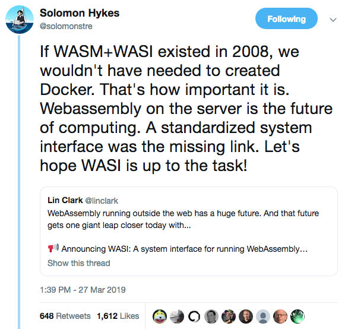

# Административни неща

- Домашно 4 приключи!
--
- Изберете си проект!

---

# Web assembly

> WebAssembly (abbreviated Wasm) is a binary instruction format for a stack-based virtual machine. Wasm is designed as a portable compilation target for programming languages, enabling deployment on the web for client and server applications.

Източник: https://webassembly.org/

---

# Web assembly

- bytecode, който се изпълнява от виртуална машина
--
- може да изпълнява сметки върху числа и не много повече
--
- няма автоматичено управление на паметта, нишки, exceptions
--
- няма достъп до външния свят - ОС, файлова система, networking

---

# Какво може да се компилира до web assembly

- за сега - основно езици с минимален runtime
--
- C, C++<sup>?</sup>, Rust

---

# Компилация на rust до wasm

- обикновенно за компилиране до wasm се използва `wasm_bindgen`
--
- но първо ще видим как се прави компилация на ръка
--
- използвайки само `cargo` и `rustc`

---

# Компилация на rust до wasm

### Крос компилация

- най-често от компилаторите се очаква да генерират код за същата платформа върху която се изпълняват
--
- но понякога искаме компилираната програма или библиотека да се изпълнява на друга платформа
--
- например пишем код за микро контролер
--
- това се нарича cross compilation

---

# Компилация на rust до wasm

### Крос компилация

- rustc използва llvm като backend за генериране на крайния код
--
- llvm поддържа задаване на платформата за която да генерира код чрез target tuple
--
- target tuple-а оказва
--
    - архитектурата на процесора (набор от процесорни инструкции)
--
    - операционната система (ако има такава)
--
    - и понякога допълнително детайли за средата в която ще се изпълнява
--
- примери
--
    - x86_64-unknown-linux-gnu
    - x86_64-pc-windows-msvc
    - aarch64-unknown-linux-gnu

---

# Компилация на rust до wasm

### Крос компилация

- web assembly се поддържа като вид "процесорна архитектура"
--
- ще използваме target `wasm32-unknown-unknown`
--
- `rustup target add wasm32-unknown-unknown`
--
- това ще ни инсталира прекомпилирана версия на стандартната rust библиотека, към която ще се линква

---

# Компилация на rust до wasm

### std и no_std

- можем да използваме `std` библиотеката, когато пишем wasm код
--
- не е нужно да се ограничаваме до `#![no_std]` - `core` и `alloc`
--
- но ако използваме функция, която не се поддържа (напр. работа с нишки) програмата ще panic-не

---

# Пример 1

### Rust до Wasm

Cargo.toml
```toml
[lib]
crate-type = ["cdylib"]
```

Трябва проекта да се компилира като библиотека.
Тази библиотека ще се зареди от javascript код и ще се използват функциите дефинирани в нея.

---

# Пример 1

### Rust до Wasm

src/lib.rs
```rust
# // ignore
#[no_mangle]
pub extern "C" fn add(a: i32, b: i32) -> i32 {
    a + b
}
```

Функцията `add` ще бъде достъпна от javascript

---

# Пример 1

### Rust до Wasm

```sh
cargo build --release --target wasm32-unknown-unknown
```

Това ше генерира `target/wasm32-unknown-unknown/release/example_01.wasm`

---

# Пример 1

### Изпълняване в уеб браузър

- нужен e статичен file server
--
- .wasm не може да се импортира от html файл, поради CORS защити
--
- трябва да се използва javascript функцията `fetch`
--
- ако имате python може да ползвате `python3 -m http.server` ([обяснение](https://pythonbasics.org/webserver/))

---

# Пример 1

### Изпълняване в уеб браузър

Сървъра ще връща следните файлове:
- index.html
- index.js
- wasm_lib.wasm

```sh
cp target/wasm32-unknown-unknown/release/example_01.wasm \
    wasm_lib.wasm
```

---

# Пример 1

### Изпълняване в уеб браузър

index.html

```html
<!DOCTYPE html>
<html>
  <head>
    <meta charset="utf-8">
    <title>Hello wasm!</title>
  </head>
  <body>
    <script src="./index.js" type="module"></script>
  </body>
</html>
```

---

# Пример 1

### Изпълняване в уеб браузър

index.js

```js
WebAssembly.instantiateStreaming(fetch('./wasm_lib.wasm'), {})
    .then(wasm => {
        // през `instance.exports` можем да достъпваме функциите,
        // които сме дефинирали в нашата библиотека.
        console.log("add(1, 2) = ", wasm.instance.exports.add(1, 2))
    })
```

---

# Пример 1

### Ограничения

- този пример работи, защото използвахме `i32`
--
- но по-сложни типове, като низове, масиви, обекти, не могат да се прехвърлят директно между js и wasm
--
- нужен е специален код от двете страни на ffi границата
--
- за това се използва `wasm-bindgen`

---

# Пример 1

### Памет

- js паметта и wasm памметта са отделни
--
- wasm няма достъп до js паметта
--
- js има достъп до wasm паметта и може да чете и пише в нея
--
- при прехвърляне на стойност между js и wasm тя трябва да се копира от едната памет в другата
--
- това отново се менежира от `wasm-bindgen`

---

# Wasm bindgen

Необходима е програмата `wasm-bindgen`, която може да се инсталира през cargo

```sh
cargo install wasm-bindgen-cli
```

Необхидима е и библиотеката `wasm-bindgen`. Cargo.toml:

```toml
[dependencies]
wasm-bindgen = { version = "0.2.69", features = ["serde-serialize"] }
```

---

# Wasm bindgen

### Използване

```sh
cargo build --release --target wasm32-unknown-unknown

wasm-bindgen target/wasm32-unknown-unknown/release/wasm_lib.wasm \
    --out-dir pkg \
    --target web
```

- копира wasm файла в `pkg/wasm_lib_bg.wasm`
- генерира js файл с wrapper-и на експортнатите функции `pkg/wasm_lib.js`
- генерира и typescript дефиниции

---

# Пример 2

```rust
# // ignore
use wasm_bindgen::prelude::*;

#[wasm_bindgen]
pub fn add_i32(a: i32, b: i32) -> i32 {
    a + b
}

#[wasm_bindgen]
pub fn add_u32(a: u32, b: u32) -> u32 {
    a + b
}

#[wasm_bindgen]
pub fn greet() -> String {
    "hello wasm".to_string()
}

// `wasm_bindgen` атрибута позволява да подаваме структурата
// на JS код като opaque тип, т.е. указател
#[wasm_bindgen]
#[derive(Debug, serde::Serialize, serde::Deserialize)]
pub struct User {
    name: String,
    age: u32,
}

#[wasm_bindgen]
impl User {
    // В този случай `User` е opaque type
    pub fn new(name: String, age: u32) -> User {
        User { name, age }
    }

    pub fn to_js_value(&self) -> JsValue {
        // Сериализира структурата до JSON и я подава на JS,
        // където ще се десериализира до JS обект
        JsValue::from_serde(self).unwrap()
    }
}
```

---

# Пример 2

```js
import { add_i32, add_u32, greet, User, default as init } from './pkg/wasm_lib.js'

init('./pkg/wasm_lib_bg.wasm')
    .then(_wasm => {
        console.log(greet())
        console.log("add_i32(-1, -2) = ", add_i32(-1, -2))  // -3
        console.log("add_u32(-1, -2) = ", add_u32(-1, -2))  // 4294967293

        const user = User.new("Иванчо", 10)
        console.log(user)               // Object { ptr: 1114144 }
        console.log(user.to_js_value()) // Object { name: "Иванчо", age: 10 }
    })
```

---

# Реален пример от истински проект

- [A Tiny, Static, Full-Text Search Engine using Rust and WebAssembly](https://endler.dev/2019/tinysearch/)
- https://github.com/tinysearch/tinysearch

---

# Импортиране на функции от wasm

Wasm модул има достъп единсвено до функции, които са му подадени експлицитно от страна на JS при създаването му.

---

# Импортиране на функции от wasm

Rust
```rust
# // ignore
extern "C" {
    pub fn setupCanvas();
}
```

Javascript
```js
function setupCanvas() { /* ... */ }

const importObject = {
    env: { setupCanvas }
}

WebAssembly.instantiateStreaming(fetch('./wasm_lib.wasm'), importObject)
    .then(wasm => {
        /// ...
    })
```

---

# Още един пример

- Triangle From Scratch / Web GL with bare Wasm
- https://rust-tutorials.github.io/triangle-from-scratch/web_stuff/web_gl_with_bare_wasm.html

---

# Инструменти за wasm

### wasm-pack

- https://rustwasm.github.io/wasm-pack/installer/
--
- или `cargo install wasm-pack`
--
- помага за интеграция с javascript света - npm, bundler-и, ...
--
- автоматизира това, което правихме досега ръчно
--
    - инсталация на target `wasm32-unknown-unknown` с `rustup`
    - компилация на rust до `.wasm`
    - `wasm-bindgen` за js binding-и
    - някои оптимизации

---

# Инструменти за wasm

### js-sys и web-sys

- https://docs.rs/js-sys
- bindings към стандартни javascript API-та

<br>

- https://docs.rs/web-sys/
- bindings към уеб и DOM API-та

---

# Оптимизации

Aко ще добавяме wasm към web страница обикновено размера на модула е по-важен критерий от скоростта му

--
```toml
[profile.release]
opt-level = "z"
lto = "thin"
codegen-units = 1
```

--
- [wasm-opt](https://github.com/WebAssembly/binaryen) - премахване на ненужни символи

--
- [wee_alloc](https://docs.rs/wee_alloc) - глобален алокатор оптимизиран за малък размер

---

# Wasm извън браузъра

Въпреки, че wasm е създаден с идеята да се използва за уеб, намира и други приложения.
Web assembly като формат притежава някои удобни свойства:

--
- сравнително прост bytecode формат
--
- поддръжка на компилация до wasm от ~~много~~ няколко езика
--
- преносим - може да се изпълнява на всякакви платформи
--
- сигурен - всички инструкции и достъпи до памет се валидират
--
- sandbox-нат - няма достъп до външния свят

---

# Wasm извън браузъра



---

# Watt

- https://github.com/dtolnay/watt
- процедурни макроси, компилирани до wasm

---

# Vscode tree sitter plugin

- https://marketplace.visualstudio.com/items?itemName=evgeniypeshkov.syntax-highlighter
- [tree sitter](https://tree-sitter.github.io/tree-sitter/) е генератор на инкрементални парсери за програмни езици
- tree sitter генерира C код по граматика
- plugin-а дистрибутира този C код, компилиран до wasm модул

---

# Lunatic

- https://github.com/lunatic-solutions/lunatic
- actor framework, използващ wasm модули като актьори
- вдъхновен от Erlang
- **много раннен етап на разработка**

