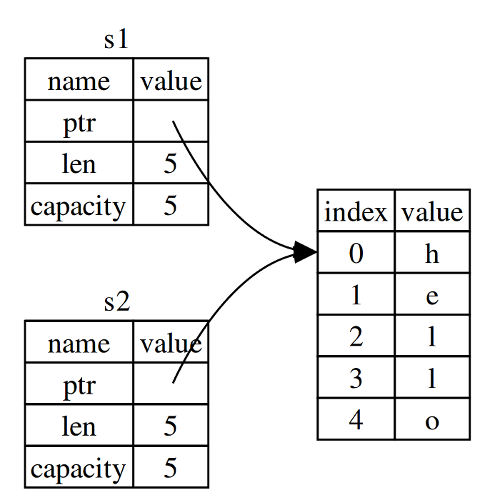
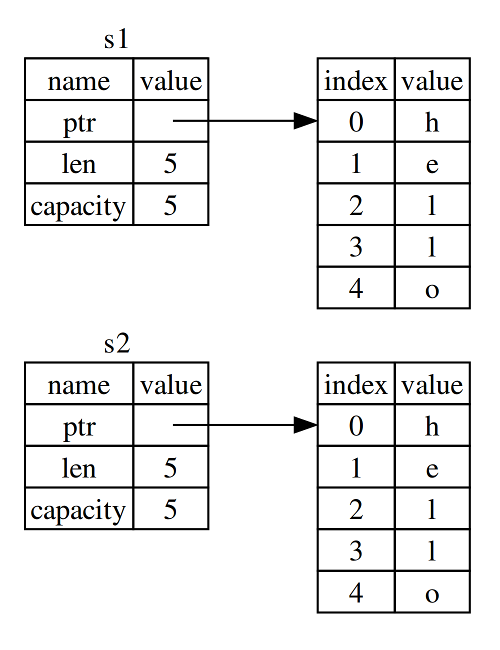
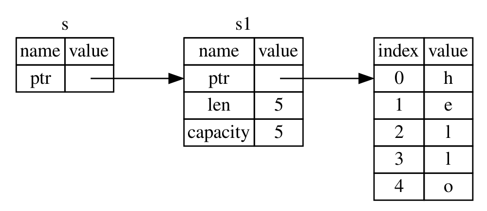

# Административни неща

- Инсталирайте си Rust: https://2017.fmi.rust-lang.bg/topics/2
--
- Елате в Discord канала: https://discord.gg/FCTNfbZ
--
- Регистрирайте се в https://fmi.rust-lang.bg!

---

# Въпрос 1

### Къде е грешката?

```rust
# // ignore
# fn main() {
let x = 3;
let y = 5_i32;

x = x + y;

println!("{}", x);
# }
```

---

# Въпрос 1

### Къде е грешката?

```rust
# // norun
# fn main() {
let x = 3;
let y = 5_i32;

x = x + y;

println!("{}", x);
# }
```

---

# Въпрос 1

### Къде е грешката?

```rust
# fn main() {
let x = 3;
let y = 5_i32;

let x = x + y;

println!("{}", x);
# }
```

---

# Въпрос 2

### Къде е грешката?

```rust
# // ignore
# fn main() {
let x = 3.14_f32 as u32;
let y = 5_i32;

let z = x + y;

println!("{}", z);
# }
```

---

# Въпрос 2

### Къде е грешката?

```rust
# // norun
# fn main() {
let x = 3.14_f32 as u32;
let y = 5_i32;

let z = x + y;

println!("{}", z);
# }
```

---

# Въпрос 2

### Къде е грешката?

```rust
# fn main() {
let x = 3.14_f32 as u32;
let y = 5_i32;

let z = (x as u8) + (y as u8);

println!("{}", z);
# }
```

---

# Преговор

* Инсталация и подкарване (`rustup`, `cargo`, Rust Playground)
--
* Документация (The Rust Book, `rustup doc`)
--
* Числа (конвертиране)
--
* Променливи (отгатване на типове, скриване на променливи, мутация)
--
* Control flow (`if`, `while`, `loop`)
--
* Функции (`fn`, връщане на стойности)
--
* Твърдения и изрази (точка-и-запетаи!)
--
* Печатане на стандартния изход (`println!("x = {}", x)`)

---

# Присвояване

```rust
# // norun
# #[allow(unused_variables)]
# fn main() {
let a = 7;
let b = a;
# }
```

---

# Присвояване

```rust
# fn main() {
let a = 7;
let b = a;

println!("a = {}, b = {}", a, b);
# }
```

---

# Присвояване

```rust
# // norun
# #[allow(unused_variables)]
# fn main() {
let a = "Hello";
let b = a;
# }
```

---

# Присвояване

```rust
# fn main() {
let a = "Hello";
let b = a;

println!("{}!", a);
println!("{} again!", b);
# }
```

---

# Присвояване

```rust
# // norun
# #[allow(unused_variables)]
# fn main() {
let s1 = String::from("Cookies!");
let s2 = s1;
# }
```

---

# Присвояване

```rust
# // ignore
let s1 = String::from("Cookies!");
let s2 = s1;

println!("{}", s1);
println!("Mmm, {}", s2);
```

---

# Присвояване

```rust
# fn main() {
let s1 = String::from("Cookies!");
let s2 = s1;

println!("{}", s1);
println!("Mmm, {}", s2);
# }
```

---

# Присвояване


---

# Разполагане в паметта

### String


---

# Разполагане в паметта

### s2 = s1

Побитово копиране на стека → двойна деалокация
--



---

# Разполагане в паметта

### s2 = s1

Копие на стека и на динамичната памет, което може да доведе до сериозно забавяне
--



---

# Семантика на местене (Move semantics)

Вместо копиране, което е скъпо в някои случаи, Rust използва семантика на местене

```rust
# fn main() {
let s1 = String::from("Cookies!");
let s2 = s1;

println!("{}", s1);
println!("Mmm, {}", s2);
# }

```
---

# Клониране

Ако все пак сме сигурни, че искаме да клонираме низа, може да използваме `clone()`
--

```rust
# fn main() {
let s1 = String::from("Cookies!");
let s2 = s1.clone();

println!("{}", s1);
println!("Mmm, {}", s2);
# }
```

---

# Низове

А защо това е проблем само при `String`, а не при литералите?

---

# Низове

%%
### Литерали

```rust
# // ignore
let s = "hello";
```

* Заделя се в статичната памет на програмата
* Непроменим (immutable)
%%
### String

```rust
# // ignore
let s = String::from("hello");
```

* Заделя се в динамичната памет
* Може да се променя (mutable)
%%

---

# Собственост и заемане


---

# Собственост и заемане

## Собственост

```rust
# // ignore
{
    let a = 123;

    // ...
}
```

--
* Променливата `a` е валидна от декларацията до края на scope-a
--

Правила

--
* Всяка стойност в Rust си има собственик (owner)
--
* Стойността може да има само един собственик по всяко едно време
--
* Когато собственикът излезе от scope, стойността се инвалидира/деалокира (подобно на деструктор)

---

# Собственост

### Функции

При подаването на аргументи към функция важат същите семантики

```rust
# #![allow(unused_variables)]
fn main() {
    let s = String::from("hello");  // Дефинираме s

    takes_ownership(s);             // Стойността на s се мести във функцията и
                                    // затова не е валидна след този ред.

} // Тук s излиза от scope, но s е преместен и не се случва нищо особено.

fn takes_ownership(some_string: String) {
    println!("{}", some_string);
} // some_string излиза от scope и се освобождава паметта.
```

---

# Собственост

### Функции

При подаването на аргументи към функция важат същите семантики

```rust
# #![allow(unused_variables)]
fn main() {
    let x = 5;                      // Дефинираме x

    makes_copy(x);                  // Тук стойността на x би се преместила във функцията,
                                    // но i32 е Copy, затова може да използваме x в последствие.

} // Тук x излиза от scope.

fn makes_copy(some_integer: i32) {
    println!("{}", some_integer);
} // some_integer излиза от scope, но не се случва нищо особено.
```

---

# Собственост

### Функции

Връщане на стойност от функция също може да прехвърля собственост

```rust
# #![allow(unused_variables)]
fn main() {
    let s1 = gives_ownership();
    let s2 = String::from("hello");
    let s3 = takes_and_gives_back(s2);
}

fn gives_ownership() -> String {
    let some_string = String::from("hello");
    some_string       // Тук местим стойността към функцията която е извикала gives_ownership
}

fn takes_and_gives_back(a_string: String) -> String {
    a_string
}
```

---

# Собственост

### Функции

```rust
# #![allow(unused_variables)]
fn main() {
    let s1 = String::from("hello");
    let (s2, len) = calculate_length(s1);

    println!("The length of '{}' is {}.", s2, len);
}

fn calculate_length(s: String) -> (String, usize) {
    let length = s.len(); // len() връща дължината на String.
    (s, length)
}
```

---

# Собственост и заемане

### Заемане (borrowing)

А какво ако искаме да използваме стойност във функция без да я местим всеки път?


---

# Собственост и заемане

### Псевдоними

```rust
# #![allow(unused_variables)]
fn main() {
    let s1 = String::from("hello");
    let len = calculate_length(&s1);

    println!("The length of '{}' is {}.", s1, len);
}

fn calculate_length(s: &String) -> usize {
    s.len()
}
```

---

# Псевдоними

### Представяне



---

# Псевдоними

### Непроменим псевдоним (immutable reference)

```rust
# // ignore
# #![allow(unused_variables)]
fn main() {
    let s = String::from("hello");
    change(&s);
    println!("{}", s);
}

fn change(some_string: &String) {
    some_string.push_str(", world");
}
```

---

# Псевдоними

### Непроменим псевдоним (immutable reference)

```rust
# #![allow(unused_variables)]
fn main() {
    let s = String::from("hello");
    change(&s);
    println!("{}", s);
}

fn change(some_string: &String) {
    some_string.push_str(", world");
}
```

---

# Псевдоними

### Променим псевдоним (mutable reference)

```rust
# #![allow(unused_variables)]
fn main() {
    let mut s = String::from("hello");
    change(&mut s);
    println!("{}", s);
}

fn change(some_string: &mut String) {
    some_string.push_str(", world");
}
```

---

# Псевдоними

Правила

* По всяко време може да съществува само едно от следните:
  * точно един mutable псевдоним
  * произволен брой immutable псевдоними
* Псевдонимите винаги са валидни

---

# Псевдоними

### Borrow checker

```rust
# // ignore
# #![allow(unused_variables)]
# fn main() {
let mut s = String::from("hello");

let r1 = &mut s;
let r2 = &mut s;
# }
```

---

# Псевдоними

### Borrow checker

```rust
# #![allow(unused_variables)]
# fn main() {
let mut s = String::from("hello");

let r1 = &mut s;
let r2 = &mut s;
# }
```

---

# Псевдоними

### Borrow checker

```rust
# #![allow(unused_variables)]
# fn main() {
let mut s = String::from("hello");

{
    let r1 = &mut s;
}

let r2 = &mut s;
# }
```

---

# Псевдоними

### Валидност

```rust
# #![allow(unused_variables)]
# fn main() {
let s1 = String::from("hello");
let r = &s1;

let s2 = s1;
# }
```

--
* псевдонимът винаги сочи към валидна инстанция (няма null псевдоним)
--
* не можем да местим инстанция докато е заета (borrowed)

---

# Псевдоними

### Валидност

```rust
# // ignore
# #![allow(unused_variables)]
# fn main() {
let r;
{
    let s = String::from("hello");
    r = &s;
}

println!("{}", r);
# }
```

---

# Псевдоними

### Валидност

```rust
# #![allow(unused_variables)]
# fn main() {
let r;
{
    let s = String::from("hello");
    r = &s;
}

println!("{}", r);
# }
```

--
Псевдонимът не може да надживее обекта, към който сочи

---

# Псевдоними

```rust
# // ignore
# #![allow(unused_variables)]
# fn main() {
let s = String::from("first");
let r = &s;

let s = String::from("second");

println!("{}", r);
println!("{}", s);
# }
```

---

# Псевдоними

```rust
# #![allow(unused_variables)]
# fn main() {
let s = String::from("first");
let r = &s;

let s = String::from("second");

println!("{}", r);
println!("{}", s);
# }
```

---

# Псевдоними

```rust
# // ignore
# #![allow(unused_variables)]
# fn main() {
let s = String::from("hello");
let s = &s;

println!("{}", s);
# }
```

---

# Псевдоними

```rust
# #![allow(unused_variables)]
# fn main() {
let s = String::from("hello");
let s = &s;

println!("{}", s);
# }
```
