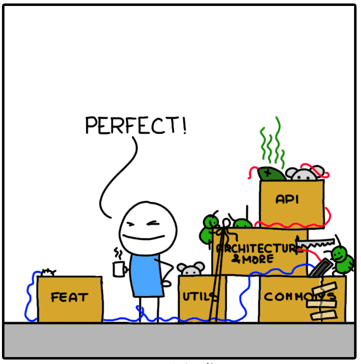

# Административни неща

--
- Инсталирайте си Rust: https://2018.fmi.rust-lang.bg/topics/2
--
- Елате в Discord канала: https://discord.gg/FCTNfbZ
--
- Регистрирайте се в https://fmi.rust-lang.bg!

---

# Съдържание

--
- преговор с допълнение
--
- структури
--
- методи
--
- модули
--
- използване на пакети от crates.io

---

# Преговор

--
- Преместване и копиране. Move semantics
--
- Собственост и заемане (Ownership & borrowing)
--
- Псевдоними (`&T` и `&mut T`)
--
- Borrow checker

---

# Преговор

### Типа String

```rust
# #![allow(unused_variables)]
# fn main() {
let mut s = String::from("hello");
s.push_str(", world");

println!("{}", s);
# }
```

---

# Преговор

### Типа &str (string slice)

```rust
# #![allow(unused_variables)]
# fn main() {
let s = String::from("hello, world");
let r1 = &s[..];
let r2 = &r1[1..4];

println!("{}", r2);
# }
```

---

# Преговор

### Tипа Vec

```rust
# #![allow(unused_variables)]
# fn main() {
let mut v = Vec::new();
v.push(1);
v.push(2);
v.push(3);

println!("{:?}", v);
# }
```

---

# Преговор

### .. и макрото vec!

```rust
# #![allow(unused_variables)]
# fn main() {
let v = vec![1, 2, 3];

println!("{:?}", v);
# }
```

---

# Неща, за които не ни стигна времето

### Типа &[T]

--
- резен от масив
--
- аналогично на &str
--
- репрезентиран като `(ptr, len)`

---

# &[T]

### Slice literal

```rust
# #![allow(unused_variables)]
# fn main() {
let slice = &[1, 2, 3];

println!("{:?}", slice);
# }
```

---

# &[T]

### Array slice

```rust
# #![allow(unused_variables)]
# fn main() {
let arr = [1, 2, 3];
let slice = &arr[..];

println!("{:?}", slice);
# }
```

---

# &[T]

### Vector slice

```rust
# #![allow(unused_variables)]
# fn main() {
let v = vec![1, 2, 3];
let slice = &v[..];

println!("{:?}", slice);
# }
```

---

# Бонус синтаксис

--
### Създаване на масиви с еднакви елементи

```rust
# #![allow(unused_variables)]
# fn main() {
let zeroed = [0, 0, 0, 0, 0, 0, 0, 0];

println!("{:?}", zeroed);
# }
```
---

# Бонус синтаксис

### Създаване на масиви с еднакви елементи

```rust
# #![allow(unused_variables)]
# fn main() {
let zeroed = [0; 8];

println!("{:?}", zeroed);
# }
```

--

Синтаксисът е `[element; count]`

---

# Бонус синтаксис

### Създаване на вектори с еднакви елементи

```rust
# #![allow(unused_variables)]
# fn main() {
let zeroed = vec![0; 8];

println!("{:?}", zeroed);
# }
```

---

# Структури


---

# Структури

### Синтаксис

```rust
# #![allow(dead_code)]
struct User {
    username: String,
    email: String,
    sign_in_count: u64,
}
# fn main() {}
```

---

# Структури

### Създаване на инстанция

```rust
# #![allow(unused_variables)]
# #![allow(dead_code)]
# struct User {
#     username: String,
#     email: String,
#     sign_in_count: u64,
# }
# fn main() {
let user = User {
    username: String::from("Иванчо"),
    email: String::from("ivan40@abv.bg"),
    sign_in_count: 10,
};
# }
```

---

# Структури

### Достъп до полета

```rust
# #![allow(unused_variables)]
# #![allow(dead_code)]
# struct User { username: String, email: String, sign_in_count: u64 }
# fn main() {
let user = User {
    username: String::from("Иванчо"),
    email: String::from("ivan40@abv.bg"),
    sign_in_count: 10,
};

println!("{}, {}", user.username, user.email);
# }
```

---

# Структури

### Достъп до полета

```rust
# #![allow(unused_variables)]
# #![allow(dead_code)]
# struct User { username: String, email: String, sign_in_count: u64 }
# fn main() {
let user = User {
    username: String::from("Иванчо"),
    email: String::from("ivan40@abv.bg"),
    sign_in_count: 10,
};

let user_ref = &user;

println!("{}, {}", user_ref.username, user_ref.email);
# }
```

--
Полетата се достъпват по същия начин и през референция

---

# Структури

### Struct update syntax

```rust
# #![allow(unused_variables)]
# #![allow(dead_code)]
# struct User { username: String, email: String, sign_in_count: u64 }
# fn main() {
let user = User {
    username: String::from("Иванчо"),
    email: String::from("ivan40@abv.bg"),
    sign_in_count: 10,
};

let hacker = User {
    email: String::from("hackerman@l33t.hax"),
    ..user
};

println!("{}, {}", hacker.username, hacker.email);
# }
```

---

# Методи и асоциирани функции

```rust
# // ignore
struct User { ... }

impl User {
    fn new(username: String, email: String) -> User {
        User {
            username: username,
            email: email,
            sign_in_count: 0,
        }
    }
}
```

--
- `struct` блока съдържа само полетата на структурата
--
- методи и функции се добавят в отделен `impl` блок

---

# Методи и асоциирани функции

```rust
# #![allow(unused_variables)]
# #![allow(dead_code)]
# struct User { username: String, email: String, sign_in_count: u64 }
# impl User {
#     fn new(username: String, email: String) -> User {
#         User { username, email, sign_in_count: 0 }
#     }
# }
# fn main() {
let user = User::new(
    String::from("Иванчо"),
    String::from("ivan40@abv.bg"),
);
# }
```

--
- функцията `new` е префиксната с името на структурата (`User`) и оператора `::`

---

# Методи и асоциирани функции

### Конструктури и деструктури

--
- в Rust няма конструктори
--
- вместо това се използват асоциирани функции
--
- често използвани имена са
  - `new`
  - `from_*`
  - `with_*`

--
<br/>
- в Rust има деструктори, но за тях ще говорим по-късно

---

# Методи и асоциирани функции

### Още един пример

```rust
# #![allow(unused_variables)]
# #![allow(dead_code)]
struct Rectangle { width: f64, height: f64 }

impl Rectangle {
    fn new(width: f64, height: f64) -> Self {
        Self { width, height }
    }

    fn area(&self) -> f64 {
        self.width * self.height
    }
}
# fn main() {}
```

---

# Методи и асоциирани функции

### Кратък синтаксис за създаване на структури

%%
```rust
# #![allow(unused_variables)]
# #![allow(dead_code)]
# struct Rectangle { width: f64, height: f64 }
# fn main() {
let width = 2.0;
let height = 3.0;

let rect = Rectangle {
    width: width,
    height: height,
};
# }
```
%%
```rust
# #![allow(unused_variables)]
# #![allow(dead_code)]
# struct Rectangle { width: f64, height: f64 }
# fn main() {
let width = 2.0;
let height = 3.0;

let rect = Rectangle {
    width,
    height,
};
# }
```
%%

---

# Методи и асоциирани функции

### Типа Self

```rust
# #![allow(unused_variables)]
# #![allow(dead_code)]
struct Rectangle { width: f64, height: f64 }

impl Rectangle {
    fn new(width: f64, height: f64) -> Self {
        Self { width, height }
    }
}
# fn main() {}
```

--
- достъпен само в `impl` блок
--
- alias на типа, за който имплементираме

---

# Методи и асоциирани функции

### Методи

```rust
# #![allow(unused_variables)]
# #![allow(dead_code)]
struct Rectangle { width: f64, height: f64 }

impl Rectangle {
    fn area(&self) -> f64 {
        self.width * self.height
    }
}
# fn main() {}
```

--
- функция, която приема като първи аргумент `self`, `&self`, `&mut self` (method receiver)
--
- `self` <=> `self: Self`
--
- `&self` <=> `self: &Self`
--
- `&mut self` <=> `self: &mut Self`

---

# Методи и асоциирани функции

### Методи

Методите могат да се използват като най-обикновена функция

```rust
# #![allow(unused_variables)]
# #![allow(dead_code)]
# struct Rectangle { width: f64, height: f64 }
# impl Rectangle {
#   fn new(width: f64, height: f64) -> Self { Self { width, height } }
#   fn area(&self) -> f64 { self.width * self.height }
# }
# fn main() {
let rect = Rectangle::new(2.0, 3.0);
let area = Rectangle::area(&rect);

println!("{}", area);
# }
```

---

# Методи и асоциирани функции

### Методи

Но могат и да се извикват със синтаксиса за методи

```rust
# #![allow(unused_variables)]
# #![allow(dead_code)]
# struct Rectangle { width: f64, height: f64 }
# impl Rectangle {
#   fn new(width: f64, height: f64) -> Self { Self { width, height } }
#   fn area(&self) -> f64 { self.width * self.height }
# }
# fn main() {
let rect = Rectangle::new(2.0, 3.0);
let area = rect.area();

println!("{}", area);
# }
```

--
- както полетата, методите се достъпват с `.`
--
- компилатора автоматично добавя `*`, `&` или `&mut`, така че аргумента да съвпадне с method receiver-а

---

# Tuple structs

Именувани кортежи

```rust
# #![allow(unused_variables)]
# fn main() {
struct Color(i32, i32, i32);
struct Point(i32, i32, i32);

let black = Color(0, 0, 0);
let origin = Point(0, 0, 0);
# }
```

---

# Tuple structs

Полетата се достъпват с `.0`, `.1`, и т.н.

```rust
# #![allow(unused_variables)]
# fn main() {
struct Color(i32, i32, i32);

let black = Color(0, 0, 0);

println!("r: {}, g: {}, b: {}", black.0, black.1, black.2);
# }
```

---

# Празни структури

```rust
# #![allow(unused_variables)]
# fn main() {
struct Electron {}
struct Proton;

let x = Electron {};
let y = Proton;
# }
```

---

# Модули

<a href="https://www.monkeyuser.com/2018/architecture/" target="_blank">
    
</a>

---

# Модули

`cargo new communicator --lib`

```sh
communicator
├── Cargo.toml
└── src
    └── lib.rs
```

---

# Модули

Модули в същия файл

```rust
# #![allow(dead_code)]
// src/lib.rs

mod network {
    fn connect() {
        // ...
    }
}

mod client {
    fn connect() {
        // ...
    }
}
# fn main() {}
```

---

# Модули

Модули в отделни файлове

```rust
# // ignore
// src/lib.rs

mod network;
mod client;
```

%%
```rust
# #![allow(dead_code)]
// src/network.rs

fn connect() {
    // ...
}
# fn main() {}
```
%%
```rust
# #![allow(dead_code)]
// src/client.rs

fn connect() {
    // ...
}
# fn main() {}
```
%%

---

# Модули

Модули в отделни файлове

```sh
communicator
├── Cargo.toml
└── src
    └── client.rs
    └── lib.rs
    └── network.rs
```

---

# Подмодули

Подмодули в същия файл

```rust
# #![allow(dead_code)]
// src/lib.rs

mod network {
    fn connect() {
        // ...
    }

    mod client {
        fn connect() {
            // ...
        }
    }
}

# fn main() {}
```

---

# Подмодули

Подмодули в отделни файлове

```rust
# // ignore
// src/lib.rs

mod network;
```

%%
```rust
# // ignore
// src/network/mod.rs

mod client;

fn connect() {
    // ...
}
```
%%
```rust
# #![allow(dead_code)]
// src/network/client.rs

fn connect() {
    // ...
}
# fn main() {}
```
%%

---

# Подмодули

Подмодули в отделни файлове

```sh
communicator
├── Cargo.toml
└── src
    └── lib.rs
    └── network
        └── client.rs
        └── mod.rs
```

--
Компилаторът търси за файловете `MOD_NAME.rs` или `MOD_NAME/mod.rs`

---

# Достъп

В модул имаме директен достъп до всичко останало дефинирано в модула

```rust
# #![allow(dead_code)]
mod client {
    fn connect() { /* ... */ }

    fn init() {
        // client::connect();
        connect();
    }
}
# fn main() {}
```

---

# Достъп

Ако искаме да използваме нещо извън модула трябва да използваме пълното име

```rust
# // ignore
# #![allow(dead_code)]
mod client {
    fn connect() { /* ... */ }
}

mod network {
    fn init() {
        ::client::connect();
    }
}
# fn main() {}
```

---

# Достъп

Ако искаме да използваме нещо извън модула трябва да използваме пълното име..

```rust
# #![allow(dead_code)]
mod client {
    fn connect() { /* ... */ }
}

mod network {
    fn init() {
        ::client::connect();
    }
}
# fn main() {}
```

---

# Достъп

.. и освен това то трябва да е публично достъпно (keyword `pub`)

```rust
# #![allow(dead_code)]
mod client {
    pub fn connect() { /* ... */ }
}

mod network {
    fn init() {
        ::client::connect();
    }
}
# fn main() {}
```

---

# Достъп

Можем да използваме `use` за да импортираме имена от друг модул

```rust
# #![allow(dead_code)]
mod client {
    pub fn connect() { /* ... */ }
}

mod network {
    use client::connect;

    fn init() {
        connect();
    }
}
# fn main() {}
```

---

# Достъп

Ако искаме да импортираме неща от подмодул, може да използваме `use self::...` за релативен път

```rust
# #![allow(dead_code)]
mod network {
    mod client {
        pub fn connect() { /* ... */ }
    }

    // еквивалентно на use network::client::connect;
    use self::client::connect;

    fn init() {
        connect();
    }
}
# fn main() {}
```

---

# Достъп: public и private

--
- по подразбиране всичко е private
--
- за да се направи нещо достъпно извън модула, в който е дефинирано, се използва `pub`
--
- винаги има достъп до нещата, които са дефинирани в текущия модул, или по-нагоре в йерархията

---

# Достъп: public и private

```rust
# // ignore
# #![allow(dead_code)]
# #![allow(unused_variables)]
mod user {
    pub struct User {
        username: String,
        email: String,
    }
}

use self::user::User;

fn main() {
    let user = User {
        username: String::from("Иванчо"),
        email: String::from("ivan40@abv.bg"),
    };
}
```

---

# Достъп: public и private

```rust
# #![allow(dead_code)]
# #![allow(unused_variables)]
mod user {
    pub struct User {
        username: String,
        email: String,
    }
}

use self::user::User;

fn main() {
    let user = User {
        username: String::from("Иванчо"),
        email: String::from("ivan40@abv.bg"),
    };
}
```

---

# Достъп: public и private

```rust
# #![allow(dead_code)]
# #![allow(unused_variables)]
mod user {
    pub struct User {
        pub username: String,
        pub email: String,
    }
}

use self::user::User;

fn main() {
    let user = User {
        username: String::from("Иванчо"),
        email: String::from("ivan40@abv.bg"),
    };
}
```

---

# Достъп: public и private

```rust
# #![allow(dead_code)]
# #![allow(unused_variables)]
mod user {
    pub struct User {
        username: String,
        email: String,
    }

    pub fn new(username: String, email: String) -> User {
        User { username, email }
    }
}

fn main() {
    let user = user::new(
        String::from("Иванчо"),
        String::from("ivan40@abv.bg"),
    );
}
```

---

# Достъп: public и private

```rust
# #![allow(dead_code)]
# #![allow(unused_variables)]
mod user {
    pub struct User {
        username: String,
        email: String,
    }

    pub mod init {
        use super::User;

        pub fn new(username: String, email: String) -> User {
            User { username, email }
        }
    }
}

fn main() {
    let user = user::init::new(
        String::from("Иванчо"),
        String::from("ivan40@abv.bg"),
    );
}
```

---

# Достъп: public и private

```rust
# #![allow(dead_code)]
# #![allow(unused_variables)]
mod user {
    mod user {
        pub struct User {
            username: String,
            email: String,
        }
    }

    pub mod init {
        use super::user::User;

        pub fn new(username: String, email: String) -> User {
            User { username, email }
        }
    }
}
# fn main() {}
```

---

# Пакети

<a href="https://www.monkeyuser.com/2018/refactoring/" target="_blank">
    
</a>

---

# Пакети

Ще си направим игра за отгатване на число

```bash
cargo new number_guessing_game --bin
```

---

# Пакети

- трябва ни генератор на случайни числа
--
- в стандартната библиотека няма такъв
--
- https://crates.io/
--
- https://crates.io/crates/rand

---

# Cargo.toml

```toml
[package]
name = "number_guessing_game"
version = "0.1.0"
authors = ["Nikola Stoyanov <ns.barzakov@gmail.com>"]

[dependencies]
```

---

# Cargo.toml

```toml
[package]
name = "number_guessing_game"
version = "0.1.0"
authors = ["Nikola Stoyanov <ns.barzakov@gmail.com>"]

[dependencies]
rand = "0.5.5"
```

---

# Използване

```rust
# //ignore
extern crate rand;

// ...
```

--
`cargo build`

---

# Документация

- https://docs.rs/ - документация за всички пакети от crates.io
--
- https://docs.rs/rand/

---

# Имплементация

Live demo
