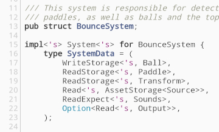

# Административни неща

--
- OpenFest
--
<br/>
- Rust 1.30
--
- `rustup update`
--
- [блог пост](https://blog.rust-lang.org/2018/10/25/Rust-1.30.0.html)

---

# Преговор

--
- конвертиране: `From`, `Into`
--
- парсене на низове: `FromStr, str::parse`
--
- error handling: `Result`
--
- error handling: `panic!`
--
- error handling: `try!`, оператор `?`
--
- IO: `Read`, `Write`, `BufRead`, `BufWrite`

---

# Lifetimes

---

# Виждали сме lifetimes

- `&'static str`
--
- `&'a [u8]`
--
<br/>


---

# Жизнени цикли

Виждали сме как работи borrow checker-а

```rust
# #![allow(unused_variables)]
# fn main()
{
    let x = 5;
    let r = &x;

    println!("{}", r);
}
```

---

# Жизнени цикли

Виждали сме как работи borrow checker-а

```rust
# #![allow(unused_variables)]
# fn main()
{
    let r = {
        let x = 5;
        &x
    };

    println!("{}", r);
}
```

---

# Жизнени цикли

Виждали сме как работи borrow checker-а

```rust
# #![allow(unused_variables)]
# fn main()
{
    let x = 5;
    let r1 = &x;
    let r2 = &*r1;

    println!("{}", r2);
}
```

---

# Жизнени цикли

Ами сега?

```rust
# // ignore
# fn main()
{
    let x = 5;

    let r2 = {
        let r1 = &x;
        &*r1
    };

    println!("{}", r2);
}
```

---

# Жизнени цикли

Ами сега?

```rust
# #![allow(unused_variables)]
# fn main()
{
    let x = 5;

    let r2 = {
        let r1 = &x;
        &*r1
    };

    println!("{}", r2);
}
```

Очевидно работи, но защо?

---

# Жизнени цикли

Защо работи?

```rust
# #![allow(unused_variables)]
# // norun
# fn main()
{
    let x = 5;          // -------+-- x
                        //        |
    let r2 = {          //        |
        let r1 = &x;    // ----+--|-- r1
        &*r1            // -+--|--|-- r2
    };                  // -|--+  |
                        //  |     |
    println!("{}", r2); //  |     |
                        // -+     |
}                       // -------+
```

--
- променливата `x` живее от ред 2 до ред 11
--
- променливите `r1` и `r2` са валидни за синтактичните scope-ове в които са дефинирани

---

# Жизнени цикли

Защо работи?

```rust
# #![allow(unused_variables)]
# // norun
# fn main()
{
    let x = 5;          // -------+-- x
                        //        |
    let r2 = {          //        |
        let r1 = &x;    // ----+--|-- *r1
        &*r1            // -+--|--|-- *r2
    };                  //  |  |  |
                        //  |  |  |
    println!("{}", r2); //  |  |  |
                        //  |  |  |
}                       // -+--+--+
```

--
- стойността към която сочи `r1` живее колкото `x`
--
- `*r1` живее колкото `x`
--
- `&*r1` създава псевдоним, който живее колкото `x`

---

# Жизнени цикли и функции

Какво става ако имаме функция

```rust
# // ignore
fn longer(x: &str, y: &str) -> &str {
    if x.len() >= y.len() {
        x
    } else {
        y
    }
}
# fn main() {}
```

---

# Жизнени цикли и функции

Какво става ако имаме функция

```rust
# #![allow(dead_code)]
fn longer(x: &str, y: &str) -> &str {
    if x.len() >= y.len() {
        x
    } else {
        y
    }
}
# fn main() {}
```

---

# Жизнени цикли и функции

Колко трябва да живее стойността, към която сочи `result`?

```rust
# #![allow(unused_variables)]
# fn longer<'a>(a: &'a str, b: &'a str) -> &'a str { a }
# fn main()
{
    let s1 = String::from("long string is long");
    {
        let s2 = String::from("short string");
        let result = longer(s1.as_str(), s2.as_str());
    }
}
```

--
- `result` е псевдоним, значи сочи към стойност
--
- но не знаем колко живее тази стойност
--
- ако `s1` е по-големият низ, `result` трябва да живее колкото него
--
- ако `s2` е по-големият низ, `result` трябва да живее колкото него
--
- но borrow checker-а работи по време на компилация

---

# Lifetime анотации

```rust
# #![allow(unused_variables)]
# #![allow(dead_code)]
fn longer<'a>(x: &'a str, y: &'a str) -> &'a str {
    if x.len() >= y.len() {
        x
    } else {
        y
    }
}
# fn main() {}
```

--
- `'а` се нарича lifetime анотация
--
- специален вид generic параметър
--
- означава scope (не задължително синтактичен), за който живее някоя стойност

---

# Lifetime анотации

```rust
# #![allow(unused_variables)]
# #![allow(dead_code)]
fn foo<'a>(x: &'a str) { }
# fn main() {}
```

--
- отделно `x: &'a str` не дава информация
--
- стойността зад `x` живее в някакъв scope, който сме кръстили `'a`
--
- няма как да означим, че `'a` e определен scope

--
```rust
# #![allow(unused_variables)]
# #![allow(dead_code)]
fn foo<'a>(x: &'a str, y: &'a str) { }
# fn main() {}
```

--
- заедно `x: &'a str` и `y: &'a str` задават ограничение
--
- стойностите зад `x` и `y` трябва да живеят едновременно в scope `'a`
--
- при извикване компилатора ще намери най-големия такъв scope, ако съществува

---

# Lifetime анотации

```rust
# // norun
# #![allow(unused_variables)]
fn longer<'a>(x: &'a str, y: &'a str) -> &'a str {
    if x.len() >= y.len() { x } else { y }
}

# fn main()
{
    let s1 = String::from("long string is long");       // ----+-- s1
    {                                                   //     |
        let s2 = String::from("short string");          // --+-|-- s2, 'a
        let result = longer(s1.as_str(), s2.as_str());  //   | |
        println!("The longer string is: {}", result);   //   | |
    }                                                   // --+ |
}                                                       // ----+
```

---

# Lifetime анотации

```rust
# // norun
# #![allow(unused_variables)]
fn longer<'a>(x: &'a str, y: &'a str) -> &'a str {
    if x.len() >= y.len() { x } else { y }
}

# fn main()
{
    let s1 = String::from("long string is long");       // ----+-- s1
    let result = {                                      //     |
        let s2 = String::from("short string");          // --+-|-- s2, 'a
        longer(s1.as_str(), s2.as_str())                //   | |
    };                                                  // --+ |
    println!("The longer string is: {}", result);       //     |
}                                                       // ----+
```

---

# Lifetime анотации

Не е задължително всички lifetime-и да са еднакви

```rust
# #![allow(unused_variables)]
# #![allow(dead_code)]
fn first_occurrence<'a, 'b>(s: &'a str, pattern: &'b str) -> Option<&'a str> {
    s.matches(pattern).next()
}
# fn main() {}
```

---

# Lifetime elision

Виждали сме и функции, които връщат референция и не използват lifetime анотации

```rust
# #![allow(unused_variables)]
# #![allow(dead_code)]
fn trim(s: &str) -> &str {
    // ...
#   unimplemented!()
}
# fn main() {}
```

Защо в някои случаи работи, а в други не?

---

# Lifetime elision

Следните дефиниции са еквивалентни:

%%
```rust
# #![allow(unused_variables)]
# #![allow(dead_code)]
fn trim(s: &str) -> &str {
    // ...
#   unimplemented!()
}
# fn main() {}
```
%%
```rust
# #![allow(unused_variables)]
# #![allow(dead_code)]
fn trim<'a>(s: &'a str) -> &'a str {
    // ...
#   unimplemented!()
}
# fn main() {}
```
%%

--
- всяка референция винаги има lifetime
--
- когато ситуацията не е двусмислена, можем да ги пропуснем и компилаторът сам ще ги добави
--
- това се нарича lifetime elision

---

# Lifetime elision

### Кога трябва да пишем lifetimes?

--
- блок код
    - никога
    - компилаторът винаги има всичката нужна информация да определи правилния lifetime

--
<br/>
- дефиниция на функция
    - понякога
    - тук се прилага lifetime elision

--
<br/>
- структура
    - винаги

---

# Lifetime elision

### Как работи

За всеки пропуснат lifetime в аргументите се добавя lifetime параметър

```rust
# // ignore
fn print(s: &str);                                  // elided
fn print<'a>(s: &'a str);                           // expanded

fn foo(x: (&u32, &u32), y: usize);                  // elided
fn foo<'a, 'b>(x: (&'a u32, &'b u32), y: usize);    // expanded
```

---

# Lifetime elision

### Как работи

Ако за аргументите има само един lifetime параметър (експлицитен или пропуснат), този lifetime се налага на всички пропуснати lifetimes в резултата

```rust
# // ignore
fn substr(s: &str, until: usize) -> &str;                         // elided
fn substr<'a>(s: &'a str, until: usize) -> &'a str;               // expanded

fn split_at(s: &str, pos: usize) -> (&str, &str);                 // elided
fn split_at<'a>(s: &'a str, pos: usize) -> (&'a str, &'a str);    // expanded
```

---

# Lifetime elision

### Как работи

Ако първият аргумент е `&self` или `&mut self`, неговият lifetime се налага на всички пропуснати lifetimes в резултата

```rust
# // ignore
fn get_mut(&mut self) -> &mut T;                                // elided
fn get_mut<'a>(&'a mut self) -> &'a mut T;                      // expanded

fn args(&mut self, args: &[T]) -> &mut Self;                    // elided
fn args<'a, 'b>(&'a mut self, args: &'b [T]) -> &'a mut Self;   // expanded
```

---

# Lifetime elision

### Как работи

Във всички останали случаи е грешка да пропуснем lifetime-а.

```rust
# #![allow(unused_variables)]
# #![allow(dead_code)]
fn get_str() -> &str {
    // ...
#   unimplemented!()
}

fn longest(x: &str, y: &str) -> &str {
    // ...
#   unimplemented!()
}
# fn main() {}
```

---

# Lifetime coersion

Променливите автоматично минават от по-голям към по-малък lifetime, ако се налага

```rust
# #![allow(dead_code)]
# #![allow(unused_variables)]
fn longer<'a>(x: &'a str, y: &'a str) -> &'a str {
    if x.len() >= y.len() { x } else { y }
}

# fn main() {
let s1 = "long string is long";         // &'static str

{
    let string = String::from("short"); // --+- 'a
    let s2 = string.as_str();           // --+- &'a str
    let result = longer(s1, s2);        //   |  s1: &'static str -> &'a str
}                                       // --+
# }
```

---

# Статичен живот


---

# Статичен живот

Специалният lifetime `'static`.

Оказва че променливата живее за целия живот на програмата.

```rust
# #![allow(unused_variables)]
# fn main() {
let s: &'static str = "I have a static lifetime.";
# }
```

---

# Референции в структури

Нека имаме структура, която връща думите от текст.

```rust
# // ignore
struct Words {
    text: ??,
}

impl Words {
    fn new(text: &str) -> Words {
        unimplemented!()
    }

    fn next_word(&mut self) -> &str {
        unimplemented!()
    }
}
```

--
- какъв да е типа на полето `text`?
--
- може да е тип който държи стойност, като `String`, но тогава ще имаме излишно копиране
--
- а може и да е референция

---

# Референции в структури

```rust
# #![allow(dead_code)]
struct Words {
    text: &str,
}
# fn main() {}
```

---

# Референции в структури

```rust
# #![allow(dead_code)]
struct Words<'a> {
    text: &'a str,
}
# fn main() {}
```

---

# Референции в структури

Съответно трябва да добавим lifetime параметъра и към `impl` блока

```rust
# #![allow(dead_code)]
#[derive(Debug)]
struct Words<'a> {
    text: &'a str,
}

impl<'a> Words<'a> {
    fn new(text: &str) -> Words {
        Words { text }
    }
}
# fn main() {}
```

---

# Референции в структури

Животът на структурата е ограничен до това колко живее обектът, от който сме взели референция

```rust
# #![allow(dead_code)]
# #[derive(Debug)]
# struct Words<'a> {
#     text: &'a str,
# }
# impl<'a> Words<'a> {
#     fn new(text: &str) -> Words {
#         Words { text }
#     }
# }
# fn main() {
let t1 = Words::new("a b c");                // Words<'static>

let t2 = {
    let s = String::from("мой таен низ");   // ---+- 'a
    Words::new(s.as_str())                  //    |- Words<'a>
};                                          // ---+

println!("{:?}", t1);
println!("{:?}", t2);
# }
```

---

# Lifetime elision в impl блок

Как се попълват пропуснатите lifetimes за функцията `new`?

```rust
# #![allow(dead_code)]
# struct Words<'a> {
#     text: &'a str,
# }
impl<'a> Words<'a> {
    fn new(text: &str) -> Words {
        Words { text }
    }
}
# fn main() {}
```

---

# Lifetime elision в impl блок

Expanded:

```rust
# #![allow(dead_code)]
# struct Words<'a> {
#     text: &'a str,
# }
impl<'a> Words<'a> {
    fn new<'b>(text: &'b str) -> Words<'b> {
        Words { text }
    }
}
# fn main() {}
```

--
- aлгоритъмът не взима под внимание lifetime-а `'a`
--
- пропуснати lifetime параметри на структури се попълват по същия начин като референциите

---

# Lifetime elision в impl блок

Ами ако използваме `Self`?

```rust
# // ignore
# #![allow(dead_code)]
# struct Words<'a> {
#     text: &'a str,
# }
impl<'a> Words<'a> {
    fn new(text: &str) -> Self {
        Words { text }
    }
}
# fn main() {}
```

---

# Lifetime elision в impl блок

Ами ако използваме `Self`?

```rust
# #![allow(dead_code)]
# struct Words<'a> {
#     text: &'a str,
# }
impl<'a> Words<'a> {
    fn new(text: &str) -> Self {
        Words { text }
    }
}
# fn main() {}
```

---

# Lifetime elision в impl блок

В случая `Self` означава `Words<'a>`:

```rust
# // ignore
# #![allow(dead_code)]
# struct Words<'a> {
#     text: &'a str,
# }
impl<'a> Words<'a> {
    fn new(text: &str) -> Words<'a> {
        Words { text }
    }
}
# fn main() {}
```

--

Expanded:

```rust
# // ignore
# #![allow(dead_code)]
# struct Words<'a> {
#     text: &'a str,
# }
impl<'a> Words<'a> {
    fn new<'b>(text: &'b str) -> Words<'a> {
        Words { text }
    }
}
# fn main() {}
```

---

# Lifetime elision в impl блок

В случая `Self` означава `Words<'a>`:

```rust
# // ignore
# #![allow(dead_code)]
# struct Words<'a> {
#     text: &'a str,
# }
impl<'a> Words<'a> {
    fn new(text: &str) -> Words<'a> {
        Words { text }
    }
}
# fn main() {}
```

Expanded:

```rust
# #![allow(dead_code)]
# struct Words<'a> {
#     text: &'a str,
# }
impl<'a> Words<'a> {
    fn new<'b>(text: &'b str) -> Words<'a> {
        Words { text }
    }
}
# fn main() {}
```

---

# Lifetime elision в impl блок

Ако искаме да използваме `Self`, правилния вариант е:

```rust
# #![allow(dead_code)]
# struct Words<'a> {
#     text: &'a str,
# }
impl<'a> Words<'a> {
    fn new(text: &'a str) -> Self {
        Words { text }
    }
}
# fn main() {}
```

---

# Имплементация на `next_word` метода

Live demo

---

# Имплементация на `next_word` метода

Финален код (с добавени `Option`-и)

```rust
# #![allow(dead_code)]
# #![allow(unused_variables)]
#[derive(Debug)]
struct Words<'a> {
    text: Option<&'a str>,
}

impl<'a> Words<'a> {
    fn new(text: &'a str) -> Self {
        Words { text: Some(text) }
    }

    fn next_word(&mut self) -> Option<&str> {
        let text = self.text?;
        let mut iter = text.splitn(2, char::is_whitespace);

        match (iter.next(), iter.next()) {
            (Some(word), rest) => {
                self.text = rest;
                Some(word)
            },
            _ => unreachable!()
        }
    }
}
# fn main() {}
```

---

# Имплементация на `next_word` метода

Всичко работи, но дали имаме правилните lifetimes?

```rust
# #![allow(dead_code)]
# #![allow(unused_variables)]
# #[derive(Debug)]
# struct Words<'a> {
#     text: Option<&'a str>,
# }
# impl<'a> Words<'a> {
#     fn new(text: &'a str) -> Self {
#         Words { text: Some(text) }
#     }
#     fn next_word(&mut self) -> Option<&str> {
#         let text = self.text?;
#         let mut iter = text.splitn(2, char::is_whitespace);
#         match (iter.next(), iter.next()) {
#             (Some(word), rest) => {
#                 self.text = rest;
#                 Some(word)
#             },
#             _ => unreachable!()
#         }
#     }
# }
fn hello() -> &'static str {
    let mut words = Words::new("hello world");
    words.next_word().unwrap()
}
# fn main() {}
```

---

# Имплементация на `next_word` метода

Това става, защото резултата от `next_word` има lifetime колкото `self` (`'b`).

```rust
# #![allow(dead_code)]
# #![allow(unused_variables)]
# #[derive(Debug)]
# struct Words<'a> {
#     text: Option<&'a str>,
# }
impl<'a> Words<'a> {
    fn next_word<'b>(&'b mut self) -> Option<&'b str> {
        let text = self.text?;
        let mut iter = text.splitn(2, char::is_whitespace);

        match (iter.next(), iter.next()) {
            (Some(word), rest) => {
                self.text = rest;
                Some(word)
            },
            _ => unreachable!()
        }
    }
}
# fn main() {}
```

---

# Имплементация на `next_word` метода

Вместо това може да върнем резултат с lifetime-а на оригиналния низ в полето `text` (`'a`).

```rust
# #![allow(dead_code)]
# #![allow(unused_variables)]
# #[derive(Debug)]
# struct Words<'a> {
#     text: Option<&'a str>,
# }
# impl<'a> Words<'a> {
#     fn new(text: &'a str) -> Self {
#         Words { text: Some(text) }
#     }
# }
impl<'a> Words<'a> {
    fn next_word(&mut self) -> Option<&'a str> {
        let text = self.text?;
        let mut iter = text.splitn(2, char::is_whitespace);

        match (iter.next(), iter.next()) {
            (Some(word), rest) => {
                self.text = rest;
                Some(word)
            },
            _ => unreachable!()
        }
    }
}

fn hello() -> &'static str {
    let mut words = Words::new("hello world");
    words.next_word().unwrap()
}

fn main() {
    println!("{}", hello());
}
```

---

# Lifetime bounds

### Релацията "надживява"

--
- `'a: 'b`
--
- `'а ≥ 'b`

--
<br/>
- `T: 'b`
--
- `T` живее поне колкото `'b`

---

# Lifetime bounds

### Релацията "надживява" за структури

- ако `T` е owning type (няма референции към други стойности), то `T: 'static`
--
- `u8: 'static`
--
- `String: 'static`

--
<br/>
- ако `T` е референция `&'a U`, или съдържа такава, то `T: 'a`
--
- `&'a str: 'a`
--
- `&'static str: 'static`

---

# Lifetime bounds

### Quirks

```rust
# #![allow(dead_code)]
struct Foo<'a, T> {
    r: &'a T,
}
# fn main() {}
```

---

# Lifetime bounds

### Quirks

```rust
# #![allow(dead_code)]
struct Foo<'a, T: 'a> {
    r: &'a T,
}
# fn main() {}
```

---

# Дреболийки

### Повече референции

- можем да имаме повече от една референция

```rust
# #![allow(dead_code)]
struct TwoRefs<'a, 'b> {
    text1: &'a str,
    text2: &'b str,
}
# fn main() {}
```

---

# Дреболийки

### Повече референции

- структурата живее колкото най-малкия lifetime
- затова обикновено е безсмислено да има повече от един lifetime параметър за структура

```rust
# #![allow(dead_code)]
struct TwoRefs<'a> {
    text1: &'a str,
    text2: &'a str,
}
# fn main() {}
```

---

# Дреболийки

### Lifetimes and generics

Aко ни се наложи да декларираме lifetimes и generics заедно, редът на декларация е `lifetimes` преди `generics`

```rust
# #![allow(dead_code)]
struct Words<T, 'a> {
    text: &'a str,
    count: T
}
# fn main() {}
```

---

# Дреболийки

### Lifetimes and generics

Aко ни се наложи да декларираме lifetimes и generics заедно, редът на декларация е `lifetimes` преди `generics`

```rust
# #![allow(dead_code)]
struct Words<'a, T> {
    text: &'a str,
    count: T
}
# fn main() {}
```
