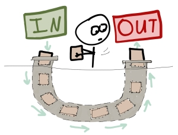

# Административни неща

- Направете си първо предизвикателство!

---

# Преговор

--
- lifetimes
--
- lifetime анотации
--
- lifetime elision

```rust
# #![allow(unused_variables)]
# #![allow(dead_code)]
// Резултатът е свързан с първия аргумент
fn find_substring<'a>(text: &'a str, query: &str) -> Option<&'a str>
# { unimplemented!() }

// Резултатът е свързан и с двата аргумента
// (може кой да е от двата да е резултат)
fn longest<'a>(first: &'a str, second: &'a str) -> &'a str
# { unimplemented!() }
# fn main() {}
```

---

# Преговор

--
- lifetimes в структури
--
- lifetimes в поле на структурата
--
- lifetimes в impl блок
--

```rust
# #![allow(dead_code)]
struct Words<'a> {
    text: &'a str,
}

impl<'a> Words<'a> {
    fn new(text: &str) -> Words {
        Words { text }
    }
}
# fn main() {}
```

---

# Често използвани типажи

--
* В стандартната библиотека са дефинирани много често използвани типажи
--
* Голяма част от rust екосистемата разчита на тях
--
* Само ние можем да имплементираме стандартните trait-ове за наши типове
--
* Затова е добре да имплементираме всички стандартни trait-ове, които можем

---

# Често използвани типажи

### Списък

* Copy
* Clone
* Eq
* PartialEq
* Ord
* PartialOrd
* Hash
* Debug
* Display
* Default

---

# Clone

```rust
# // ignore
trait Clone {
    fn clone(&self) -> Self;

    fn clone_from(&mut self, source: &Self) { ... }
}
```

--
* Създава копие на обекта
--
* Позволява да си дефинираме собствена логика за копирането
--
* Поддържа `#[derive(Clone)]`, ако всички полета имплементират `Clone`
--
* derive извиква `clone` на всички полета рекурсивно
--
* Рядко ще се налага да правим ръчна имплементация на `Clone`, защото не работим с гола памет!

---

# Copy

```rust
# // ignore
trait Copy: Clone { }
```

--
* Marker trait
--
* Показва, че стойността може да се копира чрез копиране на паметта байт по байт
--
* т.е. `memcopy`
--
* Променя се семантиката за присвояване на стойност от преместване (move) на копиране (copy)
--
* Supertrait `Clone`
--
* Може да се добави с `#[derive(Copy)]`

--

Можем да имплементираме Copy само ако:

--
* всички полета са `Copy`
--
* типа няма дефиниран деструктор (т.е. не е `Drop`)

---

# Drop

```rust
# // ignore
pub trait Drop {
    fn drop(&mut self);
}

```

--
* Позволява да дефинираме деструктори
--
* Метода се извиква автоматично, когато обекта излезе от scope
--
* Не може да се извика ръчно
--
* Можем да използваме `std::mem::drop` за да "накараме" drop-ване (просто move-ва стойността в себе си и приключва)

---

# Default

```rust
# // ignore
trait Default {
    fn default() -> Self;
}
```

--
* Позволява създаване на обект със стойност по подразбиране
--
* Може да се добави с `#[derive(Default)]`, ако всички полета имплементират `Default`
--
* Q: `Default` или `fn new() -> Self`
--
* A: и двете

---

# Hash

--
* Използва се от типове и функции, които използват хеширане
--
* Например ключовете на `HashMap` и `HashSet`
--
* Може да се добави с `#[derive(Hash)]`, ако всички полета имплементират `Hash`
--
* Няма да показваме ръчна имплементация

---

# Display & Debug

```rust
# use std::fmt::{self, Display, Formatter};
# impl Display for MagicTrick {
#     fn fmt(&self, f: &mut Formatter) -> fmt::Result {
#         write!(f, "Магически трик {:?}", self.description)
#     }
# }
# #[derive(Debug)]
struct MagicTrick {
    description: String,
    secrets: Vec<String>,
    skills: Vec<String>
}
# fn main() {
let trick = MagicTrick {
    description: String::from("Изчезваща монета"),
    secrets: vec![String::from("Монетата се прибира в ръкава")],
    skills: vec![String::from("Бързи ръце"), String::from("Заблуда")]
};

println!("{}", trick);
println!("===");
println!("{:?}", trick);
# }
```

---

# Display

--
* Използва се за форматиране на стойност, която ще се показва на потребителя
--
* Не може да се derive-не за разлика от `Debug`
--
* Използва се от placeholder-a `{}`

---

# Display

```rust
# #![allow(dead_code)]
# struct MagicTrick { description: String }
# fn main() {}
use std::fmt::{self, Display, Formatter};

impl Display for MagicTrick {
    fn fmt(&self, f: &mut Formatter) -> fmt::Result {
        write!(f, "Магически трик {:?}", self.description)
    }
}
```

---

# Display

Нека да разбием примера и да видим какво oзначават новите неща

---

# Макрос write

```rust
# #![allow(dead_code)]
# // ignore
write!(f, "Магически трик {:?}", self.description)
```

--
* Подобно на `print!` и `format!`
--
* Записва форматиран текст в структура, която имплементира `std::fmt::Write` или `std::io::Write`

---

# Display

```rust
# #![allow(dead_code)]
# use std::fmt::{self, Display, Formatter};
# impl Display for MagicTrick {
#     fn fmt(&self, f: &mut Formatter) -> fmt::Result {
#         write!(f, "Магически трик {:?}", self.description)
#     }
# }
struct MagicTrick {
    description: String,
    secrets: Vec<String>,
    skills: Vec<String>
}
# fn main() {
let trick = MagicTrick {
    description: String::from("Изчезваща монета"),
    secrets: vec![String::from("Монетата се прибира в ръкава")],
    skills: vec![String::from("Бързи ръце"), String::from("Заблуда")]
};

println!("{}", trick);
# }
```

---

# Debug

--
* Използва се за форматиране на стойност, която ще се показва само с цел debug
--
* Както знаете `#[derive(Debug)]` имплементира версия по подразбиране
--
* Използва се от placeholder-a `{:?}`

---

# Debug

```rust
# #![allow(dead_code)]
# fn main() {}
# struct MagicTrick {
#     description: String,
#     secrets: Vec<String>,
#     skills: Vec<String>
# }
use std::fmt::{self, Debug, Formatter};

impl Debug for MagicTrick {
    fn fmt(&self, f: &mut Formatter) -> fmt::Result {
        write! {
            f,
r#"Трик
Описание: {:?}
Тайни: {:?}
Умения: {:?}
"#,
            self.description,
            self.secrets,
            self.skills
        }
    }
}
```

---

# Display & Debug

```rust
# #![allow(dead_code)]
# use std::fmt::{self, Display, Debug, Formatter};
# impl Display for MagicTrick {
#     fn fmt(&self, f: &mut Formatter) -> fmt::Result {
#         write!(f, "Магически трик {:?}", self.description)
#     }
# }
# impl Debug for MagicTrick {
#     fn fmt(&self, f: &mut Formatter) -> fmt::Result {
#         write! { f,
# r#"Трик
# Описание: {:?}
# Тайни: {:?}
# Умения: {:?}
# "#,
#             self.description, self.secrets, self.skills
#         }
#     }
# }
struct MagicTrick {
    description: String,
    secrets: Vec<String>,
    skills: Vec<String>
}
# fn main() {
let trick = MagicTrick {
    description: String::from("Изчезваща монета"),
    secrets: vec![String::from("Монетата се прибира в ръкава")],
    skills: vec![String::from("Бързи ръце"), String::from("Заблуда")]
};

println!("{}", trick);
println!("===");
println!("{:?}", trick);
# }
```

---

# Предефиниране на оператори

Операторите се дефинират с trait-ове

Видяхме trait-а Add, с който дефинираме оператора +

```rust
# // ignore
trait Add<RHS = Self> {
    type Output;

    fn add(self, rhs: RHS) -> Self::Output;
}
```

---

# Предефиниране на оператори

### Примери

* `Add`, `Sub`, `Mul`, `Div`, `Rem`
* `BitAnd`, `BitOr`, `BitXor`, `Shl`, `Shr`
* `*Assign` (`AddAssign`, `SubAssign`, и т.н.)
* `Neg`, `Not`
* `Index`
* `IndexMut`

---

# Предефиниране на оператори

### PartialEq

```rust
# // ignore
trait PartialEq<Rhs = Self> where Rhs: ?Sized {
    fn eq(&self, other: &Rhs) -> bool;

    fn ne(&self, other: &Rhs) -> bool { ... }
}

```

--
* Дефинира операторите `==` и `!=`
--
* Не е задължително `a == a` да върне `true`
--
* `assert_eq!(::std::f64::NAN == ::std::f64::NAN, false);`

---

# Предефиниране на оператори

### Eq

```rust
# // ignore
trait Eq: PartialEq<Self> { }
```

--
* Marker trait
--
* Задължава `a == a` да е `true`

---

# Предефиниране на оператори

### PartialOrd

```rust
# // ignore
trait PartialOrd<Rhs = Self>: PartialEq<Rhs> where Rhs: ?Sized {
    fn partial_cmp(&self, other: &Rhs) -> Option<Ordering>;

    fn lt(&self, other: &Rhs) -> bool { ... }
    fn le(&self, other: &Rhs) -> bool { ... }
    fn gt(&self, other: &Rhs) -> bool { ... }
    fn ge(&self, other: &Rhs) -> bool { ... }
}

enum Ordering {
    Less,
    Equal,
    Greater,
}
```

---

# Предефиниране на оператори

### PartialOrd

Дефинира операторите `< <= > >=`

PartialOrd дефинира частична наредба

```rust
# fn main() {
assert_eq!(::std::f64::NAN < 0.0, false);
assert_eq!(::std::f64::NAN >= 0.0, false);
# }
```

---

# Предефиниране на оператори

### Ord

```rust
# // ignore
trait Ord: Eq + PartialOrd<Self> {
    fn cmp(&self, other: &Self) -> Ordering;

    fn max(self, other: Self) -> Self { ... }
    fn min(self, other: Self) -> Self { ... }
}
```

Дефинира тотална наредба т.е само едно от `a < b`, `a == b`, `a > b` е изпълнено.

---

# Итератори



---

# Итератори

Итераторите си имат типаж, който изглежда така:

```rust
# // norun
# #![allow(dead_code)]
# fn main() {}
trait Iterator {
    type Item;

    fn next(&mut self) -> Option<Self::Item>;

    // ... predefined iterator methods ...
}
```

---

# Итератори

Ето и как може да си имплементиране собствен итератор

```rust
# // norun
# #![allow(dead_code)]
# fn main() {}
struct OneTwoThree {
    state: u32,
}

impl OneTwoThree {
    fn new() -> Self {
        Self { state: 0 }
    }
}

impl Iterator for OneTwoThree {
    type Item = u32;

    fn next(&mut self) -> Option<Self::Item> {
        if self.state < 3 {
            self.state += 1;
            Some(self.state)
        } else {
            None
        }
    }
}
```

---

# Итератори

```rust
# #![allow(dead_code)]
# struct OneTwoThree {
#     state: u32,
# }
# impl Iterator for OneTwoThree {
#     type Item = u32;
#     fn next(&mut self) -> Option<Self::Item> {
#         if self.state < 3 { self.state += 1 ; Some(self.state) } else { None }
#     }
# }
# impl OneTwoThree {
#     fn new() -> Self {
#         Self { state: 0 }
#     }
# }
fn main() {
    let mut iter = OneTwoThree::new();

    println!("{:?}", iter.next());
    println!("{:?}", iter.next());
    println!("{:?}", iter.next());
    println!("{:?}", iter.next());
    println!("{:?}", iter.next());
    // ...
}
```

---

# Итератори

### IntoIterator

Указва как може един тип да се конвертира до итератор.

```rust
# // ignore
trait IntoIterator
{
    type Item;
    type IntoIter: Iterator<Item=Self::Item>;
    fn into_iter(self) -> Self::IntoIter;
}
```

---

# Итератори

### IntoIterator

```rust
# #![allow(dead_code)]
# fn main() {
let v = vec![1, 2, 3];
let mut iter = v.into_iter();

while let Some(i) = iter.next() {
    println!("{}", i);
}
# }
```

---

# Итератори

### IntoIterator

Също така получаваме и благото да използваме типа директно във `for-in` цикли

Тъй като векторите имплементират този типаж, следните два примера са еднакви

%%
```rust
# #![allow(dead_code)]
# fn main() {
let v = vec![1, 2, 3];

for i in v.into_iter() {
    println!("{}", i);
}
# }
```
%%
```rust
# #![allow(dead_code)]
# fn main() {
let v = vec![1, 2, 3];

for i in v {
    println!("{}", i);
}
# }
```
%%

---

# Итератори

### for-in цикъл

Нека отбележим и доста важен факт, че всеки итератор има имплементиран `IntoIterator`

```rust
# // ignore
impl<I: Iterator> IntoIterator for I {
    type Item = I::Item;
    type IntoIter = I;

    fn into_iter(self) -> I {
        self
    }
}
```

---

# Итератори

### for-in цикъл

```rust
# #![allow(dead_code)]
# fn main() {
let values = vec![1, 2, 3];

for x in values {
    println!("{}", x);
}
# }
```

Rust генерира следният код зад всеки `for-in` цикъл:

```rust
# #![allow(dead_code)]
# fn main() {
let values = vec![1, 2, 3];
{
    let result = match IntoIterator::into_iter(values) {
        mut iter => loop {
            let next;
            match iter.next() {
                Some(val) => next = val,
                None => break,
            };
            let x = next;
            let () = { println!("{}", x); };
        },
    };
    result
}
# }
```

---

# Итератори

### FromIterator

Обратно на `IntoIterator`, `FromIterator` се използва за да окаже как един итератор да се конвертира до тип, най-често структура от данни.

```rust
# // ignore
trait FromIterator<A>: Sized {
    fn from_iter<T: IntoIterator<Item=A>>(iter: T) -> Self;
}
```

--
Ще видим как това е полезно при итератор адаптeрите.

---

# Итератори

### Vec

Има две интересни имплементации на `Iterator` за `Vec`, освен стандартната

```rust
// ignore
impl<T> IntoIterator for Vec<T>

impl<'a, T> IntoIterator for &'a mut Vec<T>
impl<'a, T> IntoIterator for &'a Vec<T>
```

---

# Итератори

### Vec

които позволяват взаимно заменяемия код

%%
```rust
# fn main() {
let v = vec![1, 2, 3];
for i in v.iter() {
    println!("{}", i);
}
# }
```
%%
```rust
# fn main() {
let v = vec![1, 2, 3];
for i in &v {
    println!("{}", i);
}
# }
```
%%

---

# Итератори

### Vec

както и mutable версията

%%
```rust
# fn main() {
let mut v = vec![1, 2, 3];
for i in v.iter_mut() {
    *i += 1;
}
println!("{:?}", v);
# }
```
%%
```rust
# fn main() {
let mut v = vec![1, 2, 3];
for i in &mut v {
    *i += 1;
}
println!("{:?}", v);
# }
```
%%

---

# Итератори

### Адаптери


---

# Итератори

### Адаптери

```rust
# fn main() {
let v = vec![1, 2, 3];
let iter = v.into_iter().map(|x| x + 1).filter(|&x| x < 4);
for i in iter {
    println!("{}", i);
}
# }
```

--
* Това са функции които взимат итератор и връщат нов итератор.
--
* Най-често правят трансформации на данните.

---

# Итератори

### Адаптери

```rust
# fn main() {
let v = vec![1, 2, 3];
let v = v
    .into_iter()
    .map(|x| x + 1)
    .filter(|&x| x < 4)
    .collect::<Vec<_>>();

println!("{:?}", v);
# }
```

--
Това е възможно защото `collect` извиква вътрешно `FromIterator::from_iter`.

---

# Итератори

### Адаптери

Преди да правите някакви странни цикли за трансформация, разгледайте какви адаптери има за `Iterator`.

---

# Closures


---

# Closures

### syntax

```rust
# // ignore
|x: u32| -> u32 { x + 1 };
|x|             { x + 1 };
|x|               x + 1  ;
```

---

# Closure vs fn

Каква е разликата между функция и closure?

Closures могат да използват променливи дефинирани по-горе в scope-a.

```rust
# // norun
fn main() {
    let other = String::from("foo");               // <-+
                                                   //   |
    Some("bar").map(|s| s.len() + other.len());    // --+
}
```

---

# Вътрешна имплементация

```rust
# // norun
# #![allow(dead_code)]
# fn main() {}
/// Структура в която запомняме променливите, които сме прихванали
struct State {
    other: String,
}

impl State {
    /// Функция която съдържа логиката
    fn call(&self, s: &str) -> usize {
        s.len() + self.other.len()
    }
}
```

---

# Вътрешна имплементация

```rust
# #![allow(dead_code)]
# struct State {
#     other: String,
# }
# impl State {
#     fn call(&self, s: &str) -> usize {
#         s.len() + self.other.len()
#     }
# }
fn map_option(opt: Option<&str>, f: State) -> Option<usize> {
    match opt {
        Some(s) => Some(f.call(s)),
        None => None,
    }
}

fn main() {
    let other = String::from("foo");

    map_option(Some("bar"), State { other });
}
```

---

# Move closure

Една подробност - closure-ите не консумират прихванатите променливи

```rust
# #![allow(dead_code)]
# struct State {
#     other: String,
# }
# impl State {
#     fn call(&self, s: &str) -> usize {
#         s.len() + self.other.len()
#     }
# }
# fn map_option(opt: Option<&str>, f: State) -> Option<usize> {
#     match opt {
#         Some(s) => Some(f.call(s)),
#         None => None,
#     }
# }
# fn main() {
let other = String::from("foo");

println!("{:?}", Some("bar").map(|s| s.len() + other.len()));
println!("{:?}", other);       // Ок

println!("{:?}", map_option(Some("bar"), State { other }));
// println!("{:?}", other);    // комп. грешка - use of moved value `other`
# }
```

---

# Move closure

По подразбиране променливите се прихващат по референция

Можем да променим това с ключовата дума move

%%
```rust
# // ignore
|s| s.len() + other.len();

// генерира

struct State<'a> {
    other: &'a String
}
```
%%
```rust
# // ignore
move |s| s.len() + other.len();

// генерира

struct State {
    other: String
}
```
%%

---

# Fn traits

* `Fn`
* `FnMut`
* `FnOnce`

--

Синтаксис

* `Fn()`
* `FnMut(u32, u32) -> bool`
* `FnOnce() -> String`

---

# Fn traits

### FnOnce

```rust
# // ignore
// опростено
trait FnOnce<Args> {
    type Output;
    fn call_once(self, args: Args) -> Self::Output;
}

```

--
* `self`
--
* може да се извика само веднъж
--
* в комбинация с move closure може да се използва за прехвърляне на собственост

---

# Fn traits

### FnMut

```rust
# // ignore
// опростено
trait FnMut<Args>: FnOnce<Args> {
    fn call_mut(&mut self, args: Args) -> Self::Output;
}

```

--
* `&mut self`

---

# Fn traits

### Fn

```rust
# // ignore
// опростено
trait Fn<Args>: FnMut<Args> {
    fn call(&self, args: Args) -> Self::Output;
}

```

--
* `&self`

---

# Fn traits

Когато създадем closure, компилатора имплементира всички trait-ове, който може

--
* `FnOnce` + `FnMut` + `Fn`
--
* `FnOnce` + `FnMut`
--
* `FnOnce`
--
* Не можем да имаме само `Fn` или `FnMut` заради ограниченията на трейтовете
--
* Ако това ви се струва странно, помислете как бихте имплементирали `FnMut` и `FnOnce` ако вече имате `Fn`

---

# Taking closures

По-популярния начин за взимане на closure е чрез static dispatch

```rust
# // ignore
fn eval_and_increment<F>(f: F) -> usize where F: Fn???() -> usize {
    f() + 1
}

assert_eq!(eval_and_increment(|| 1), 2);
```

---

# Taking closures

Кой Fn trait да сложим за ограничение?

--
* добре е да налагаме възможно най-малко ограничения
--
* `FnOnce` - най-добре
--
* `FnMut` - ок
--
* `Fn` - в последен случай
--
* пробваме в този ред - което компилаторът ни разреши

---

# Taking closures

```rust
fn eval_and_increment<F>(f: F) -> usize where F: FnOnce() -> usize {
    f() + 1
}
# fn main() {
assert_eq!(eval_and_increment(|| 1), 2);
# }
```
