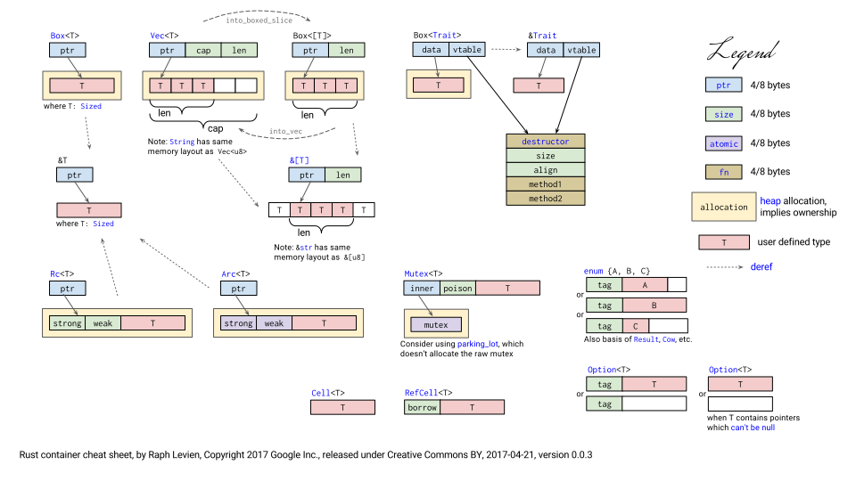
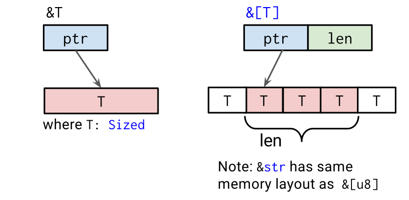
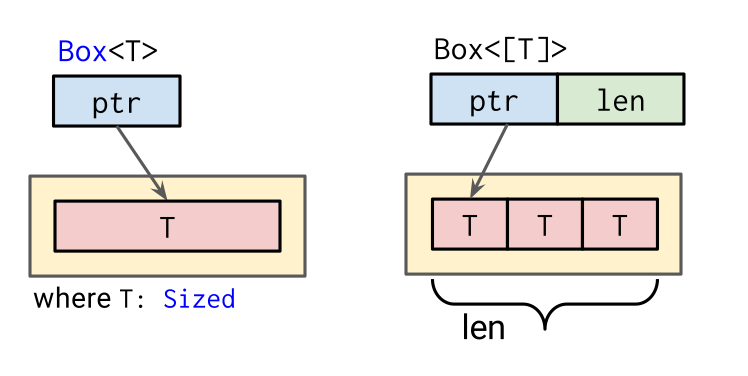
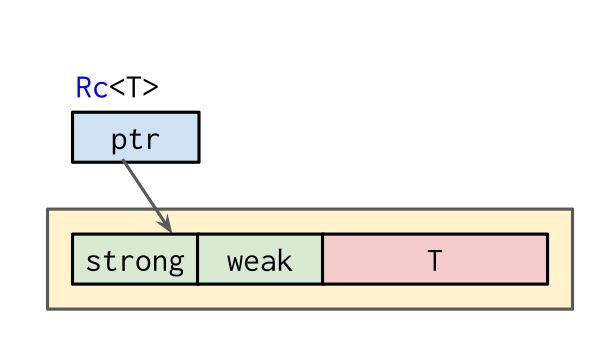

# Административни неща

--
* Първо предизвикателство мина, ще оправим точките скоро
--
* Второ домашно ще е скоро (== "трябва да е скоро")

---

# Преговор

--
* Често срещани trait-ове (`Copy`, `Drop`, `Display`/`Debug`, оператори и т.н.)
--
* Iterator (for-цикли, адаптери, `FromIterator` + `convert`)
--
* Closures (анонимни функции и още нещо!)
--
* Fn trait-ове (когато искаме да подаваме closures на функции)

---

# Smart pointers

<a target="_blank" href="https://docs.google.com/presentation/d/1q-c7UAyrUlM-eZyTo1pd8SZ0qwA_wYxmPZVOQkoDmH4/edit">
    
</a>

---

# `?Sized` ???

--
* `Sized` е ✨магически✨ trait
--
* Имплементира се автоматично от типове, чиито размер се знае at compile-time
--
* Примерно: `u8`, `Vec<T>`, `&T`

---

# ?Sized ???

--
* Типове, които не са `Sized`: `[T]`, `Trait`, `str`
--
* Винаги стоят зад някакъв pointer/reference: `&[T]`, `&Trait`, `&str`
--
* Reference-а в този случай е "fat pointer", който държи не само указател, но и размера на парчето данни, което има този тип.
--
* Забележете, че `[u32]` не е `Sized`, но `[u32; 5]` е. Защото размера на данните се съдържа в конкретния тип.

---

# ?Sized ???

`?Sized` означава, че типа **не е нужно** да имплементира Sized.

```rust
# //ignore
// Използваем само с тип, който имплементира Sized:
fn foo<T>() {}

// Използваем с тип, който *може* да имплементира Sized,
// но не е *нужно*:
fn bar<T: ?Sized>() {}
```

Особено ограничение, понеже *разширява* броя типове, които могат да се приемат, вместо да го стеснява.

Защо? Защото ако една стойност не е Sized, компилатора не може да я алокира на стека. Така че е доста добра идея да присъства като автоматичен trait bound.

---

# Smart pointers

---

# &T

Най-глупавия указател, но важен за целите на сравнението



---

# &T

--
* Най-простия начин да реферираме към памет, където и да е в паметта (който не изисква `unsafe`)
--
* Няма ownership -- нещо друго трябва да е owner на тази памет
--
* Нужда от жонглиране на lifetimes
--
* Позволяват изключителна ефективност

---

# &T

```rust
# fn main() {
let potato = String::from("
    Любов, любов, варен картоф,
    разрежеш го, а той суров.
");

let lines = potato.
    trim().
    lines().
    map(|l| l.trim());

for line in lines {
    println!("{}", line);
}
# }
```

---

# Box

Reference + ownership!



---

# Box

```rust
fn main() {
    let b = Box::new(5);
    println!("b = {}", b);
}
```

---

# Box

--
* Също прост -- сочи към парцал памет, само и единствено в heap-а
--
* Има ownership, което значи, че няма нужда да се грижим за lifetimes
--
* (Но алокира нова стойност на heap-а, така че не позволява ефективността на гол reference.)
--
* Донякъде магически -- няма как да си направим наш `Box`, защото няма как да укажем на компилатора "алокирай това на heap-а".
--
* Много условно казано, горе-долу, донякъде, може да си представите, че:
* `String` ~~ `Box<str>`
* `Vec<T>` ~~ `Box<[T]>`

---

# Box

```rust
fn main() {
    let x = Box::new(3);
    let y = Box::new(5);

    println!("{}", x + y);
}
```

---

# Box

```rust
fn main() {
    let x = Box::new(3);
    let y = Box::new(5);

    println!("{}", *x + *y);

    let x = &3;
    let y = &5;

    println!("{}", *x + *y);
}
```

(Note: not magic)

---

# Box

А за какво ни е всъщност?

---

# Box

### Linked list

```rust
# //ignore
#[derive(Debug)]
enum List {
    Nil,
    Cons(i32, List),
}

use List::{Cons, Nil};

fn main() {
    let list = Cons(1, Cons(2, Cons(3, Nil)));

    println!("{:#?}", list);
}
```

---

# Box

### Linked list

```rust
#[derive(Debug)]
enum List {
    Nil,
    Cons(i32, List),
}

use List::{Cons, Nil};

fn main() {
    let list = Cons(1, Cons(2, Cons(3, Nil)));

    println!("{:#?}", list);
}
```

---

# Box

### Linked list

```rust
#[derive(Debug)]
enum List {
    Nil,
    Cons(i32, Box<List>),
}

use List::{Cons, Nil};

fn main() {
    let list = Cons(1, Box::new(Cons(2, Box::new(Cons(3, Box::new(Nil))))));
    println!("{:?}", list);
}
```

---

# Box

### Trait objects

```rust
# use std::fmt::Display;
fn vec_of_things<'a>() -> Vec<&'a dyn Display> {
    let x = 123;
    vec![&x, &3.14, &"foobar"]
}
# fn main() {}
```

---

# Box

### Trait objects

```rust
# #![allow(dead_code)]
# use std::fmt::Display;
fn vec_of_things() -> Vec<Box<dyn Display>> {
    let x = 123;
    vec![Box::new(x), Box::new(3.14), Box::new("foobar")]
}
# fn main() {}
```

---

# Box

### Trait objects

`Box<Error>` -- ако ни мързи да правим error handling

```rust
fn get_x() -> Result<i32, std::io::Error> { Ok(3) }
fn get_y() -> Result<i32, std::fmt::Error> { Ok(5) }

fn foo() -> Result<i32, Box<dyn std::error::Error>> {
    let x = get_x()?;
    let y = get_y()?;
    Ok(x + y)
}

fn main() {
    println!("{:?}", foo());
}
```

---

# Nightly Rust

--
* В nightly rust има експериментален синтаксис
--
* Можете да си инсталирате nightly rust с `rustup install nightly`
--
* Можете да си тествате код с `cargo +nightly run`
--
* Можете и да го направите default-ен

---

# Box

### Nightly features

Има специален keyword : `box` за създаване на Box smart pointer-и

```rust
# //ignore
let x = Box::new(5);
let list = Cons(1, Box::new(Cons(2, Box::new(Cons(3, Box::new(Nil))))));

// Може да се напише така:
let x = box 5;
let list = Cons(1, box Cons(2, box Cons(3, box Nil)));
```

---

# Box

### Nightly features

За да може да използвате този 'feature', трябва да го оповестите така в началото на програмата си:

```rust
# //ignore
#![feature(box_syntax)]

struct Heart {
    owner: &'static str,
}

fn main() {
  let heart_shaped_box = box Heart { owner: "Kurt" };
}
```

---

# Box

### Nightly features

Ключовата дума `box` е мнооого полезна при pattern matching! Пример:

```rust
#[derive(Clone, Debug, PartialEq)]
pub enum Term {
    True,
    False,
    If(Box<Term>, Box<Term>, Box<Term>),
    Value
}
# fn main() {}
```

---

# Box

### Nightly features

```rust
# #![allow(dead_code)]
# #[derive(Clone, Debug, PartialEq)]
# pub enum Term {
#     True,
#     False,
#     If(Box<Term>, Box<Term>, Box<Term>),
#     Value
# }
fn one_step_eval(t: Term) -> Result<Term, String> {
    match t {
        Term::If(t1, t2, t3) => {
            match *t1 { // След малко ще си говорим за Deref, спокойно!
                Term::True => Ok(*t2),
                Term::False => Ok(*t3),
                _ => Ok(Term::If(Box::new(one_step_eval(*t1)?), t2, t3)),
            }
        },
        any => Err(format!("Term can't be evaluated : {:?}", any))
    }
}
# fn main() {}
```

---

# Box

### Nightly features

Ключовата дума `box` е мнооого полезна при pattern matching! Пример:

```rust
# //ignore
#![feature(box_syntax)]
#![feature(box_patterns)]

fn one_step_eval(t: Term) -> Result<Term, String> {
    match t {
        Term::If(box Term::True, t2, _) => Ok(*t2),
        Term::If(box Term::False, _, t3) => Ok(*t3),
        Term::If(t1, t2, t3) => Ok(Term::If(box one_step_eval(*t1)?, t2, t3)),
        any => Err(format!("Term can't be evaluated : {:?}", any))
    }
}
```

---

# Box

### Nightly features

За да може да използвате този 'feature', трябва да го оповестите така в началото на програмата си:

```rust
# //ignore
#![feature(box_patterns)]
```

---

# Deref

```rust
# fn main() {
let mut x = 5;
{
    let y = &mut x;

    *y += 1;
}
println!("{}", x);
# }
```

---

# Deref

```rust
# fn main() {
let x = 5;
{
    let mut y = Box::new(x);

    *y += 1;
    println!("{}", y);
}
println!("{}", x);
# }
```

---

# Deref

```rust
# //ignore
pub trait Deref {
    type Target: ?Sized;
    fn deref(&self) -> &Self::Target;
}
```

Нужно е `?Sized`, понеже така може да имплементираме `Deref` за не-Sized тип. От стандартната библиотека:

```rust
# //ignore
impl ops::Deref for String {
    type Target = str;

    #[inline]
    fn deref(&self) -> &str {
        unsafe { str::from_utf8_unchecked(&self.vec) }
    }
}
```

Deref не връща `T`, защото това би ни дало ownership над стойността и в случая на `Box<T>`, това ще премести стойноста и ще направи инстанцията неизползваема.

---

# DerefMut

```rust
# //ignore
pub trait DerefMut: Deref {
    fn deref_mut(&mut self) -> &mut Self::Target;
}
```

Забележете липсата на декларация на `Target` -- на практика се случва `<Self as Deref>::Target`.

---

# Deref

```rust
# //norun
# #![allow(dead_code)]
use std::ops::Deref;

struct Mp3 {
    audio: Vec<u8>,
    artist: Option<String>,
    title: Option<String>,
}

impl Deref for Mp3 {
    type Target = Vec<u8>;

    fn deref(&self) -> &Vec<u8> {
        &self.audio
    }
}
# fn main() {}
```

---

# Deref

```rust
# #![allow(dead_code)]
# use std::ops::Deref;
# struct Mp3 {
#     audio: Vec<u8>,
#     artist: Option<String>,
#     title: Option<String>,
# }
# impl Deref for Mp3 {
#     type Target = Vec<u8>;
#     fn deref(&self) -> &Vec<u8> {
#         &self.audio
#     }
# }
fn main() {
    let my_favorite_song = Mp3 {
        audio: vec![1, 2, 3],
        artist: Some(String::from("Poets of the Fall")),
        title: Some(String::from("Carnival of Rust")),
    };

    assert_eq!(vec![1, 2, 3], *my_favorite_song);
}
```

---

# Deref

```rust
# //ignore
*my_favorite_song

*(my_favorite_song.deref())

fn deref(&self) -> &Vec<u8> {
    &self.audio
}

*(&my_favorite_song.audio)
```

---

# Deref

--
* Позволява свеждане на нещо-което-работи-като-указател до истински указател
--
* Извиква се автоматично от `*`: Когато напишем `*foo`, компилатора го свежда до `*Deref::deref(&foo)`.
--
* Извиква се автоматично от `*=`: Когато напишем `*foo = ...`, компилатора го свежда до `*(DerefMut::deref_mut(&mut foo)) = ...`.
--
* Извиква се автоматично и в няколко други ситуации, които ще видим след няколко слайда
--
* Дефиниран е автоматично за references.

```rust
# //ignore
impl<'a, T: ?Sized> Deref for &'a T {
    type Target = T;

    fn deref(&self) -> &T { *self }
}
```

Въпрос: защо `*self`?

--

Защото `&self` е от тип `&Self`, което в случая е `&&T`. Така че `*self` е от тип `&T`!

---

# DerefMut

```rust
//
//
fn main() {
    let mut y: Box<u32> = Box::new(5); // Note: mutable

    *y += 1;
    println!("{}", y);
}
```

---

# DerefMut

```rust
use std::ops::DerefMut;

fn main() {
    let mut y: Box<u32> = Box::new(5); // Note: mutable

    *(DerefMut::deref_mut(&mut y)) += 1; //*(&mut u32)
    println!("{}", y);
}
```

---

# Deref

### deref coercion

```rust
# //ignore
# fn main() {
fn compress_mp3(audio: &[u8]) -> Vec<u8> {
    // ...
}

compress_mp3(my_favorite_song.audio.as_slice())
# }
```

---

# Deref

### deref coercion

* `&[u32; 5]` &rarr; `&[u32]`
* `&Vec<u32>` &rarr; `&[u32]`
* `&String` &rarr; `&str`

---

# Deref

### deref coercion

```rust
# //ignore
fn compress_mp3(audio: &[u8]) -> Vec<u8> {
    // ...
}

# fn main() {
compress_mp3(my_favorite_song.audio.as_slice())
// &Vec<u8> -> &[u8]
compress_mp3(&my_favorite_song.audio)
// &Mp3 -> &Vec<u8>
compress_mp3(&my_favorite_song)

// Става и без викане на функция:
let song_bytes: &[u8] = &my_favorite_song;
# }
```

---

# Deref

### deref coercion

```rust
# //ignore
fn compress_mp3(audio: &[u8]) -> Vec<u8> {
    // ...
}

# fn main() {
//
//
//
//
compress_mp3(&my_favorite_song.deref().deref())

// Става и без викане на функция:
let song_bytes: &[u8] = &my_favorite_song.deref().deref();
# }
```

---

# Deref

### deref coercion

--
* От `&T` до `&U` когато `T: Deref<Target=U>`
--
* От `&mut T` до `&mut U` когато `T: DerefMut<Target=U>`
--
* От `&mut T` до `&U` когато `T: Deref<Target=U>`
--
* (Вижте документацията на String, където ще намерите "Methods from `Deref<Target = str>`")
--
* От `&mut T` до `&T` (просто "coercion", не "deref coercion")

---

# Deref

--
* Цялата тая имплицитност е много удобна, но... Не прекалявайте. `Deref` се ползва *специфично* за smart pointer-и.
--
* `Mp3` е симпатичен пример, но автоматичен дереф може да е доста объркващ в случай на грешка.

---

# Rc

Reference counter



---

# Reference counting

```rust
use std::rc::Rc;

fn main() {
    let first = Rc::new(String::from("foobar"));
    let second = Rc::clone(&first);

    println!("{}", first);
    println!("{}", second);
}
```

---

# Reference counting

```rust
# use std::rc::Rc;
# fn main() {
let a = Rc::new(3);
let b = Rc::new(5);

println!("{}", *a + *b);
# }
```

---

# Reference counting

* `Rc::new` алокира подадената си стойност на heap-а, както Box
--
* `Rc::clone` дава ново `Rc`, което вътрешно сочи до същата стойност, но има ownership, също както Box!
--
* Всяко викане на `clone`, вместо да клонира потенциално голямата стойност, просто връща фасада към тази стойност и увеличава един counter.
--
* Когато `Rc`-то се drop-не, counter-а пада с 1. Като падне до 0, стойността се деалокира.

---

# Reference counting

Проблем: стойността е read-only:

```rust
# use std::rc::Rc;
# fn main() {
let mut a = Rc::new(3);

*a = 5;

println!("{:?}", a);
# }
```

---

# Reference counting

* `Rc` не ни позволява да взимаме mutable reference към пазената стойност
--
* това би нарушило ограничението за един `&mut T` / много `&T`
--
* но въпреки това има начини да модифицираме пазената стойност

---

# Cow


---

# Cow

### Copy on Write

```rust
# //ignore
# fn main() {
impl<T> Rc<T> where T: Clone {
    fn make_mut(this: &mut Rc<T>) -> &mut T
}
# }
```

--
* ако сме единствения собственик модифицираме директно пазената стойност
--
* ако не първо си правим копие на стойността и модифицираме копието

---

# Cow

```rust
use std::rc::Rc;

fn main() {
    let mut a = Rc::new(3);

    *Rc::make_mut(&mut a) = 5;

    println!("a: {}", a);
}
```

---

# Cow

```rust
use std::rc::Rc;

fn main() {
    let mut a = Rc::new(3);
    let b = Rc::clone(&a);
    // Дотук a и b сочат към една и съща стойност в паметта

    {
        let temp_ref = Rc::make_mut(&mut a);
        // Връщаме &mut към copy-on-write стойност
        *temp_ref = 5;
    }
    // Вече a и b сочат към различни стойности

    println!("a: {}", a);
    println!("b: {}", b);
}
```

---

# Internal mutability

--
* пазим състояние (internal state), невидимо за външния свят
--
* искаме да модифицираме това състояние в методи, които са логически immutable
--
* това се нарича internal mutability

---

# Cell, RefCell


---

# Internal mutability

```rust
use std::cell::Cell;

fn main() {
    // забележете, че няма `mut`
    let cell = Cell::new(10);

    println!("{}", cell.get());

    cell.set(42);
    println!("{}", cell.get());
}
```

---

# Internal mutability

### Cell

* използва се основно за `Copy` типове
--
* `get` прави копие на пазената стойност
* `set` презаписва пазената стойност с новата
* `replace` записва нова стойност и връща старата
--
* `into_inner` ще консумира `Cell`-а и директно ще върне вътрешната стойност
--
* `take` (дефинирано само за типове, които имплементират `Default`) ще върне вътрешната стойност и ще я замести с `Default::default()`-а на типа.
--
* не можем да вземем референция (`&`/`&mut`) към стойността

---

# Internal mutability

### RefCell

```rust
use std::cell::RefCell;

fn main() {
    let cell = RefCell::new(String::from("foo"));   // отново няма `mut`
    println!("{}", cell.borrow()); // -> Ref

    {
        let mut r = cell.borrow_mut(); // -> RefMut
        r.push_str("bar");
    }

    println!("{}", cell.borrow()); // -> Ref
}
```

---

# Internal mutability

### RefCell

```rust
use std::cell::RefCell;

fn main() {
    let cell = RefCell::new(String::from("foo"));   // отново няма `mut`
    println!("{}", cell.borrow());

    cell.borrow_mut().push_str("bar");

    println!("{}", cell.borrow());
}
```

---

# Internal mutability

### RefCell

```rust
# #![allow(unused_variables)]
# #![allow(unused_mut)]
use std::cell::RefCell;

fn main() {
    let cell = RefCell::new(String::from("foo"));   // отново няма `mut`

    let mut first = cell.borrow_mut();
    let mut second = cell.borrow_mut(); // BOOM!
}
```

---

# Internal mutability

### RefCell

* Runtime borrow checker
--
* помни колко immutable и mutable референции е раздал
--
* `borrow()` ще върне структура от тип `Ref`, която има deref до `&T`
--
* `borrow_mut()` ще върне структура от тип `RefMut`, която има deref до `&mut T`
--
* ако не можем да вземем референция ще получим `panic!`

---

# Internal mutability

Често `Cell` и `RefCell` се използват в комбинация с `Rc`

```rust
use std::cell::RefCell;
use std::rc::Rc;

fn main() {
    let first = Rc::new(RefCell::new(String::from("foo")));
    let second = Rc::clone(&first);

    first.borrow_mut().push_str("bar");

    println!("{}", second.borrow());
}
```

---

# Cell, RefCell

* Заобикалят "нормалните" правила, съответно ги избягвайте.
--
* Документацията казва: "... interior mutability is something of a last resort."
--
* Една мъдра книжка казва: "RefCells make everything sadness."

---

# Обратно към Rc

### Weak reference

Какво правим, когато структурата ни може да има цикли?

```rust
# #![allow(dead_code)]
# use std::rc::Rc;
# use std::cell::RefCell;
# //norun
struct TreeNode {
    index: u32,
    parent: Option<Rc<RefCell<TreeNode>>>,
    children: Vec<Rc<RefCell<TreeNode>>>,
}

impl TreeNode {
    fn new(index: u32, parent: Option<Rc<RefCell<TreeNode>>>) -> Rc<RefCell<TreeNode>> {
        Rc::new(RefCell::new(TreeNode { index, parent, children: vec![] }))
    }
}
# fn main() {}
```

---

# Обратно към Rc

### Side note

Може да си улесните малко живота с type alias:

```rust
# #![allow(dead_code)]
# use std::rc::Rc;
# use std::cell::RefCell;
# //norun

type TreeNodeRef = Rc<RefCell<TreeNode>>;

struct TreeNode {
    index: u32,
    parent: Option<TreeNodeRef>,
    children: Vec<TreeNodeRef>,
}

impl TreeNode {
    fn new(index: u32, parent: Option<TreeNodeRef>) -> TreeNodeRef {
        Rc::new(RefCell::new(TreeNode { index, parent, children: vec![] }))
    }
}
# fn main() {}
```

---

# Weak reference

```rust
# #![allow(dead_code)]
# use std::rc::Rc;
# use std::cell::RefCell;
# use std::mem;
# #[derive(Debug)]
# struct TreeNode {
#     index: u32,
#     parent: Option<Rc<RefCell<TreeNode>>>,
#     children: Vec<Rc<RefCell<TreeNode>>>,
# }
# impl TreeNode {
#     fn new(index: u32, parent: Option<Rc<RefCell<TreeNode>>>) -> Rc<RefCell<TreeNode>> {
#         Rc::new(RefCell::new(TreeNode { index, parent, children: vec![] }))
#     }
# }
fn make_tree() -> Rc<RefCell<TreeNode>> {
    let root = TreeNode::new(0, None);
    let v1 = TreeNode::new(1, Some(Rc::clone(&root)));
    let v2 = TreeNode::new(2, Some(Rc::clone(&root)));

    {
        let mut r = root.borrow_mut();
        r.children.push(v1);
        r.children.push(v2);
    }

    root
}

fn main() {
    let tree = make_tree();
    println!("{:?}", tree.borrow().index);
    mem::drop(tree);
}
```

---

# Weak reference

* нищо не гърми, но родителя държи Rc към децата, а децата държат Rc към родителя
--
* получаваме цикъл от референции -- никога няма да се деалокират
--
* това води до изтичане на памет

---


# Weak reference

### Sidenote

* забележете, че можем да имаме memory leak в safe code
--
* затова съществува безопасната функция `mem::forget` (https://doc.rust-lang.org/std/mem/fn.forget.html#safety)
--
* и затова нямаме гаранция че деструкторите ще се извикат

---

# Weak reference

Да се върнем на проблема с дървото

--
* искаме родителят да е собственик на децата
--
* не искаме детето да е собственик на родителя
--
* за това се използват силни и слаби референции

---

# Weak reference

```rust
use std::mem;
use std::rc::{Rc, Weak};

fn main() {
    let rc = Rc::new(10);
    let weak = Rc::downgrade(&rc);

    println!("{:?}", Weak::upgrade(&weak)); // Option<Rc<T>>

    mem::drop(rc);
    println!("{:?}", Weak::upgrade(&weak)); // Option<Rc<T>>
}
```

---

# Reference counting

### Weak references

```rust
# //ignore
# fn main() {
let gosho_source = "Гошо, Гошо, скочи лошо";
let shared_gosho = Rc::new(gosho_source); // shared_gosho { strong = 1, weak = 0 };

let bratcheda = Rc::clone(&shared_gosho); // shared_gosho { strong = 2, weak = 0 };
// или, shared_gosho.clone(), но първото е по-ясно

let slabichko = Rc::downgrade(&shared_gosho); // shared_gosho { strong = 2, weak = 1 };
println!("{:#?}", Weak::upgrade(&slabichko)); // => Some("Гошо, Гошо, скочи лошо")
                                              // shared_gosho { strong = 3, weak = 1 };
                                              // shared_gosho { strong = 2, weak = 1 };

std::mem::drop(bratcheda); // shared_gosho { strong = 1, weak = 1 };
std::mem::drop(shared_gosho); // shared_gosho { strong = 0, weak = 1 }; => DROP!

println!("{:#?}", Weak::upgrade(&slabichko)); // => None
# }
```

---

# Rc

```rust
# //ignore
# fn main() {
// Инициализираме споделената стойност
let gosho_source = "Гошо, Гошо, скочи лошо";
let shared_gosho = Rc::new(gosho_source); // Rc<&str>

let bratcheda = Rc::clone(&shared_gosho); // Rc<&str>

let slabichko = Rc::downgrade(&shared_gosho); // Weak<&str>
println!("{:#?}", Weak::upgrade(&slabichko)); // Option<Rc<&str>>
# }
```

---

# Rc


---

# Raw pointers

Ок, нека видим и как изглеждат указателите

```rust
# #![allow(dead_code)]
# #![allow(unused_variables)]
# fn main() {
let raw_const_ptr: *const u32 = &1_u32 as *const u32;
let raw_mut_ptr: *mut u32 = &mut 1_u32 as *mut u32;

// Coercion
let raw_const_ptr: *const u32 = &1;
let raw_mut_ptr: *mut u32 = &mut 1;
# }
```

---

# Raw pointers

Първо и най-важно правило - указателите са safe, докато не се опитаме да четем или пишем в тях

```rust
# fn main() {
let raw_const_ptr: *const u32 = &1;
let raw_mut_ptr: *mut u32 = &mut 1;

unsafe {
    println!("{}", *raw_const_ptr);
}

// За разлика от псевдонимите, указателите могат да са null или dangling pointers
unsafe {
    *raw_mut_ptr += 1;
    println!("{}", *raw_mut_ptr);
}
# }
```

---

# Raw pointers

Нямат Deref и DerefMut. Тук компилатора си има само вградения оператор за това.

```rust
# fn main() {
(&1 as *const u32).deref();
# }
```

---

# Raw pointers

### Някои полезни методи

--
* `is_null(self) -> bool`
--
* `unsafe fn as_ref<'a>(self) -> Option<&'a T>`
--
* `unsafe fn offset(self, count: isize) -> *const T`
--
* И други безумия тук: https://doc.rust-lang.org/std/primitive.pointer.html
