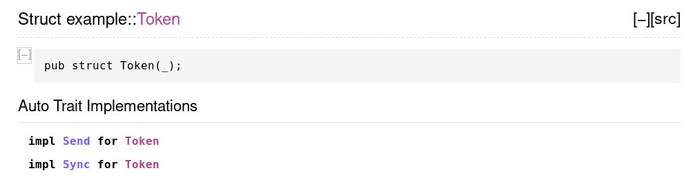

# Административни неща

- Домашно 2

---

# Преговор

- Entirely too many linked lists
--
- има качени слайдове

---

# Многонишково програмиране


---

# Fearless concurrency


---

# Нишки

```rust
# // norun
use std::thread;

fn main() {
    thread::spawn(|| println!("hi from the spawned thread"));

    println!("hi from the main thread");
}
```

--
- `1:1` multithreading - нишките в rust са нишки на операционната система
--
- `thread::spawn` пуска нова нишка и изпълнява подадената функция в нея
--
- когато функцията завърши, нишката се спира

---

# Нишки

```rust
use std::thread;

fn main() {
    let handle = thread::spawn(|| println!("hi from the spawned thread"));

    println!("hi from the main thread");
    let _ = handle.join();
}
```

--
- програмата приключва когато главната нишка завърши
--
- можем да използваме `join` за да изчакаме пуснатите нишки

---

# Нишки

Има и `Builder` с допълнителни опции

```rust
use std::thread::Builder;

fn main() {
    let handle = Builder::new()
        .name("sirespawn".to_string())
        .spawn(|| {
            println!("hi from the spawned thread");
            panic!();
        })
        .expect("could not create thread");

    handle.join().unwrap();
}
```

---

# Споделяне на стойности

```rust
# // ignore
use std::thread;

fn main() {
    let nums = (0..5).collect::<Vec<_>>();

    let handle = thread::spawn(|| {
        for i in &nums {
            println!("number {}", i);
        }
    });

    let _ = handle.join();
}
```

---

# Споделяне на стойности

```rust
use std::thread;

fn main() {
    let nums = (0..5).collect::<Vec<_>>();

    let handle = thread::spawn(|| {
        for i in &nums {
            println!("number {}", i);
        }
    });

    let _ = handle.join();
}
```

---

# Споделяне на стойности

```rust
use std::thread;

fn main() {
    let nums = (0..5).collect::<Vec<_>>();

    let handle = thread::spawn(move || {
        for i in &nums {
            println!("number {}", i);
        }
    });

    let _ = handle.join();
}
```

---

# Споделяне между няколко нишки

Това очевидно няма да работи

```rust
use std::thread;

fn main() {
    let nums = (0..5).collect::<Vec<_>>();

    let handles = (0..2)
        .map(|_| {
            //
            //
            thread::spawn(move || {
                for i in &nums {
                    println!("number {}", i);
                }
            })
        })
        .collect::<Vec<_>>();

    for h in handles {
        let _ = h.join();
    }
}
```

---

# Споделяне между няколко нишки

Ами с `Rc`?

```rust
# // ignore
use std::rc::Rc;
use std::thread;

fn main() {
    let nums = Rc::new((0..5).collect::<Vec<_>>());

    let handles = (0..2)
        .map(|_| {
            let nums = Rc::clone(&nums);

            thread::spawn(move || {
                for i in &*nums {
                    println!("number {}", i);
                }
            })
        })
        .collect::<Vec<_>>();

    for h in handles {
        let _ = h.join();
    }
}
```

---

# Споделяне между няколко нишки

Ами с `Rc`?

```rust
use std::rc::Rc;
use std::thread;

fn main() {
    let nums = Rc::new((0..5).collect::<Vec<_>>());

    let handles = (0..2)
        .map(|_| {
            let nums = Rc::clone(&nums);

            thread::spawn(move || {
                for i in &*nums {
                    println!("number {}", i);
                }
            })
        })
        .collect::<Vec<_>>();

    for h in handles {
        let _ = h.join();
    }
}
```

---

# Send и Sync

```rust
# #![allow(dead_code)]
# #![allow(unused_variables)]
# use std::thread::JoinHandle;
pub fn spawn<F, T>(f: F) -> JoinHandle<T> where
    F: FnOnce() -> T + Send + 'static,
    T: Send + 'static
# { unimplemented!() }
# fn main() {}
```

---

# Send и Sync

--
Send - позволява прехвърляне на собственост между нишки
--
Sync - позволява споделяне между нишки през референция (`&T`)

--
- marker traits
--
- имплементирани са за повечето типове
--
- аuto traits - имплементират се автоматично ако всичките полета са съответно `Send` и `Sync`
--
- unsafe traits - unsafe са за ръчна имплементация

---

# Send и Sync

```rust
# #![allow(dead_code)]
pub struct Token(u32);
# fn main() {}
```

--


---

# Send и Sync

Send - позволява прехвърляне на собственост между нишки

--
<br/>
Пример за типове, които не са `Send`:
--
- `Rc`
--
- `*const T` и `*mut T`
--
- thread local типове, например `rand::rngs::ThreadRng`
--
- и други

---

# Send + Sync

Sync - позволява споделяне между нишки през референция, т.е. `&T` е `Send`

--
<br/>
Tипове, които не са `Sync`, обикновено имат internal mutability без синхронизация, например:
--
- `Cell`
--
- `RefCell`
--
- `Rc`
--
- `*const T` и `*mut T`
--
- и други

---

# Имплементация

```rust
# #![allow(dead_code)]
# fn main() {}
struct MyBox(*mut u8);

unsafe impl Send for MyBox {}
unsafe impl Sync for MyBox {}
```

---

# Деимплементация

```rust
# // ignore
// Само на nightly
#![feature(optin_builtin_traits)]

struct SpecialToken(u8);

impl !Send for SpecialToken {}
impl !Sync for SpecialToken {}
```

--
- автоматичната имплементация никога няма да е грешна от само себе си
--
- но може да пишем код, който разчита, че определен тип не може да се прехвърля / споделя

---

# Деимплементация

Хак за stable

```rust
# #![allow(dead_code)]
# fn main() {}
use std::marker::PhantomData;

struct SpecialToken(u8, PhantomData<*const ()>);
```

---

# Arc

Да се върнем на кода, който не се компилираше

```rust
use std::rc::Rc;
use std::thread;

fn main() {
    let nums = Rc::new((0..5).collect::<Vec<_>>());

    let handles = (0..2)
        .map(|_| {
            let nums = Rc::clone(&nums);

            thread::spawn(move || {
                for i in &*nums {
                    println!("number {}", i);
                }
            })
        })
        .collect::<Vec<_>>();

    for h in handles {
        let _ = h.join();
    }
}
```

---

# Arc

Решението е да заменим `Rc` с `Arc`

```rust
use std::sync::Arc;
use std::thread;

fn main() {
    let nums = Arc::new((0..5).collect::<Vec<_>>());

    let handles = (0..2)
        .map(|_| {
            let nums = Arc::clone(&nums);

            thread::spawn(move || {
                for i in &*nums {
                    println!("number {}", i);
                }
            })
        })
        .collect::<Vec<_>>();

    for h in handles {
        let _ = h.join();
    }
}
```

---

# Arc

--
- Atomic Reference Counter
--
- аналогично на Rc, но използва атомарни операции за броене на референциите
--
- може да се използва за споделяне на стойности между нишки, ако `T: Send + Sync`

---

# Примитиви за синхронизация

---

# Примитиви за синхронизация

Стандартния пример за грешен многонишков алгоритъм:

```rust
# use std::sync::Arc;
# use std::thread;
# fn main() {
let v = Arc::new((0..100).collect::<Vec<_>>());
let mut sum = 0;

let t1 = {
    let v = Arc::clone(&v);
    thread::spawn(move || for i in &v[0..50] { sum += i; })
};

let t2 = {
    let v = Arc::clone(&v);
    thread::spawn(move || for i in &v[51..100] { sum += i; })
};

let _ = t1.join();
let _ = t2.join();
println!("sum: {}", sum);
# }

```

---

# Примитиви за синхронизация

Можем ли да го накараме да работи?

--
- `&mut i32` - `spawn` не позволява заради `'static` trait bound-а
--
- `Arc<i32>` - нямаме как да модифицираме съдържанието
--
- `Arc<Cell<i32>>`, `Arc<RefCell<i32>>` - `Cell` и `RefCell` не са `Sync`

---

# Примитиви за синхронизация

Можем да го накараме да работи

--
- `Arc<Mutex<i32>>`
--
- atomic integers
--
- да връщаме резултат от нишката
--
- ...

--
<br/>
С две думи трябва да го напишем правилно, за да се компилира

---

# Mutex

```rust
use std::sync::Mutex;

fn main() {
    // мутекса опакова стойността, която предпазва
    let mutex = Mutex::new(10);

    {
        // заключваме мутекса
        // `lock` е умен указател с deref до `&T` и `&mut T`
        let mut lock = mutex.lock().unwrap();
        *lock += 32;

        // мутекса се отключва когато `lock` се деалокира
    }
}
```

---

# Panic

--
- `panic!` в главната нишка спира програмата
--
- `panic!` в друга нишка спира нишката
--
- `JoinHandle::join` връща резултат
--
- `Ok(T)` ако функцията е завършила успешно
--
- `Err(Box<Any>)` ако е имало паника

---

# Panic

--
- ако нишка е заключила mutex и се панира по това време, може данните пазени от mutex-а да са невалидни
--
- mutex-а се зачита за отровен (mutex poisoning)
--
- `Mutex::lock()` и `Mutex::try_lock()` връщат резултат
--
- `Ok(MutexGuard)`
--
- `Err(PoisonError)`

---

# Други примитиви за синхронизация

--
- `RwLock`
--
- `Condvar`
--
- `Barrier`
--
- вижте `std::sync`

---

# Lock-free алгоритми

---

# Integer atomics

- AtomicBool
--
- AtomicUsize, AtomicIsize, AtomicPtr
--
- AtomicU8, AtomicU16, ... (nightly)

---

# Integer atomics

### Атомарни аритметични операции

- fetch_add
--
- fetch_xor
--
- ...

--
<br/>
- удобни са за създаване на различни броячи и други неща
--
- препоръчително да се използват пред `Mutex<i32>`

---

# Integer atomics

### Операции по паметта

- load
--
- store
--
- compare_and_swap
--
- ...

--
<br/>
- използват се за имплементация на lock-free алгоритми и структури от данни
--
- но няма да задълбаваме в тях

---

# Канали


---

# Канали

### Go-lang motto

> Don't communicate by sharing memory,
> share memory by communicating

---

# Канали в стандартната библиотека

```rust
use std::sync::mpsc;
use std::thread;

fn main() {
    let (sender, receiver) = mpsc::channel();

    thread::spawn(move || {
        sender.send(10).unwrap();
    });

    println!("received {}", receiver.recv().unwrap());
}
```

---

# Типове канали

### Неограничен канал

--
- unbounded / infinitely buffered / "asynchronous"
--
- `std::sync::mpsc::channel()`
--
- `(Sender, Receiver)`
--
- изпращане на съобщение никога не блокира

---

# Типове канали

### Неограничен канал

```rust
# use std::sync::mpsc;
# use std::thread;
# fn main() {
let (sender, receiver) = mpsc::channel();

thread::spawn(move || {
    sender.send(1).unwrap();
    sender.send(2).unwrap();
    sender.send(3).unwrap();
});

assert_eq!(receiver.recv().unwrap(), 1);
assert_eq!(receiver.recv().unwrap(), 2);
assert_eq!(receiver.recv().unwrap(), 3);
# }
```

---

# Типове канали

### Oграничен канал

- bounded / "synchronous"
--
- `std::sync::mpsc::sync_channel(k)`
--
- `(SyncSender, Receiver)`
--
- има буфер за `k` съобщения
--
- изпращане на съобщения ще блокира ако буфера е пълен
--
- при `k = 0` става "rendezvous" канал

---

# Типове канали

### Ограничен канал

```rust
# use std::sync::mpsc;
# use std::thread;
# fn main() {
let (sender, receiver) = mpsc::sync_channel(1);

thread::spawn(move || {
    // записва съобщението и връща веднага
    sender.send(1).unwrap();

    // ще блокира докато главната нишка не извика `receiver.recv()`
    sender.send(2).unwrap();
});

assert_eq!(receiver.recv().unwrap(), 1);
assert_eq!(receiver.recv().unwrap(), 2);
# }
```

---

# Множество изпращачи

```rust
# use std::sync::mpsc;
# use std::thread;
# fn main() {
let (sender, receiver) = mpsc::channel();
let sender2 = sender.clone();

thread::spawn(move || {
    sender.send(1).unwrap();
    sender.send(2).unwrap();
});

thread::spawn(move || {
    sender2.send(3).unwrap();
    sender2.send(4).unwrap();
});

println!("{} {} {} {}",
    receiver.recv().unwrap(), receiver.recv().unwrap(),
    receiver.recv().unwrap(), receiver.recv().unwrap());
# }
```

---

# Sender

### Методи

```rust
# // ignore
// изпраща `t`
// връща грешка ако получателят е бил унищожен
fn send(&self, t: T) -> Result<(), SendError<T>>
```

---

# Sender

### Методи

```rust
# use std::mem;
# use std::sync::mpsc::{self, SendError};
# fn main() {
let (sender, receiver) = mpsc::channel();

assert_eq!(sender.send(12), Ok(()));

// унищожаваме получателя
// съобщението `12` никога няма да бъде получено
mem::drop(receiver);

// грешка - получателя е унищожен
// можем да си върнем съобщението `23` от грешката
assert_eq!(sender.send(23), Err(SendError(23)));
# }
```

---

# SyncSender

### Методи

```rust
# // ignore
// блокира ако буфера е пълен
fn send(&self, t: T) -> Result<(), SendError<T>>

// връща грешка ако буфера е пълен или получателят е бил унищожен
fn try_send(&self, t: T) -> Result<(), TrySendError<T>>
```

---

# SyncSender

### Методи

```rust
# use std::mem;
# use std::sync::mpsc::{self, TrySendError};
# fn main() {
let (sender, receiver) = mpsc::sync_channel(1);

assert_eq!(sender.try_send(12), Ok(()));
assert_eq!(sender.try_send(23), Err(TrySendError::Full(23)));

mem::drop(receiver);

assert_eq!(sender.try_send(23), Err(TrySendError::Disconnected(23)));
# }
```

---

# Множество получатели

--
- не може - каналите са multi-producer, single-consumer
--
- `Receiver` не може да се клонира
--
- `Receiver` e `Send`, но не е `Sync`

---

# Receiver

### Методи

```rust
# // ignore
// блокира докато не получи съобщение
// връща грешка ако всички изпращачи са унищожени
fn recv(&self) -> Result<T, RecvError>

// не блокира
// връща грешка ако всички изпращачи са унищожени или няма съобщение в опашката
fn try_recv(&self) -> Result<T, TryRecvError>

// блокира за определено време
// връща грешка ако всички изпращачи са унищожени или е изтекло времето
fn recv_timeout(&self, timeout: Duration) -> Result<T, RecvTimeoutError>
```

---

# Receiver

### Методи

```rust
# // norun
# use std::sync::mpsc;
# use std::thread;
# fn main() {
let (sender, receiver) = mpsc::channel();

thread::spawn(move || {
    for i in (0..50).rev() {
        sender.send(i).unwrap();
    }
});

while let Ok(msg) = receiver.recv() {
    println!("received {}", msg);
}
# }
```

---

# Receiver

### Итератори

```rust
# // norun
# use std::sync::mpsc;
# use std::thread;
# fn main() {
let (sender, receiver) = mpsc::channel();

thread::spawn(move || {
    for i in (0..50).rev() {
        sender.send(i).unwrap();
    }
});

for msg in receiver.iter() {
    println!("received {}", msg);
}
# }
```

---

# Други структури

--
- crossbeam
--
- https://crates.io/crates/crossbeam
--
- MPMC channel с опция за select по няколко канала
--
- lock-free структури от данни - опашка, стек, deque
--
- и доста utilities

---

# Други библиотеки

--
- rayon
--
- https://crates.io/crates/rayon
--
- библиотека за паралелизъм по данни
--
- threadpool
--
- parallel iterators
--
- split/join
