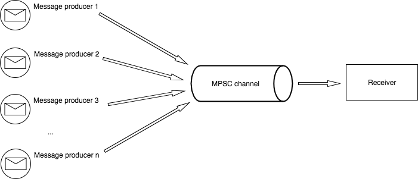

# Административни неща

- второ домашно приключи
--
- следващата седмица няма да имаме лекции (7 и 9 декември)

---

# Fearless concurrency


---

# Нишки

```rust
# // norun
use std::thread;

fn main() {
    thread::spawn(|| println!("hi from spawned thread"));

    println!("hi from main thread");
}
```

--
- `thread::spawn` пуска нова нишка (на операционната система)
--
- и изпълнява подадената функция в нея
--
- когато функцията завърши, нишката се спира

---

# Нишки

```rust
use std::thread;

fn main() {
    let handle = thread::spawn(|| println!("hi from spawned thread"));

    println!("hi from main thread");
    let _ = handle.join();
}
```

--
- програмата приключва когато главната нишка завърши
--
- `spawn` връща `JoinHandle`
--
- можем да използваме `join` за да изчакаме пуснатите нишки
--
- когато `JoinHandle` се drop-не нишката се detach-ва

---

# Panic

--
- `panic!` в главната нишка спира програмата
--
- `panic!` в друга нишка спира нишката
--
- `JoinHandle::join` връща резултат
--
- `Ok(T)` ако функцията е завършила успешно
--
- `Err(Box<Any>)` ако е имало паника

---

# Споделяне на стойности

```rust
# // ignore
use std::thread;

fn main() {
    let nums = (0..5).collect::<Vec<_>>();

    let handle = thread::spawn(|| {
        for i in &nums {
            println!("number {}", i);
        }
    });

    let _ = handle.join();
}
```

---

# Споделяне на стойности

```rust
use std::thread;

fn main() {
    let nums = (0..5).collect::<Vec<_>>();

    let handle = thread::spawn(|| {
        for i in &nums {
            println!("number {}", i);
        }
    });

    let _ = handle.join();
}
```

---

# Споделяне на стойности

- новосъздадената нишка може да надживее функцията в която е извикана
--
- затова rust не позволява да подадем референции към локални променливи
--
- това се налага от ограничението на `spawn`, която приема `F: 'static`

```rust
# // ignore
pub fn spawn<F, T>(f: F) -> JoinHandle<T> where
    F: FnOnce() -> T,
    F: Send + 'static,
    T: Send + 'static
```

---

# Споделяне на стойности

Можем да преместим стойността в новата нишка

```rust
use std::thread;

fn main() {
    let nums = (0..5).collect::<Vec<_>>();

    let handle = thread::spawn(move || {
        for i in &nums {
            println!("number {}", i);
        }
    });

    let _ = handle.join();
}
```

---

# Споделяне между няколко нишки

Как бихме споделили стойност между няколко нишки?

```rust
# // ignore
use std::thread;

fn main() {
    let nums = (0..5).collect::<Vec<_>>();

    let handles = (0..2).map(|_| {
            thread::spawn(move || {
                for i in &nums {
                    println!("number {}", i);
                }
            })
        })
        .collect::<Vec<_>>();

    for h in handles {
        let _ = h.join();
    }
}
```

--
- прехвърляне на собствеността няма как да работи
--
- не можем да ползваме референция, защото нишката може да надживее `main`

---

# Споделяне между няколко нишки

Можем да пробваме с `Rc`

```rust
# // ignore
use std::rc::Rc;
use std::thread;

fn main() {
    let nums_vec = (0..5).collect::<Vec<_>>();
    let nums = Rc::new(nums_vec);

    let handles = (0..2)
        .map(|_| {
            let nums = Rc::clone(&nums);

            thread::spawn(move || {
                for i in &*nums {
                    println!("number {}", i);
                }
            })
        })
        .collect::<Vec<_>>();

    for h in handles {
        let _ = h.join();
    }
}
```

---

# Споделяне между няколко нишки

Можем да пробваме с `Rc`

```rust
use std::rc::Rc;
use std::thread;

fn main() {
    let nums_vec = (0..5).collect::<Vec<_>>();
    let nums = Rc::new(nums_vec);

    let handles = (0..2)
        .map(|_| {
            let nums = Rc::clone(&nums);

            thread::spawn(move || {
                for i in &*nums {
                    println!("number {}", i);
                }
            })
        })
        .collect::<Vec<_>>();

    for h in handles {
        let _ = h.join();
    }
}
```

---

# Send и Sync

```rust
# // ignore
pub fn spawn<F, T>(f: F) -> JoinHandle<T> where
    F: FnOnce() -> T,
    F: Send + 'static,
    T: Send + 'static
```

---

# Send и Sync

--
- Send - позволява прехвърляне на собственост между нишки
--
- Sync - позволява споделяне между нишки през референция (`&T`)
--
- marker traits
--
- имплементирани са за повечето типове
--
- auto traits
--
- unsafe traits

---

# Send и Sync

### Send

- позволява прехвърляне на собственост между нишки
--
- пример за типове, които не са `Send`:
--
  - `Rc`
--
  - `*const T` и `*mut T`
--
  - thread local типове, напр. `rand::rngs::ThreadRng`
--
  - и други

---

# Send + Sync

### Sync

- позволява споделяне на референция `&T` между нишки
--
- `T: Sync` ⟺ `&T: Send`
--
- пример за типове, които не са `Sync`:
--
  - `Cell`, `RefCell`
--
  - `Rc`
--
  - `*const T` и `*mut T`
--
  - и други

---

# Send + Sync

### Sync

Това значи ли че `Vec<T>` е `Sync`?

--
- да, ако `T: Sync`
--
- ако нашата нишка има `&Vec<_>` значи никой не може да модифицира вектора
--
- ако нашата нишка има `&mut Vec<_>` значи никой друг няма референция до вектора
--
- типове, които не са `Sync`, обикновено имат internal mutability без синхронизация

---

# Send и Sync

### Аuto traits

- имплементират се автоматично ако всичките полета са съответно `Send` и `Sync`

```rust
pub struct Token(u32);
# fn main() {}
```


---

# Send + Sync

### Unsafe traits

- unsafe са за ръчна имплементация

```rust
# fn main() {}
struct MyBox(*mut u8);

unsafe impl Send for MyBox {}
unsafe impl Sync for MyBox {}
```

---

# Send + Sync

### Деимплементация

```rust
# // ignore
// Само на nightly
#![feature(optin_builtin_traits)]

struct SpecialToken(u8);

impl !Send for SpecialToken {}
impl !Sync for SpecialToken {}
```

--
- автоматичната имплементация никога няма да е грешна от само себе си
--
- но може да пишем код, който разчита, че определен тип не може да се прехвърля / споделя

---

# Send + Sync

### Деимплементация

Хак за stable

```rust
# fn main() {}
use std::marker::PhantomData;

struct SpecialToken(u8, PhantomData<*const ()>);
```

---

# Arc

Да се върнем на кода, който не се компилираше

```rust
use std::rc::Rc;
use std::thread;

fn main() {
    let nums = Rc::new((0..5).collect::<Vec<_>>());

    let handles = (0..2)
        .map(|_| {
            let nums = Rc::clone(&nums);

            thread::spawn(move || {
                for i in &*nums {
                    println!("number {}", i);
                }
            })
        })
        .collect::<Vec<_>>();

    for h in handles {
        let _ = h.join();
    }
}
```

---

# Arc

Решението е да заменим `std::rc::Rc` с `std::sync::Arc`

```rust
use std::sync::Arc;
use std::thread;

fn main() {
    let nums = Arc::new((0..5).collect::<Vec<_>>());

    let handles = (0..2)
        .map(|_| {
            let nums = Arc::clone(&nums);

            thread::spawn(move || {
                for i in &*nums {
                    println!("number {}", i);
                }
            })
        })
        .collect::<Vec<_>>();

    for h in handles {
        let _ = h.join();
    }
}
```

---

# Arc

--
- Atomic Reference Counter
--
- аналогично на Rc (споделена собственост, позволява само взимане на `&T` към вътрешността)
--
- но използва атомарни операции за броене на референциите
--
- може да се използва за споделяне на стойности между нишки, ако `T: Send + Sync`

---

# Синхронизация

---

# Примитиви за синхронизация

--
Стандартния пример за грешен многонишков алгоритъм:

```rust
# use std::sync::Arc;
# use std::thread;
# fn main() {
let v = Arc::new((0..100).collect::<Vec<_>>());
let mut sum = 0;

let t1 = {
    let v = Arc::clone(&v);
    let sum = &mut sum;
    thread::spawn(move || for i in &v[0..50] { *sum += i; })
};

let t2 = {
    let v = Arc::clone(&v);
    let sum = &mut sum;
    thread::spawn(move || for i in &v[51..100] { *sum += i; })
};

let _ = t1.join();
let _ = t2.join();
println!("sum: {}", sum);
# }

```

---

# Примитиви за синхронизация

Можем ли да го накараме да работи?

--
- `&mut i32` - не можем да имаме два пъти `&mut`, а и `spawn` очаква `'static`
--
- `Arc<i32>` - нямаме как да модифицираме съдържанието
--
- `Arc<Cell<i32>>`, `Arc<RefCell<i32>>` - `Cell` и `RefCell` не са `Sync`

---

# Примитиви за синхронизация

Можем да го накараме да работи

--
- `Arc<Mutex<i32>>`
--
- атомарни числа
--
- да връщаме резултат от нишката
--
- ...

---

# Примитиви за синхронизация

### Модула std::sync

- [std::sync](https://doc.rust-lang.org/stable/std/sync/index.html)
- `Arc`
- `Mutex`, `RwLock`
- `Condvar`, `Barrier`
- `atomic`
- `mpsc`
- ...

---

# Mutex

```rust
use std::sync::Mutex;

fn main() {
    // мутекса опакова стойността, която предпазва
    let mutex = Mutex::new(10);

    {
        // заключваме мутекса
        // `lock` връща умен указател с deref до `&T` и `&mut T`
        let mut lock = mutex.lock().unwrap();
        *lock += 32;

        // мутекса се отключва когато `lock` се деалокира
    }
}
```

---

# Mutex

- mutual exclusion
--
- използва се за да ни даде ексклузивен достъп до някакъв общ ресурс
--
- scope-а за който имаме ексклузивен достъп се нарича критична секция
--
- работи по следния начин
--
  - съдържа флаг - дали мутекса е заключен или свободен
--
  - ако мутекса е отключен и извикаме `lock` - заключваме го
--
  - ако мутекса е заключен и извикаме `lock` - нишката ни се спира
--
  - операционната система ще я събуди когато мутекса е свободен

---

# Мutex

Обикновенно мутекса се възприема като примитива която определя критична секция

```c
lock(my_mutex);
// начало на критичната секция

do_stuff(shared_data);

// край на критичната секция
unlock(my_mutex);
```

В Ръст това не би било удобно, защото не дава достатъчна информация на компилатора как ползваме данните.
Затова `Mutex` е generic и опакова данните.

---

# Mutex

- `Mutex<()>` може да се използва като флаг
--
- дали е наш ред да изпълним някаква операция
--
- понякога `Condvar` е по-подходящ за този случай

---

# Mutex

### Panic

--
- ако нишка е заключила мутекс и влезе в `panic!` по това време, мутекса се зачита за отровен
--
- може данните пазени от мутекса да са останали в невалидно състояние
--
- затова `Mutex::lock()` и `Mutex::try_lock()` връщат резултат
--
- `Ok(MutexGuard)`
--
- `Err(PoisonError)`
--
- често срещано е резултата от `lock` просто да се `unwrap`-не

---

# RwLock

- Reader-writer lock
--
- позволява четене от много места
--
- или писане от едно място
--
- подобно на `RefCell` в многонишков контекст

---

# Mutex срещу RwLock

- Mutex е по-бърз и по-лек от RwLock
--
- добра практика е критичните секции да са възможно най-кратки
--
- ако спазваме това няма да имаме много съперничество между нишките и мутекса е добра идея
--
- `RwLock` може да се използва да опаковаме стари C++ библиотеки

---

# Arc + Mutex

Подобно на `Rc<RefCell<T>>`, може често да виждате `Arc<Mutex<T>>` или `Arc<RwLock<T>>`

---

# Condvar

- Conditional variable
--
- позволява да изчакаме за някакво събитие или състояние
--
- нишката ни ще заспи докато това не се изпълни
--
- и ще бъде събудена от операционната система

---

# Condvar

```rust
# // norun
# use std::sync::{Arc, Mutex, Condvar};
# fn main() {
    let pair = Arc::new((Mutex::new(false), Condvar::new()));
# }
```

%%
```rust
# // norun
# use std::sync::{Arc, Mutex, Condvar};
# fn main() {
# let pair = Arc::new((Mutex::new(false), Condvar::new()));
// Thread A
let (lock, cvar) = &*pair;
let mut started = lock.lock().unwrap();

while !*started {
    started = cvar.wait(started).unwrap();
}
# }
```
%%
```rust
# // norun
# use std::sync::{Arc, Mutex, Condvar};
# fn main() {
# let pair = Arc::new((Mutex::new(false), Condvar::new()));
// Thread B
let (lock, cvar) = &*pair;
let mut started = lock.lock().unwrap();

*started = true;
cvar.notify_one();
# }
```
%%

---

# Външни библиотеки

### Parking lot

- https://crates.io/crates/parking_lot
- https://docs.rs/parking_lot
- имплементация на `Mutex`, `RwLock`, `Condvar`, `Once`
- по-малки от към памет от `std`
- по-бързи от `std` (в почти всички случаи)

---

# Атомарни числа

- AtomicBool, AtomicUsize, AtomicIsize, AtomicPtr
--
- AtomicU8, AtomicU16, ...
--
- имплементират се чрез специални инструкции на процесора
--
- стоят в основата на много алгоритми
--
- удобни са за създаване на различни броячи и подобни

---

# Атомарни числа

- препоръчително да се използват пред `Mutex<{integer}>`
--
- интерфейса наподобява `Cell<{integer}>`, но са `Send + Sync`
--
- т.е. модифицират се през `&T` и връщат копие на числото
--
- аритметични операции: `fetch_add`, `fetch_xor`, ...
--
- oперации по паметта: `load`, `store`, `compare_and_swap`, ...

---

# Глобални променливи

---

# Глобални променливи

### Immutable static

Искаме да имаме глобална променлива, която се инициализира веднъж и повече не се модифицира

```rust
# // ignore
static MY_HASHMAP: HashMap<String, String> = /* ??? */;
```

---

# Глобални променливи

### Immutable static

Ако стойността може да се сметне по време на компилация сме готови

```rust
static MY_VEC: Vec<String> = Vec::new();
# fn main() {}
```

--
Но това рядко се случва

```rust
static MY_VEC: Vec<String> = {
    let mut vec = Vec::new();
    vec.push(String::new());
    vec
};
# fn main() {}
```

---

# Глобални променливи

### Immutable static

За целта можем да използваме библиотеката lazy_static

```rust
use std::collections::HashMap;
use lazy_static::lazy_static;

lazy_static! {
    static ref FOOS: HashMap<u32, &'static str> = {
        let mut m = HashMap::new();
        m.insert(0, "foo");
        m.insert(1, "bar");
        m.insert(2, "baz");
        m
    };
}

fn main()  {
    println!("len: {}", FOOS.len());   // инициализира се при първи достъп
    println!("map: {:?}", *FOOS);      // deref magic
}
```

Отзаде се използва `std::sync::Once`

---

# Глобални променливи

### Mutable static

Искаме да имаме глобална променлива, чиято стойност се променя по време на изпълнение на програмата

--
- можем да използваме `static mut` и `unsafe` код, но това обикновенно е лоша идея
--
- просто трябва да се погрижим, че достъпването и в многонишков контекст е безопасно

---

# Глобални променливи

### Mutable static

```rust
use std::sync::Mutex;
use std::collections::HashMap;
use lazy_static::lazy_static;

// `Mutex::new` не е константна функция
lazy_static! {
    static ref FOOS: Mutex<HashMap<u32, String>> = Mutex::new(HashMap::new());
}

fn main() {
    FOOS.lock().unwrap().insert(0, "foo".to_string());
    FOOS.lock().unwrap().insert(1, "bar".to_string());
    FOOS.lock().unwrap().insert(2, "baz".to_string());

    println!("{:?}", FOOS.lock().unwrap());
}
```

---

# Глобални променливи

### Thread local

Искаме да имаме отделна глобална променлива за всяка нишка

--

```rust
# use std::collections::HashMap;
# use std::cell::RefCell;
thread_local! {
    static FOOS: RefCell<HashMap<u32, String>> = RefCell::new(HashMap::new());
}

fn main() {
    FOOS.with(|foos| foos.borrow_mut().insert(0, "foo".to_string()));

    std::thread::spawn(|| {
        FOOS.with(|foos| {
            foos.borrow_mut().insert(1, "bar".to_string());
            foos.borrow_mut().insert(2, "baz".to_string());
            println!("thread 1: {:?}", foos.borrow());
        });
    })
    .join()
    .unwrap();

    FOOS.with(|foos| {
        println!("thread main: {:?}", foos.borrow());
    });
}
```

---

# Канали



---

# Канали

### Go-lang motto

> Don't communicate by sharing memory,
> share memory by communicating

---

# Канали в стандартната библиотека

```rust
use std::sync::mpsc;
use std::thread;

fn main() {
    let (sender, receiver) = mpsc::channel();

    thread::spawn(move || {
        sender.send(10).unwrap();
    });

    println!("received {}", receiver.recv().unwrap());
}
```

---

# Типове канали

### Неограничен канал

--
- unbounded / infinitely buffered / "asynchronous"
--
- `std::sync::mpsc::channel()`
--
- `(Sender, Receiver)`
--
- изпращане на съобщение никога не блокира

---

# Типове канали

### Неограничен канал

```rust
# use std::sync::mpsc;
# use std::thread;
# fn main() {
let (sender, receiver) = mpsc::channel();

thread::spawn(move || {
    sender.send(1).unwrap();
    sender.send(2).unwrap();
    sender.send(3).unwrap();
});

assert_eq!(receiver.recv().unwrap(), 1);
assert_eq!(receiver.recv().unwrap(), 2);
assert_eq!(receiver.recv().unwrap(), 3);
# }
```

---

# Типове канали

### Oграничен канал

- bounded / "synchronous"
--
- `std::sync::mpsc::sync_channel(k)`
--
- `(SyncSender, Receiver)`
--
- има буфер за `k` съобщения
--
- изпращане на съобщения ще блокира ако буфера е пълен

---

# Типове канали

### Ограничен канал

```rust
# use std::sync::mpsc;
# use std::thread;
# fn main() {
let (sender, receiver) = mpsc::sync_channel(1);

thread::spawn(move || {
    // записва съобщението и връща веднага
    sender.send(1).unwrap();

    // ще блокира докато главната нишка не извика `receiver.recv()`
    sender.send(2).unwrap();
});

assert_eq!(receiver.recv().unwrap(), 1);
assert_eq!(receiver.recv().unwrap(), 2);
# }
```

---

# Множество изпращачи

```rust
# use std::sync::mpsc;
# use std::thread;
# fn main() {
let (sender, receiver) = mpsc::channel();
let sender2 = sender.clone();

thread::spawn(move || {
    sender.send(1).unwrap();
    sender.send(2).unwrap();
});

thread::spawn(move || {
    sender2.send(3).unwrap();
    sender2.send(4).unwrap();
});

println!("{} {} {} {}",
    receiver.recv().unwrap(), receiver.recv().unwrap(),
    receiver.recv().unwrap(), receiver.recv().unwrap());
# }
```

---

# Sender

### Методи

```rust
# // ignore
// изпраща `t`
// връща грешка ако получателят е бил унищожен
fn send(&self, t: T) -> Result<(), SendError<T>>
```

---

# Sender

### Методи

```rust
# use std::mem;
# use std::sync::mpsc::{self, SendError};
# fn main() {
let (sender, receiver) = mpsc::channel();

assert_eq!(sender.send(12), Ok(()));

// унищожаваме получателя
// съобщението `12` никога няма да бъде получено
mem::drop(receiver);

// грешка - получателя е унищожен
// можем да си върнем съобщението `23` от грешката
assert_eq!(sender.send(23), Err(SendError(23)));
# }
```

---

# SyncSender

### Методи

```rust
# // ignore
// блокира ако буфера е пълен
fn send(&self, t: T) -> Result<(), SendError<T>>

// връща грешка ако буфера е пълен или получателят е бил унищожен
fn try_send(&self, t: T) -> Result<(), TrySendError<T>>
```

---

# SyncSender

### Методи

```rust
# use std::mem;
# use std::sync::mpsc::{self, TrySendError};
# fn main() {
let (sender, receiver) = mpsc::sync_channel(1);

assert_eq!(sender.try_send(12), Ok(()));
assert_eq!(sender.try_send(23), Err(TrySendError::Full(23)));

mem::drop(receiver);

assert_eq!(sender.try_send(23), Err(TrySendError::Disconnected(23)));
# }
```

---

# Множество получатели

--
- не може - каналите са multi-producer, single-consumer
--
- `Receiver` не може да се клонира
--
- `Receiver` e `Send`, но не е `Sync`

---

# Receiver

### Методи

```rust
# // ignore
// блокира докато не получи съобщение
// връща грешка ако всички изпращачи са унищожени
fn recv(&self) -> Result<T, RecvError>

// не блокира
// връща грешка ако всички изпращачи са унищожени или няма съобщение в опашката
fn try_recv(&self) -> Result<T, TryRecvError>

// блокира за определено време
// връща грешка ако всички изпращачи са унищожени или е изтекло времето
fn recv_timeout(&self, timeout: Duration) -> Result<T, RecvTimeoutError>
```

---

# Receiver

### Методи

```rust
# // norun
# use std::sync::mpsc;
# use std::thread;
# fn main() {
let (sender, receiver) = mpsc::channel();

thread::spawn(move || {
    for i in (0..50).rev() {
        sender.send(i).unwrap();
    }
});

while let Ok(msg) = receiver.recv() {
    println!("received {}", msg);
}
# }
```

---

# Receiver

### Итератори

```rust
# // norun
# use std::sync::mpsc;
# use std::thread;
# fn main() {
let (sender, receiver) = mpsc::channel();

thread::spawn(move || {
    for i in (0..50).rev() {
        sender.send(i).unwrap();
    }
});

for msg in receiver.iter() {
    println!("received {}", msg);
}
# }
```

---

# Външни библиотеки

### Crossbeam channel

- https://crates.io/crates/crossbeam-channel
- https://docs.rs/crossbeam-channel/
- Multi-producer multi-consumer (mpmc) channel
- с опция за select по няколко канала

---

# Външни библиотеки

### Crossbeam

- https://crates.io/crates/crossbeam
- https://docs.rs/crossbeam/
- колекция от алгоритми и структури от данни
- lock-free структури от данни - опашка, стек, deque
- crossbeam_channel
- scoped threads
- и доста utilities

---

# Външни библиотеки

### Rayon

- https://crates.io/crates/rayon
- https://docs.rs/rayon/
- библиотека за паралелизъм по данни
- threadpool
- parallel iterators
- split/join
