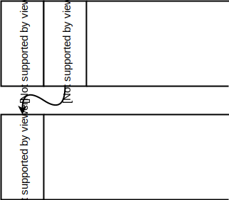
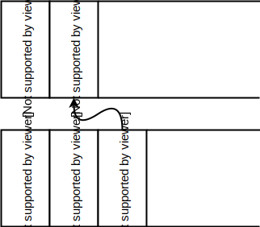

# Async/await

--
- ще говорим за async/await в Rust
--
- нова функционалност в езика
--
- стабилизирана в rust 1.39 (07 ноември 2019)
--
- дълго чакана функционалност
--
- но първо - защо async?

---

# Защо async/await?

### Проблемът

Конкурентност - искаме да изпълняваме няколко неща едновременно

```rust
# // norun
# use std::io;
# fn read_file(path: &str) -> io::Result<String> { unimplemented!() }
#
fn main() -> io::Result<()> {
    let contents1 = read_file("file1.txt")?;
    let contents2 = read_file("file2.txt")?;
    // ...
#   Ok(())
}
```

---

# Защо async/await?

### Решение

Нишки

```rust
# // norun
# use std::io;
# use std::thread;
# fn read_file(path: &str) -> io::Result<String> { unimplemented!() }
#
fn main() -> io::Result<()> {
    let t1 = thread::spawn(|| read_file("file1.txt"));
    let t2 = thread::spawn(|| read_file("file2.txt"));

    let contents1 = t1.join().unwrap()?;
    let contents2 = t2.join().unwrap()?;
    // ...
#   Ok(())
}
```

---

# Защо async/await?

### Нишки

--
- удобни
--
- предоставени са ни наготово от операционната система
--
- [preemptive scheduling](https://en.wikipedia.org/wiki/Preemption_(computing))
--
- fair scheduling
--
- и т.н.

---

# Защо async/await?

### Нишки

--
- недостатъци - не са подходящи ако искаме да имаме хиляди едновременни операции
--
- бавно превключване, заемат много памет, ...
--
- затова в такива ситуации се използват coroutines
--
- много задачи които работят конкурентно върху малък брой нишки на ОС
--
- async/await е оптимизация за случаи когато се нуждаем от голямо количество нишки

---

# Async/await в Rust

- за пример за използване на async/await ще използваме библиотеката [async-std](https://crates.io/crates/async-std)

```toml
# Cargo.toml

[dependencies]
async-std = "1.1.0"
```

---

# Async/await в Rust

### Std

```rust
use std::fs::File;
use std::io::{self, Read};


fn read_file(path: &str) -> io::Result<String> {
    let mut file = File::open(path)?;
    let mut buffer = String::new();
    file.read_to_string(&mut buffer)?;
    Ok(buffer)
}
#
# fn main() {}
```

---

# Async/await в Rust

### Async-std

```rust
# extern crate async_std;
use async_std::prelude::*;
use async_std::fs::File;
use async_std::io;


async fn read_file(path: &str) -> io::Result<String> {
    let mut file = File::open(path).await?;
    let mut buffer = String::new();
    file.read_to_string(&mut buffer).await?;
    Ok(buffer)
}
#
# fn main() {}
```

---

# Async/await в Rust

### \`async fn\`

```rust
# extern crate async_std;
use async_std::prelude::*;
use async_std::fs::File;
use async_std::io;

// async fn декларира, че това е асинхронна функция, която връща Future
async fn read_file(path: &str) -> io::Result<String> {
    let mut file = File::open(path).await?;
    let mut buffer = String::new();
    file.read_to_string(&mut buffer).await?;
    Ok(buffer)
}
#
# fn main() {}
```

---

# Async/await в Rust

### Груб превод на \`async fn\`

`async fn(...) -> T` ⇒ `fn(...) -> impl Future<Output = T>`

```rust
use async_std::prelude::*;
use async_std::fs::File;
use async_std::io;

use std::future::Future;

fn read_file<'a>(path: &'a str) -> impl Future<Output = io::Result<String>> + 'a {
    // async блок също връща `impl Future`
    async move {
        let mut file = File::open(path).await?;
        let mut buffer = String::new();
        file.read_to_string(&mut buffer).await?;
        Ok(buffer)
    }
}
#
# fn main() {}
```

---

# Trait Future

```rust
# use std::task::Context;
# use std::pin::Pin;
#
pub trait Future {
    type Output;
    fn poll(self: Pin<&mut Self>, cx: &mut Context) -> Poll<Self::Output>;
}

pub enum Poll<T> {
    Ready(T),
    Pending,
}
#
# fn main() {}
```

- игнорирайте `Pin` и `Context` засега

---

# Trait Future

--
- декларира отложено изпълнение
--
- наподобява closure, чието изпълнение може да бъде прекъсвано и продължавано
--
- по само себе си future-а не прави нищо
--
- той е мързелив
--
- за да започне работа трябва някой да го изпълни

---

# std::future и futures-rs

- преди да бъдат добавени към `std` futures съществуваха в rust екосистемата като библиотеката [futures](https://docs.rs/futures)
--
- `futures 0.1` е стар интерфейс, който все още се използва от някои библиотеки, има варианти за съвместимост с новия интерфейс, ако го срещнете
--
- `futures 0.3` е новият интерфейс, който се използва от async/await
--
- `std::future` стабилизира основната част от интерфейса
--
- `futures 0.3` и `std::future` предоставят едни и същи типове (`trait Future` в `futures 0.3.1` е reexport от `std`)
--
- но в библиотеката `futures` има допълнителни utilities които не са добавени в `std`

---

# Async/await в Rust

### .await

- един начин да се изпълни future е накой да го `.await`-не
- `.await` е постфиксен оператор
- `.await` може да се използва само в `async fn` или `async {}`

```rust
# extern crate async_std;
use async_std::prelude::*;
use async_std::fs::File;
use async_std::io;

async fn read_file(path: &str) -> io::Result<String> {
    // File::open() -> impl Future<Output=Result<File, io::Error>>
    // .await       -> Result<File, io::Error>
    // ?            -> File
    let mut file = File::open(path).await?;

    let mut buffer = String::new();
    file.read_to_string(&mut buffer).await?;
    Ok(buffer)
}
#
# fn main() {}
```

---

# Изпълнение

Има два начина да изпълним future
- `.await` в `async` функция или блок
- да го подадем на изпълнител (executor), който ще използва `future.poll()`

---

# Задачи

- изпълнителите работят със задачи ("task"-ове)
--
- задачата е цялото дърво от навързани future-и, които искаме да изпълним като една цяла операция

---

# Задачи

### Синхронно изпълнение

- най-простия вариант да изпълним future е да блокираме докато операцията не приключи
--
- за целта можем да използваме `task::block_on` от `async_std`
--
- това създава машинарията нужна за изпълнение на задачи (припомнете си `Pin<Self>`, `Context`)
--
- и извиква `future.poll` в цикъл в текущата нишка докато future-а не върне `Ready`.

```rust
# extern crate async_std;
# use async_std::prelude::*;
# use async_std::fs::File;
# use async_std::io;
use async_std::task;
#
# async fn read_file(path: &str) -> io::Result<String> {
#     let mut file = File::open(path).await?;
#
#     let mut buffer = String::new();
#     file.read_to_string(&mut buffer).await?;
#     Ok(buffer)
# }
#
fn main() {
# let file_contents = "Failure is just success rounded down, my friend!\n";
# std::fs::write("deep_quotes.txt", file_contents.as_bytes()).unwrap();
    let file_contents = task::block_on(read_file("deep_quotes.txt"));
    println!("{:?}", file_contents);
}
```

---

# Задачи

### Асинхронно изпълнение

- ще ни трябва някакъв executor, т.е. runtime
--
- има множество библиотеки които предоставят executor, но двете най-разпространени са
--
    - tokio
--
    - async_std

---

# Задачи

### Асинхронно изпълнение

- от `async_std` можем да използваме `task::spawn`
--
- `task::spawn` ще добави задачата към някакъв списък от задачи
--
- които се изпълняват паралелно върху thread pool
--
- и ще върне `JoinHandle`
--
- което е future, който връща резултата от задачата

---

# Задачи

### Асинхронно изпълнение

```rust
# extern crate async_std;
# use async_std::prelude::*;
# use async_std::fs::File;
# use async_std::io;
use async_std::task;
#
# async fn read_file(path: &str) -> io::Result<String> {
#     let mut file = File::open(path).await?;
#
#     let mut buffer = String::new();
#     file.read_to_string(&mut buffer).await?;
#     Ok(buffer)
# }
#
fn main() {
# let deep_contents = "Failure is just success rounded down, my friend!\n";
# let wide_contents = "F a i l u r e  i s  j u s t  s u c c e s s  r o u n d e d  d o w n ,  m y  f r i e n d !\n";
# std::fs::write("deep_quotes.txt", deep_contents.as_bytes()).unwrap();
# std::fs::write("wide_quotes.txt", wide_contents.as_bytes()).unwrap();
    let file_contents = task::block_on(async {
        let deep_handle = task::spawn(read_file("deep_quotes.txt"));
        let wide_handle = task::spawn(read_file("wide_quotes.txt"));

        let deep = deep_handle.await;
        let wide = wide_handle.await;

        println!("All quotes:\n{:?}\n{:?}", deep, wide);
    });
}
```

---

# Конкурентност и паралелизъм

--
Конкурентност - много задачи се изпълняват върху една нишка, като се редуват за резен от процесорното време
--
Паралелизъм - много задачи се изпълняват по едно и също време върху много нишки

---

# Примери

- нека направим демонстрация
--
- за целта ще използваме функция която прочита съдържанието на файл, но бавно

```rust
# extern crate async_std;
# use async_std::prelude::*;
# use async_std::fs::File;
# use async_std::io;
use async_std::task;
use std::time::Duration;
#
# async fn read_file(path: &str) -> io::Result<String> {
#     let mut file = File::open(path).await?;
#
#     let mut buffer = String::new();
#     file.read_to_string(&mut buffer).await?;
#     Ok(buffer)
# }

async fn fetch_file(path: &str) -> io::Result<String> {
    task::sleep(Duration::from_secs(1)).await;
    read_file(path).await
}
# fn main() {}
```

--
- забележете, че използваме `async_std::task::sleep` вместо `std::thread::sleep`
--
- `async_std` предоставя алтернативи на стандартните типове и функции, които блокират текущата задача, а не текущата нишка
--
- други важни типове - мутекс, канали, ...
--
- важно е да не използваме блокиращи функции в асинхронен код, защото като блокираме изпълняващата нишка никоя друга задача не може да се изпълни на нея

---

# Примери

```rust
# extern crate async_std;
# use async_std::prelude::*;
# use async_std::fs::File;
# use async_std::io;
# use async_std::task;
#
# async fn read_file(path: &str) -> io::Result<String> {
#     let mut file = File::open(path).await?;
#
#     let mut buffer = String::new();
#     file.read_to_string(&mut buffer).await?;
#     Ok(buffer)
# }
#
# async fn fetch_file(path: &str) -> io::Result<String> {
#     task::sleep(std::time::Duration::from_secs(1)).await;
#     read_file(path).await
# }
#
# fn main() {
# let deep_contents = "Deep!\n";
# let wide_contents = "W i d e!\n";
# std::fs::write("deep_quotes.txt", deep_contents.as_bytes()).unwrap();
# std::fs::write("wide_quotes.txt", wide_contents.as_bytes()).unwrap();
let begin = std::time::Instant::now();

task::block_on(async {
    let deep = fetch_file("deep_quotes.txt").await;
    let wide = fetch_file("wide_quotes.txt").await;

    println!("All quotes: {:?} {:?}", deep, wide);
});

println!("Работата отне: {:?}", begin.elapsed());
# }
```

--
- тази имплементация е синхронна - изчакваме първият файл да се прочете преди да започнем да четем втория

---

# Примери

```rust
# extern crate async_std;
# use async_std::prelude::*;
# use async_std::fs::File;
# use async_std::io;
# use async_std::task;
#
# async fn read_file(path: &str) -> io::Result<String> {
#     let mut file = File::open(path).await?;
#
#     let mut buffer = String::new();
#     file.read_to_string(&mut buffer).await?;
#     Ok(buffer)
# }
#
# async fn fetch_file(path: &str) -> io::Result<String> {
#     task::sleep(std::time::Duration::from_secs(1)).await;
#     read_file(path).await
# }
#
# fn main() {
# let deep_contents = "Deep!\n";
# let wide_contents = "W i d e!\n";
# std::fs::write("deep_quotes.txt", deep_contents.as_bytes()).unwrap();
# std::fs::write("wide_quotes.txt", wide_contents.as_bytes()).unwrap();
let begin = std::time::Instant::now();

task::block_on(async {
    let deep_future = fetch_file("deep_quotes.txt");
    let wide_future = fetch_file("wide_quotes.txt");

    let deep = deep_future.await;
    let wide = wide_future.await;

    println!("All quotes: {:?} {:?}", deep, wide);
});

println!("Работата отне: {:?}", begin.elapsed());
# }
```

--
- отново синхронна - future-ите не правят нищо докато не им извикаме `poll` или `.await`

---

# Примери - конкурентност

```rust
# extern crate async_std;
# use async_std::prelude::*;
# use async_std::fs::File;
# use async_std::io;
# use async_std::task;
#
# async fn read_file(path: &str) -> io::Result<String> {
#     let mut file = File::open(path).await?;
#
#     let mut buffer = String::new();
#     file.read_to_string(&mut buffer).await?;
#     Ok(buffer)
# }
#
# async fn fetch_file(path: &str) -> io::Result<String> {
#     task::sleep(std::time::Duration::from_secs(1)).await;
#     read_file(path).await
# }
#
# fn main() {
# let deep_contents = "Deep!\n";
# let wide_contents = "W i d e!\n";
# std::fs::write("deep_quotes.txt", deep_contents.as_bytes()).unwrap();
# std::fs::write("wide_quotes.txt", wide_contents.as_bytes()).unwrap();
use futures::join;

let begin = std::time::Instant::now();

task::block_on(async {
    let deep_future = fetch_file("deep_quotes.txt");
    let wide_future = fetch_file("wide_quotes.txt");

    let (deep, wide) = join!(deep_future, wide_future);

    println!("All quotes: {:?} {:?}", deep, wide);
});

println!("Работата отне: {:?}", begin.elapsed());
# }
```

--
- това е пример за конкурентно изпълнение
--
- всичко се изпълнява само на главната нишка
--
- използваме [join!](https://docs.rs/futures/0.3.1/futures/macro.join.html) от библиотеката `futures`
--
- `join!` се опитва да позволи на всеки future да прогресира
--
- извиква `poll` върху първия, ако той върне че ще блокира извиква `poll` върху втория, и т.н.

---

# Примери - паралелизъм

```rust
# extern crate async_std;
# use async_std::prelude::*;
# use async_std::fs::File;
# use async_std::io;
# use async_std::task;
#
# async fn read_file(path: &str) -> io::Result<String> {
#     let mut file = File::open(path).await?;
#
#     let mut buffer = String::new();
#     file.read_to_string(&mut buffer).await?;
#     Ok(buffer)
# }
#
# async fn fetch_file(path: &str) -> io::Result<String> {
#     task::sleep(std::time::Duration::from_secs(1)).await;
#     read_file(path).await
# }
#
# fn main() {
# let deep_contents = "Deep!\n";
# let wide_contents = "W i d e!\n";
# std::fs::write("deep_quotes.txt", deep_contents.as_bytes()).unwrap();
# std::fs::write("wide_quotes.txt", wide_contents.as_bytes()).unwrap();
let begin = std::time::Instant::now();

task::block_on(async {
    let deep = task::spawn(fetch_file("deep_quotes.txt")).await;
    let wide = task::spawn(fetch_file("wide_quotes.txt")).await;

    println!("All quotes: {:?} {:?}", deep, wide);
});

println!("Работата отне: {:?}", begin.elapsed());
# }
```

--
- отново синхронно - чакаме да прочетем първия файл преди да пуснем втория таск

---

# Примери - паралелизъм

```rust
# extern crate async_std;
# use async_std::prelude::*;
# use async_std::fs::File;
# use async_std::io;
# use async_std::task;
#
# async fn read_file(path: &str) -> io::Result<String> {
#     let mut file = File::open(path).await?;
#
#     let mut buffer = String::new();
#     file.read_to_string(&mut buffer).await?;
#     Ok(buffer)
# }
#
# async fn fetch_file(path: &str) -> io::Result<String> {
#     task::sleep(std::time::Duration::from_secs(1)).await;
#     read_file(path).await
# }
#
# fn main() {
# let deep_contents = "Deep!\n";
# let wide_contents = "W i d e!\n";
# std::fs::write("deep_quotes.txt", deep_contents.as_bytes()).unwrap();
# std::fs::write("wide_quotes.txt", wide_contents.as_bytes()).unwrap();
let begin = std::time::Instant::now();

task::block_on(async {
    let deep_handle = task::spawn(fetch_file("deep_quotes.txt"));
    let wide_handle = task::spawn(fetch_file("wide_quotes.txt"));

    let deep = deep_handle.await;
    let wide = wide_handle.await;

    println!("All quotes: {:?} {:?}", deep, wide);
});

println!("Работата отне: {:?}", begin.elapsed());
# }
```

--
- паралелно - задачите започват да се изпълняват в момента в който извикаме `task::spawn`

---

# Справяне с блокиращи операции

```rust
# use std::fs::File;
# use std::io::{self, Read};
# use std::thread;
# use std::time::Duration;
#
# fn read_file_sync(path: &str) -> io::Result<String> {
#     let mut file = File::open(path)?;
#     let mut buffer = String::new();
#     file.read_to_string(&mut buffer)?;
#     Ok(buffer)
# }
#
fn fetch_file_sync(path: &str) -> io::Result<String> {
    thread::sleep(Duration::from_millis(1500));
    read_file_sync(path)
}
# fn main() {}
```

---

# Справяне с блокиращи операции

```rust
# extern crate async_std;
# use async_std::prelude::*;
# use async_std::task;
# use std::io::Read as _;
#
# async fn read_file(path: &str) -> async_std::io::Result<String> {
#     let mut file = async_std::fs::File::open(path).await?;
#     let mut buffer = String::new();
#     file.read_to_string(&mut buffer).await?;
#     Ok(buffer)
# }
#
# async fn fetch_file(path: &str) -> async_std::io::Result<String> {
#     task::sleep(std::time::Duration::from_secs(1)).await;
#     read_file(path).await
# }
#
# fn read_file_sync(path: &str) -> std::io::Result<String> {
#     let mut file = std::fs::File::open(path)?;
#     let mut buffer = String::new();
#     file.read_to_string(&mut buffer)?;
#     Ok(buffer)
# }
#
# fn fetch_file_sync(path: &str) -> std::io::Result<String> {
#     std::thread::sleep(std::time::Duration::from_millis(1500));
#     read_file_sync(path)
# }
#
# fn main() {
# let deep_contents = "Deep!\n";
# let wide_contents = "W i d e!\n";
# std::fs::write("deep_quotes.txt", deep_contents.as_bytes()).unwrap();
# std::fs::write("wide_quotes.txt", wide_contents.as_bytes()).unwrap();
let begin = std::time::Instant::now();

task::block_on(async {
    let deep_handle = task::spawn(fetch_file("deep_quotes.txt"));
    let wide_handle = task::spawn_blocking(|| fetch_file_sync("wide_quotes.txt"));

    let deep = deep_handle.await;
    let wide = wide_handle.await;

    println!("All quotes: {:?} {:?}", deep, wide);
});

println!("Работата отне: {:?}", begin.elapsed());
# }
```

--
- [task::spawn_blocking](https://docs.rs/async-std/1.2.0/async_std/task/fn.spawn_blocking.html) - използва отделен threadpool само за блокиращи операции, за да не се блокират нишките които изпълняват задачи

---

# Справяне с блокиращи операции

Вариант за ръчна имплементация, ако нямаше `task::spawn_blocking`

```rust
# extern crate async_std;
# use async_std::prelude::*;
# use async_std::task;
# use std::io::Read as _;
#
# async fn read_file(path: &str) -> async_std::io::Result<String> {
#     let mut file = async_std::fs::File::open(path).await?;
#     let mut buffer = String::new();
#     file.read_to_string(&mut buffer).await?;
#     Ok(buffer)
# }
#
# async fn fetch_file(path: &str) -> async_std::io::Result<String> {
#     task::sleep(std::time::Duration::from_secs(1)).await;
#     read_file(path).await
# }
#
# fn read_file_sync(path: &str) -> std::io::Result<String> {
#     let mut file = std::fs::File::open(path)?;
#     let mut buffer = String::new();
#     file.read_to_string(&mut buffer)?;
#     Ok(buffer)
# }
#
# fn fetch_file_sync(path: &str) -> std::io::Result<String> {
#     std::thread::sleep(std::time::Duration::from_millis(1500));
#     read_file_sync(path)
# }
#
# fn main() {
# let deep_contents = "Deep!\n";
# let wide_contents = "W i d e!\n";
# std::fs::write("deep_quotes.txt", deep_contents.as_bytes()).unwrap();
# std::fs::write("wide_quotes.txt", wide_contents.as_bytes()).unwrap();
let begin = std::time::Instant::now();

task::block_on(async {
    let deep_handle = task::spawn(fetch_file("deep_quotes.txt"));
    let wide_handle = task::spawn(async {
        let (sender, receiver) = async_std::sync::channel(1);
        std::thread::spawn(move || {
            let res = fetch_file_sync("wide_quotes.txt");
            task::block_on(sender.send(res));
        });

        receiver.recv().await
    });

    let deep = deep_handle.await;
    let wide = wide_handle.await;

    println!("All quotes: {:?} {:?}", deep, wide);
});

println!("Работата отне: {:?}", begin.elapsed());
# }
```

---

# Имплементация на futures

---

# Стандартен стек


- трябва да ви е познато от курса по C++
- но ако не ви е:
- парче памет, което е заделено за вашата нишка да си пише неща
- използва се при викане на функции
- аргументи, локални променливи, временни стойности, резултати, регистри, ...
- използва се като стек - последният влязъл елемент е първият излязъл

---

# Стандартен стек


- извикване на функция
- добавя се нова стекова рамка на върха на стека

---

# Стандартен стек


- връщане от функция
- премахва се стековата рамка от върха на стека

---

# Stackfull coroutine

- корутини които наподобяват нишки
--
- всяка нишка си има стек
--
- имитират изпълнението на нишки от операционната система
--
- повечето езици които поддържат promises, futures или async/await използват тази имплементация
--
- наричат се още - зелени нишки, fibers, корутини, ...

---

# Stackfull coroutine


Как работят
--
- нека имаме стандартна нишка на ОС, която изпълнява функция `foo1`
--
- `foo1` е извикала `foo2`

---

# Stackfull coroutine



- `foo2` иска да изпълни асинхронна функция
--
- алокира се нов стек за `BAR`
--
- променя се адреса на стека (процесорът държи указател към върха на стека)
--
- извиква се функцията `bar1` в новия стек
--
- процесора продължава да си работи все едно нищо не се е променило

---

# Stackfull coroutine


- `bar1` извиква `bar2`
- `bar2` извиква `bar3`

---

# Stackfull coroutine



- функцията `bar3` е асинхронна и иска да прекъсне
--
- (например чака за входно-изходна операция)
--
- за целта пренасочва адреса на стека обратно към оригиналната памет
--
- и се "връща" в `foo2`

---

# Stackfull coroutine


- оттам нататък `foo2` може да извика друга корутина
--
- или да продължи изпълнението на `bar3`

---

# Stackfull coroutine

Предимства
- прекъсване по всяко време
- корутината си пази състоянието в което е прекъсната - всичко е на стека
- може да се продължи от същото състояние

Недостатъци
- заема се много памет за стекове
- преоразмеряването на стекове е проблемно

---

# Stackless coroutines

- корутини без стек
--
- представляват една машина на състояния
--
- прогреса представлява преминаване от едно състояние в следващо
--
- по-рядко се използват - виждал съм ги само на две места
--
    - futures в rust
    - предложението за корутини в c++20

---

# Stackless coroutines


Как работят
--
- отново започваме с нишка на ОС
--
- нишката изпълнява функциите `foo1` и `foo2`

---

# Stackless coroutines


- `foo2` започва да изпълнява корутина `BAR`
--
- заделя машината от състояния на `BAR` (напр. `Box<BarState>`)
--
- и извиква `bar1` като съвсем нормална функция (напр. `bar1(&mut bar_state)`)
--
- `bar1` извиква други функции

---

# Stackless coroutines


- функцията `bar3` иска да прекъсне
--
- но за да се върне до `foo2` трябва да освободи стека
--
- запазва текущото си състояние
--
- връща `NotReady`

---

# Stackless coroutines


- понеже `bar3` е върнала, че не може да продължи, значи `bar2` също не може
--
- `bar2` си запазва състоянието и връща `NotReady`
--
- `bar1` си запазва състоянието и връща `NotReady`

---

# Stackless coroutines


- ако искаме да продължим изпълнението на `bar3` трябва отново:
--
- `foo2` да извика `bar1`
--
- `bar1` да извика `bar2`
--
- `bar2` да извика `bar3`

---

# Stackless coroutines

Предимства
- евтини за създаване - трябва да се задели само структурата пазеща state машината
- използват стека на нишката в която се изпълняват (добре от гледна точка на процесорен кеш)

Недостатъци
- трябва езикът/компилаторът да може да генерира state машината
- по-сложно за имплементиране от stackfull coroutines

---

# Разгъване на `.await`

```rust
# // ignore
let mut file = File::open(path).await?;
let mut buffer = String::new();
file.read_to_string(&mut buffer).await?;
Ok(buffer)
```

---

# Разгъване на `.await`

```rust
# use async_std::fs::File;
#
fn read_file(path: &str) -> ReadFileFut {
    ReadFileFut::Initialized { path }
}

enum ReadFileFut<'a> {
    Initialized { path: &'a str },
    FileOpen { fut: FileOpenFut },
    ReadToString { file: File, buffer: String, fut: ReadToStringFut },
    Done,
}
#
# struct FileOpenFut;
# struct ReadToStringFut;
#
# fn main() {}
```

---

# Разгъване на `.await`

```rust
# // ignore
impl<'a> Future for ReadFileFut<'a> {
    type Output = io::Result<String>;

    fn poll(self: Pin<&mut Self>, _ctx: Context) -> Poll<Self::Output> {
        loop {
            match self {
                ReadFileFut::Initialized { .. } => { /* ... */ },
                ReadFileFut::FileOpen { .. } => { /* ... */ },
                ReadFileFut::ReadToString { .. } => { /* ... */ },
                ReadFileFut::Done => { /* ... */ },
            }
        }
    }
}
```

---

# Разгъване на `.await`

Initialized { path }
--
- `let fut = File::open(path)`
- `self = FileOpen { fut }`

---

# Разгъване на `.await`

FileOpen { fut }
--
- извикваме `fut.poll()`
    - `Poll::NotReady` => `return Poll::NotReady`
    - `Poll::Ready(file)` => `file?`
        - `Err(e)`
            - `self = Done`
            - `return Poll::Ready(Err(e.into()))`
        - `Ok(file)`
            - `let buffer = String::new()`
            - `let fut = file.read_to_string(&mut buffer)`
            - `self = ReadToString { file, buffer, fut }`

---

# Разгъване на `.await`

ReadToString { buffer, fut, .. }
--
- извикваме `fut.poll()`
    - `Poll::NotReady` => `return Poll::NotReady`
    - `Poll::Ready(res)` => `res?`
        - `Err(e)`
            - `self = Done`
            - `return Poll::Ready(Err(e.into()))`
        - `Ok`
            - `self = Done`
            - `return Poll::Ready(Ok(buffer))`

---

# Разгъване на `.await`

ReadFileFut::Done
--
- `panic!()`

---

# Обобщение

--
- за всеки `async fn` или `async {}` се генерира state машина
--
- машината се репрезентира като енумерация
--
- за вариант за всяка ситуация в която се `.await`-ва future
--
- когато машината изчаква future и ѝ извикаме `poll`
--
    - ще извика `poll` на вътрешния future
--
    - ако той върне `NotReady` - връща `NotReady`
--
    - ако той върне `Ready` - продължава към следващото състояние

---

# Допълнителна информация

- https://www.youtube.com/watch?v=L7X0vpAU-sU - презентация за async-std
- https://book.async.rs/ - книгата за async std, туториала в който имплементират чат сървър е много добър
