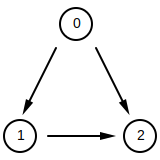

# Преговор

--
- примерно решение на домашно 2
--
- сравняване на floating point числа
--
- crate `approx`
--
- property testing с `quick_check`

---

# Преговор

--
- демо на hangman
--
- използване на аргументи от командния ред
--
- crates `clap` и `structopt`

---

# Threadpool

### Какво е threadpool

--
- модел за разпределяне и конкурентно изпълнение на работа, която се състои от независими задачи
--
- съдържа множество нишки (обикновенно по една нишка на ядро)
--
- съдържа опашка от задачи, които чакат да бъдат изпълнени
--
- когато някоя нишка е свободна, тя взима задача от опашката и я изпълнява

---

# Threadpool

Има готови имплементации на threadpool:

- [threadpool](https://crates.io/crates/threadpool)
- [rayon](https://crates.io/crates/rayon)

Но за упражнение ще си напишем минималистична имплементация

---

# Threadpool

Целим да имаме следния интерфейс:

```rust
pub struct ThreadPool {
    /* ... */
}

impl ThreadPool {
    pub fn new() -> Self {
#       unimplemented!()
    }

    pub fn spawn<F: FnOnce()>(&self, task: F) {
#       unimplemented!()
    }

    pub fn join(self) {
#       unimplemented!()
    }
}
# fn main() {}
```

---

# Threadpool

### Spawning threads

При създаване пускаме определен брой нишки. Всяка нишка ще цикли докато не получи задача.

```rust
use std::thread::{self, JoinHandle};

pub struct ThreadPool {
    threads: Vec<JoinHandle<()>>
}

impl ThreadPool {
    pub fn new() -> Self {
        const NUM_CPUS: usize = 4;

        let threads = (0..NUM_CPUS)
            .map(|_| thread::spawn(move || {
                loop {
                    /* TODO: get tasks */
                }
            }))
            .collect::<Vec<_>>();

        ThreadPool {
            threads,
        }
    }
}
# fn main() {}
```

---

# Threadpool

`const NUM_CPUS = 4` не е добро решение. По-добре би било да пуснем толкова нишки, колкото ядра има процесора на машината на която вървим.

Има crate специално за това - [num_cpus](https://crates.io/crates/num_cpus)

```rust
extern crate num_cpus;

# use std::thread::{self, JoinHandle};

pub struct ThreadPool {
    threads: Vec<JoinHandle<()>>
}

impl ThreadPool {
    pub fn new() -> Self {
        let threads = (0..num_cpus::get())
            .map(|_| thread::spawn(move || {
                loop {
                    /* TODO: run tasks */
                }
            }))
            .collect::<Vec<_>>();

        ThreadPool {
            threads,
        }
    }
}
# fn main() {}
```

---

# Threadpool

### Tasks

Трябва ни начин да доставим задачите до нишките.

`std::sync::channel` няма да ни свърши работа, защото е MPSC (multi-producer single-consumer), а ние имаме много нишки (consumers).

Можем да използваме някоя структура от `crossbeam`:
- `crossbeam::deque` няма да ни свърши работа, защото позволява само една нишка да добавя елементи, т.е. ефективно е SPMC (това беше структурата която ползвах на живото демо, упс).
- `crossbeam::queue::MsQueue` е супер проста опашка с push и pop методи и ще свърши работа.
- `crossbeam::channel` също би работил.

```rust
# // ignore
extern crate crossbeam;
# extern crate num_cpus;
#
use crossbeam::queue::MsQueue as Queue;
# use std::thread::{self, JoinHandle};
# use std::sync::Arc;

enum Task {
    Run(Box<dyn FnOnce() + Send>),
    Exit,
}

pub struct ThreadPool {
    threads: Vec<JoinHandle<()>>,
    queue: Arc<Queue<Task>>,
}

impl ThreadPool {
    pub fn new() -> Self {
        // слагаме опашката в Arc, за да я споделим между нишките
        let queue = Arc::new(Queue::new());

        let threads = (0..num_cpus::get())
            .map(|_| {
                let queue = queue.clone();

                thread::spawn(move || {
                    loop {
                        // опашката използва атомарни операции,
                        // затова `push` и `pop` методите приемат `&self`
                        match queue.pop() {
                            Task::Run(f) => f(),
                            Task::Exit => break,
                        }
                    }
                })
            })
            .collect::<Vec<_>>();

        ThreadPool {
            threads,
            queue,
        }
    }
}
# fn main() {}
```

---

# Threadpool

### FnBox

Ако компилираме кода ще получим грешка.

Причината е, че `Box<dyn FnOnce()>` не е директно използваемо, поради ограничеята за trait objects. По-точно през trait object не можем да извикаме функция, която приема `self`.

```rust
# extern crate crossbeam;
# extern crate num_cpus;
#
# use crossbeam::queue::MsQueue as Queue;
# use std::thread::{self, JoinHandle};
# use std::sync::Arc;

enum Task {
    Run(Box<dyn FnOnce() + Send>),
    Exit,
}

pub struct ThreadPool {
    threads: Vec<JoinHandle<()>>,
    queue: Arc<Queue<Task>>,
}

impl ThreadPool {
    pub fn new() -> Self {
        // слагаме опашката в Arc, за да я споделим между нишките
        let queue = Arc::new(Queue::new());

        let threads = (0..num_cpus::get())
            .map(|_| {
                let queue = queue.clone();

                thread::spawn(move || {
                    loop {
                        // опашката използва атомарни операции,
                        // затова `push` и `pop` методите приемат `&self`
                        match queue.pop() {
                            Task::Run(f) => f(),
                            Task::Exit => break,
                        }
                    }
                })
            })
            .collect::<Vec<_>>();

        ThreadPool {
            threads,
            queue,
        }
    }
}
# fn main() {}
```

---

# Threadpool

### FnBox

Има workaround на проблема, който е да използваме trait-а `FnBox`, който го има само на nightly.
Ако не искаме да ползваме nightly можем да си го напишем сами - [пример][tp].

[tp]: https://docs.rs/threadpool/1.7.1/src/threadpool/lib.rs.html#89-97

```rust
#![feature(fnbox)]
#
# extern crate crossbeam;
# extern crate num_cpus;
#
# use crossbeam::queue::MsQueue as Queue;
use std::boxed::FnBox;
# use std::sync::Arc;
# use std::thread::{self, JoinHandle};

enum Task {
    Run(Box<dyn FnBox() + Send>),
    Exit,
}

pub struct ThreadPool {
    threads: Vec<JoinHandle<()>>,
    queue: Arc<Queue<Task>>,
}

impl ThreadPool {
    pub fn new() -> Self {
        // слагаме опашката в Arc, за да я споделим между нишките
        let queue = Arc::new(Queue::new());

        let threads = (0..num_cpus::get())
            .map(|_| {
                let queue = queue.clone();

                thread::spawn(move || {
                    loop {
                        // опашката използва атомарни операции,
                        // затова `push` и `pop` методите приемат `&self`
                        match queue.pop() {
                            Task::Run(f) => f(),
                            Task::Exit => break,
                        }
                    }
                })
            })
            .collect::<Vec<_>>();

        ThreadPool {
            threads,
            queue,
        }
    }
}
# fn main() {}
```

---

# Threadpool

За да добавим задача просто я добавяме в опашката.

Понеже `ThreadPool` имплементира `Sync` и `spawn` приема `&self`, можем да си споделим thread pool-a, например като го сложим в `Arc`, и да добавяме задачи от няколко нишки.

```rust
# #![feature(fnbox)]
#
# extern crate crossbeam;
# extern crate num_cpus;
#
# use crossbeam::queue::MsQueue as Queue;
# use std::boxed::FnBox;
# use std::sync::Arc;
# use std::thread::JoinHandle;
#
# enum Task {
#     Run(Box<dyn FnBox() + Send>),
#     Exit,
# }
#
# pub struct ThreadPool {
#     threads: Vec<JoinHandle<()>>,
#     queue: Arc<Queue<Task>>,
# }
#
impl ThreadPool {
    pub fn spawn<F>(&self, task: F)
    where
        F: FnOnce() + Send + 'static
    {
        self.queue.push(Task::Run(Box::new(task)))
    }
}
# fn main() {}
```

---

# Threadpool

Добавяме си и функция `join`, която блокира докато всички задачи не бъдат изпълнени.

```rust
# #![feature(fnbox)]
#
# extern crate crossbeam;
# extern crate num_cpus;
#
# use crossbeam::queue::MsQueue as Queue;
# use std::boxed::FnBox;
# use std::sync::Arc;
# use std::thread::JoinHandle;
#
# enum Task {
#     Run(Box<dyn FnBox() + Send>),
#     Exit,
# }
#
# pub struct ThreadPool {
#     threads: Vec<JoinHandle<()>>,
#     queue: Arc<Queue<Task>>,
# }
#
#
impl ThreadPool {
    pub fn join(self) {
        for _ in &self.threads {
            self.queue.push(Task::Exit);
        }

        for t in self.threads {
            let _ = t.join();
        }
    }
}
# fn main() {}
```

---

# Threadpool

Целият код:

```rust
#![feature(fnbox)]

extern crate crossbeam;
extern crate num_cpus;

use crossbeam::queue::MsQueue as Queue;
use std::boxed::FnBox;
use std::sync::Arc;
use std::thread::{self, JoinHandle};

enum Task {
    Run(Box<FnBox() + Send>),
    Exit,
}

struct ThreadPool {
    threads: Vec<JoinHandle<()>>,
    queue: Arc<Queue<Task>>,
}

impl ThreadPool {
    pub fn new() -> Self {
        let queue = Arc::new(Queue::new());

        let threads = (0..num_cpus::get())
            .map(|_| {
                let queue = queue.clone();

                thread::spawn(move || loop {
                    match queue.pop() {
                        Task::Run(f) => f(),
                        Task::Exit => break,
                    }
                })
            })
            .collect::<Vec<_>>();

        ThreadPool {
            threads,
            queue,
        }
    }

    pub fn spawn<F>(&self, f: F)
    where
        F: FnOnce() + Send + 'static,
    {
        self.queue.push(Task::Run(Box::new(f)));
    }

    pub fn join(self) {
        for _ in &self.threads {
            self.queue.push(Task::Exit);
        }

        for t in self.threads {
            let _ = t.join();
        }
    }
}
# fn main() {}
```

---

# Threadpool

И това е. Разбира се в готовите библиотеки има доста допълнителни функционалностии, които не сме покрили:

- справяне с `panic!`
- отменяне на задача
- информация за това кои задачи са се изпълнили и колко остават в опашката
- динамично оразмеряване на броя нишки
- и др.

---

# Rayon

- библиотека за паралелизъм по данни
- https://crates.io/crates/rayon
- https://docs.rs/rayon/

---

# par_graph

За пример за използване на rayon ще си направим програма, която генерира граф.

Върховете на графа ще се бележат с числа 0..n. Графа ще бъде записан в списъци на съседство.
Например следната структура описва графа по-отдолу:

```rust
# // ignore
let lists = [
    [1, 2],     // съседи на връх 0, т.е. графът съдържа ребра (0, 1) и (0, 2)
    [2],        // съседи на връх 1, т.е. графът съдържа ребро (1, 2)
    [],         // съсъде на връх 2
];
```



---

# Базови дефиниции

```rust
#[derive(Debug, Clone)]
pub struct AdjLists {
    n_verts: usize,
    lists: Vec<Vec<usize>>,
}

impl AdjLists {
    pub fn new(n_verts: usize) -> Self {
        AdjLists {
            n_verts,
            lists: vec![vec![]; n_verts],
        }
    }
}
# fn main() {}
```

---

# Базови дефиниции

```rust
extern crate rand;
use rand::distributions::Uniform;
use rand::prelude::*;
# use std::ops::Range;

/// Помощна структура, обхващаща работата
/// необходима за генериране на част от графа
pub struct Job<'a> {
    pub from_verts: Range<usize>,
    pub to_verts: Range<usize>,
    pub n_edges: usize,
    pub lists: &'a mut [Vec<usize>],
}

impl<'a> Job<'a> {
    pub fn gen(&mut self) {
        let mut added = 0;
        let mut rng = rand::thread_rng();

        let from_range = Uniform::new(self.from_verts.start, self.from_verts.end);
        let to_range = Uniform::new(self.to_verts.start, self.to_verts.end);

        while added < self.n_edges {
            let from = from_range.sample(&mut rng);
            let to = to_range.sample(&mut rng);

            if from != to && self.list_at(from).iter().find(|&&e| e == to).is_none() {
                self.list_at(from).push(to);
                added += 1;
            }
        }
    }

    fn list_at(&mut self, v: usize) -> &mut Vec<usize> {
        &mut self.lists[v - self.from_verts.start]
    }
}
# fn main() {}
```

---

# Еднонишкова версия

За да има нещо с което да сравняваме.

```rust
# use std::ops::Range;
#
# pub struct Job<'a> {
#     pub from_verts: Range<usize>,
#     pub to_verts: Range<usize>,
#     pub n_edges: usize,
#     pub lists: &'a mut [Vec<usize>],
# }
#
# impl<'a> Job<'a> {
#     pub fn gen(&mut self) {
#         unimplemented!()
#     }
# }
#
# #[derive(Debug, Clone)]
# pub struct AdjLists {
#     n_verts: usize,
#     lists: Vec<Vec<usize>>,
# }
#
impl AdjLists {
#     pub fn new(n_verts: usize) -> Self {
#         unimplemented!()
#     }
#
    pub fn gen_seq(n_verts: usize, n_edges: usize) -> Self {
        let mut graph = AdjLists::new(n_verts);

        {
            let mut job = Job {
                from_verts: 0..n_verts,
                to_verts: 0..n_verts,
                n_edges: n_edges,
                lists: &mut graph.lists,
            };

            job.gen();
        }

        graph
    }
}
# fn main() {}
```

---

# Многонишкова версия с ръчна паралелизация

Ръчно разделяме графа на N еднакви части, по една за всяка нишка, и ги пускаме като задачи в threadpool-а на rayon.

```rust
extern crate rayon;
# use std::ops::Range;
# use std::mem;

# pub struct Job<'a> {
#     pub from_verts: Range<usize>,
#     pub to_verts: Range<usize>,
#     pub n_edges: usize,
#     pub lists: &'a mut [Vec<usize>],
# }
#
# impl<'a> Job<'a> {
#     pub fn gen(&mut self) {
#         unimplemented!()
#     }
# }
#
# #[derive(Debug, Clone)]
# pub struct AdjLists {
#     n_verts: usize,
#     lists: Vec<Vec<usize>>,
# }
#
impl AdjLists {
#     pub fn new(n_verts: usize) -> Self {
#         unimplemented!()
#     }
#
    pub fn gen_manual(n_verts: usize, n_edges: usize, n_threads: usize) -> Self {
        let mut graph = AdjLists::new(n_verts);

        {
            let mut state = graph.lists.as_mut_slice();

            // добавяме задача към глобалния thread pool
            // функцията блокира докато всички задача пуснати вътре не приключат
            rayon::scope(|scope| {
                (0..n_threads).map(move |i| {
                    let from_verts = subrange(0..n_verts, i, n_threads);

                    // `mem::replace` to "trick" the borrow checker
                    let tmp = mem::replace(&mut state, &mut []);
                    let (lists, next) = tmp.split_at_mut(from_verts.len());
                    state = next;

                    let n_edges = subrange(0..n_edges, i, n_threads).len();

                    Job {
                        from_verts,
                        to_verts: 0..n_verts,
                        n_edges,
                        lists,
                    }
                })
                .for_each(|mut job| {
                    // добавяме задача в глобалния thread pool на rayon
                    scope.spawn(move |_| job.gen())
                });
            });
        }

        graph
    }
}

/// Разделя `range` на `n_threads` равни части и връща `t`-тата част
fn subrange(range: Range<usize>, t: usize, n_threads: usize) -> Range<usize> {
    let from = t as f32 / n_threads as f32;
    let to = (t + 1) as f32 / n_threads as f32;

    Range {
        start: (range.start as f32 + from * range.len() as f32).floor() as usize,
        end: (range.start as f32 + to * range.len() as f32).floor() as usize,
    }
}
# fn main() {}
```

---

# Многонишкова версия с автоматична паралелизация

Разделяме графа на много парчета от по `CHUNK_SIZE` върха и оставяме `rayon` да се оправи с паралелизацията

```rust
extern crate rayon;
use rayon::prelude::*;
# use std::ops::Range;

# pub struct Job<'a> {
#     pub from_verts: Range<usize>,
#     pub to_verts: Range<usize>,
#     pub n_edges: usize,
#     pub lists: &'a mut [Vec<usize>],
# }
#
# impl<'a> Job<'a> {
#     pub fn gen(&mut self) {
#         unimplemented!()
#     }
# }
#
# #[derive(Debug, Clone)]
# pub struct AdjLists {
#     n_verts: usize,
#     lists: Vec<Vec<usize>>,
# }
#
impl AdjLists {
#     pub fn new(n_verts: usize) -> Self {
#         unimplemented!()
#     }
#
    pub fn gen_par_iter(n_verts: usize, n_edges: usize) -> Self {
        let mut graph = AdjLists::new(n_verts);

        const CHUNK_SIZE: usize = 128;

        graph.lists
            .par_chunks_mut(CHUNK_SIZE)
            .enumerate()
            .map(move |(i, lists)| {
                let start = i * CHUNK_SIZE;
                let end = start + lists.len();

                let from_verts = start..end;
                let to_verts = 0..n_verts;
                let n_edges = edge_count(from_verts.clone(), n_verts, n_edges);

                Job {
                    from_verts,
                    to_verts,
                    n_edges,
                    lists,
                }
            })
            .for_each(|mut job| job.gen());

        graph
    }
}

/// Брой ребра които трябва да се генерират
fn edge_count(from_verts: Range<usize>, n_verts: usize, n_edges: usize) -> usize {
    let from = from_verts.start as f64 / n_verts as f64;
    let to = from_verts.end as f64 / n_verts as f64;

    (to * n_edges as f64).floor() as usize - (from * n_edges as f64).floor() as usize
}
# fn main() {}
```

---

# Benchmarking

- за да разберем дали паралелният ни код е по-добър от еднонишковия, трябва да направим сравнение
- rust има вградена библиотека за benchmarking, но тя не е стабилна.
- за да я достъпим трябва да ползваме nightly feature.
- benchmark-овете се поставят в директория benches

<div class="code-block"><div class="code-container"><pre class="hljs-comment hljs">
├── Cargo.lock
├── Cargo.toml
├── benches
│   └── graph.rs
└── src
    └── lib.rs
</pre></div></div>

---

# Benchmarking

```rust
# // ignore
#![feature(test)]

// Трябва да добавим проекта ни като към външен пакет.
extern crate par_graph;

// `#![feature(test)]` ни дава достъп до пакета `test`.
extern crate test;

use test::Bencher;

#[bench]
fn benchmark(bencher: &mut Bencher) {
    // Можем да настроим начално състояние за теста преди да извикаме
    // `bencher.iter()` и то няма да се брои към засеченото време.

    bencher.iter(|| {
        // На `bencher.iter()` се подава closure,
        // който ще бъде изпълнен множество пъти от библиотеката
        // и ще бъде засечено времето за всяко едно изпълнение.

        // На края се показва статистика за засечените времена.
    });
}
```

---

# Benchmarking

### Примерен тест за паралелния граф

```rust
# #![feature(test)]
# #![allow(unused_imports)]
# extern crate test;
# use test::Bencher;
#
# extern crate rayon;
# use rayon::prelude::*;
# use std::ops::Range;
#
# pub struct Job<'a> {
#     pub from_verts: Range<usize>,
#     pub to_verts: Range<usize>,
#     pub n_edges: usize,
#     pub lists: &'a mut [Vec<usize>],
# }
#
# impl<'a> Job<'a> {
#     pub fn gen(&mut self) {
#         unimplemented!()
#     }
# }
#
# #[derive(Debug, Clone)]
# pub struct AdjLists {
#     n_verts: usize,
#     lists: Vec<Vec<usize>>,
# }
#
# impl AdjLists {
#     pub fn new(n_verts: usize) -> Self {
#         unimplemented!()
#     }
#
#     pub fn gen_par_iter(n_verts: usize, n_edges: usize) -> Self {
#         let mut graph = AdjLists::new(n_verts);
#
#         const CHUNK_SIZE: usize = 128;
#
#         graph.lists
#             .par_chunks_mut(CHUNK_SIZE)
#             .enumerate()
#             .map(move |(i, lists)| {
#                 let start = i * CHUNK_SIZE;
#                 let end = start + lists.len();
#
#                 let from_verts = start..end;
#                 let to_verts = 0..n_verts;
#                 let n_edges = edge_count(from_verts.clone(), n_verts, n_edges);
#
#                 Job {
#                     from_verts,
#                     to_verts,
#                     n_edges,
#                     lists,
#                 }
#             })
#             .for_each(|mut job| job.gen());
#
#         graph
#     }
# }
#
# /// Брой ребра които трябва да се генерират
# fn edge_count(from_verts: Range<usize>, n_verts: usize, n_edges: usize) -> usize {
#     let from = from_verts.start as f64 / n_verts as f64;
#     let to = from_verts.end as f64 / n_verts as f64;
#
#     (to * n_edges as f64).floor() as usize - (from * n_edges as f64).floor() as usize
# }
# fn main() {}
#
// Тестваме генериране с паралелни итератори
// с 4 нишки, 4_000 върха и 400_000 ребра
#[bench]
fn par_iter_t4_n4k_m400k(bencher: &mut Bencher) {
    // Ръчно инициализираме rayon thread pool с 4 нишки
    let thread_pool = ThreadPoolBuilder::new()
        .num_threads(4)
        .build()
        .unwrap();

    // Всички rayon операции извикани от closure-а аргумента на `install`
    // ще използват ръчно инициализирания thread pool вместо глобалния.
    thread_pool.install(|| {
        bencher.iter(|| AdjLists::gen_par_iter(4_000, 400_000, None))
    });
}
```

---

# Benchmarking

Изпълнение: `cargo +nightly bench`

<div class="code-block"><div class="code-container"><pre class="hljs-comment hljs">
test manual_t1_n4k_m400k ... bench:  49,611,783 ns/iter (+/- 20,393,860)
test manual_t2_n4k_m400k ... bench:  32,891,567 ns/iter (+/- 7,411,710)
test manual_t4_n4k_m400k ... bench:  16,658,675 ns/iter (+/- 1,670,698)
test manual_t8_n4k_m400k ... bench:  14,196,021 ns/iter (+/- 5,979,191)
test par_iter_t1_n4k_m400k  ... bench:  30,916,100 ns/iter (+/- 2,442,593)
test par_iter_t2_n4k_m400k  ... bench:  16,075,870 ns/iter (+/- 4,243,729)
test par_iter_t4_n4k_m400k  ... bench:  13,176,011 ns/iter (+/- 2,134,242)
test par_iter_t8_n4k_m400k  ... bench:  14,355,875 ns/iter (+/- 3,413,343)
test seq_n4k_m400k       ... bench:  49,739,925 ns/iter (+/- 22,063,050)
</pre></div></div>

---

# Ресурси

Стара глава от rust книгата свързана с benchmarking:
- https://doc.rust-lang.org/1.5.0/book/benchmark-tests.html

Кодът за паралелно генериране на граф е взет от следния проект:
- https://github.com/nikolads/fmi-parallel-dfs
