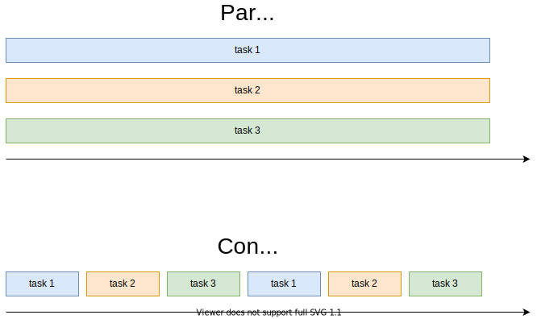

# Паралелизъм и конкурентност



---

# Защо искаме конкурентност

--
- I/O операции
--
    - четене или писане; от файл или от сокет
--
    - напр. http заявки или заявки до бази данни
--
    - малко работа за процесора, но дълъг период на изчакване
--
    - искаме да правим други неща, докато чакаме

---

# Защо искаме конкурентност

--
- или просто искаме да изпълняваме задачи конкурентно
--
    - от прекъсвания на ниско ниво (bare metal)
--
    - до fair scheduling

---

# Варианти за конкурентност

### Kernel space

- нишки и процеси
--
- предоставени са ни наготово от операционната система
--
- не скалират добре (за стотици или хиляди задачи)

---

# Варианти за конкурентност

### User space

--
- могат да се оптимизират специфично за целта
--
- по-малки от към памет
--
- по-бързо превключване
--
- могат да скалират до стотици хиляди, дори милиони задачи

---

# Async/await в Rust

--
- сравнително нова функционалност в езика
--
- стабилизирана в rust 1.39 (07 ноември 2019)
--
- https://rust-lang.github.io/async-book/

---

# Async/.await в Rust

### async функции

```rust
# #![allow(dead_code)]
// връща анонимен тип, който имплементира trait-а `Future<Output = u8>`
async fn five() -> u8 {
    5
}
# fn main() {}
```

--
- `five()` е от тип `impl Future<Output = u8>`
--
- `five().await` е от тип `u8`
--
- груб превод `async fn(...) -> T` ⇒ `fn(...) -> impl Future<Output = T>`

---

# Async/.await в Rust

### async блокове

```rust
# #![allow(dead_code)]
use std::future::Future;

fn ten() -> impl Future<Output = u8> {
    // връща анонимен тип, който имплементира trait-а `Future<Output = u8>`
    async {
        let x: u8 = five().await;
        x + 5
    }
}
# async fn five() -> u8 { 5 }
# fn main() {}
```

---

# Async/.await в Rust

### .await

- `.await` е постфиксен оператор
- `.await` може да се използва само в `async fn` или `async {}`

```rust
async fn five() -> u8 {
    5
}

async fn ten() -> u8 {
    five().await + 5
}

fn main() {
    let x = ten().await;
}
```

---

# Trait Future

```rust
# use std::task::Context;
# use std::pin::Pin;
#
pub trait Future {
    type Output;

    fn poll(self: Pin<&mut Self>, cx: &mut Context) -> Poll<Self::Output>;
}

pub enum Poll<T> {
    Ready(T),
    Pending,
}
#
# fn main() {}
```

- тип, който имплементира `Future`, съдържа всичката информация нужна за изпълнението на асинхронна операция
- игнорирайте `Pin` и `Context` засега

---

# Trait Future

```rust
# #![allow(unused_variables)]
# fn main() {
async fn foo() {
    println!("foo");
}

let foo_future = foo();
# }
```

--
- future-а е само структура
--
- по само себе си не прави нищо (той е мързелив)
--
- за да започне работа трябва някой да му извика `poll`

---

# Изпълнение на future

Future може да се изпълни

- като му се извика `.await` в `async` блок или функция
- като се подаде на executor

---

# Futures екосистемата

- стандартната библиотека съдържа само най-базовия интерфейс необходим за създаване на асинхронни операции
--
- преди да бъдат добавени към `std` futures съществуваха в rust екосистемата като библиотеката [futures](https://docs.rs/futures)
--
- `futures 0.1` е стар интерфейс, който все още се използва от някои библиотеки, има варианти за съвместимост с новия интерфейс, ако го срещнете
--
- `futures 0.3` е новият интерфейс, който се използва от async/await
--
- в стандартната библиотека са стабилизирани част от `futures 0.3`
--
- но има още неща които не са добавени в `std` - `Stream`, `Sink`, `AsyncRead`, `AsyncWrite` и utilitites

---

# Futures екосистемата

- за да използвате async/await трябва да си изберете executor
--
- [tokio](https://docs.rs/tokio)
--
- [async-std](https://docs.rs/async-std)
--
- [smol](https://docs.rs/smol)
--
- и др.

---

# Futures екосистемата

### Съвместимост

- Не всички async библиотеки са съвместими една с друга!
--
- Асинхроннен вход/изход, таймери и подобни (и всички библиотеки които надграждат над това) обикновенно могат да работят само на определен executor
--
- Всякакъв друг асинхронен код, като комбинатори, синхронизационни примитиви и подобни обикновенно могат да работят на произволен executor
--
- https://rust-lang.github.io/async-book/08_ecosystem/00_chapter.html

---

# Демо код

Web crawler, който събира и напечатва линкове към блогове от https://this-week-in-rust.org

Използвани библиотеки
- [reqwest](https://docs.rs/reqwest) - асинхронни http рекуести
- [scraper](https://docs.rs/scraper) - парсене на html и търсене на елементи чрез css селектори
- [tokio](https://docs.rs/tokio/0.2.24/tokio) v0.2 - async executor

https://github.com/nikolads/rust_async_demo

---

# Синхронно изпълнение

- понякога искаме да извикаме `async fn` от синхронен код
--
- функция `block_on`
--
- повечето библиотеки за async executors предоставят такава функция
    - `futures::block_on`, `tokio::block_on` и т.н.
    - няма практическа разлика - считайте го като помощна функция която все още не е добавена в std
--
- създава машинарията нужна за изпълнение на задачи (припомнете си `Pin<Self>`, `Context`)
--
- извиква `future.poll` в цикъл в текущата нишка докато future-а не върне `Ready`

---

# Async и блокиращи операции

- когато ползваме async е важно да нямаме блокиращи операции
--
- блокиращите операции блокират текущата нишка
--
- async executor-ите ползват ограничено количество нишки за изпълнение на задачи
--
- в резултат можем лесно да си забавим или тотално забием програмата

---

# Async и блокиращи операции

### Примитиви за синхронизация

- примитивите в `std::sync` блокират текущата нишка
--
- вместо това трябва да се използват async версии, които блокират само текущата задача
--
- `async_std::sync`
--
- `tokio::sync`

---

# Async и блокиращи операции

### Тежки операции

- други блокиращи операции, като
    - тежки изчисления
    - блокиращ код, който не може да се промени
--
- трябва да се изпълняват на отделна ОС нишка
--
- може да се пуска нова нишка за всяка операция
--
- или да се използва thread pool

---

# Async и блокиращи операции

### Тежки операции

Един примерен вариант е

```rust
# #![allow(unused_variables)]
# fn blocking_op() {}
# fn main() {
# async_std::task::block_on(async {
let task_handle = async_std::task::spawn(async {
    let (sender, receiver) = async_std::channel::bounded(1);

    std::thread::spawn(move || {
        let result = blocking_op();

        // `block_on` ще върне веднага, защото има място в канала
        async_std::task::block_on(sender.send(result)).unwrap();
    });

    receiver.recv().await
});

let blocking_op_result = task_handle.await;
# });
# }
```

---

# Допълнителна информация

### async-std

Давахме примери главно за `tokio` екосистемата, но друга обещаваща библиотека е [async-std](https://docs.rs/async-std).
Тя предоставя аналогичен интерфейс на `std`, но всички функции които нормално са блокиращи в `async-std` са асинхронни

- https://www.youtube.com/watch?v=L7X0vpAU-sU - презентация за async-std
- https://book.async.rs/ - книгата за async std, имат добър туториал за имплементация на чат сървър
